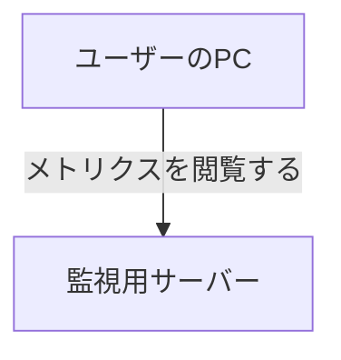

# MDX の規約

このブログは Hono (HonoX) + MDX で構築されている。記事ファイルは `app/routes/posts/<slug>/index.mdx` に配置する。

## ディレクトリと slug

```
app/routes/posts/<slug>/
├── index.mdx
├── score.png        記事内で使う画像は同じディレクトリに置く
└── ogp.jpg          OGP 画像 (任意)
```

slug には半角英小文字とハイフンのみを使用し、内容が推測できる簡潔な語にする。

- 良い例: `migrate-to-hono`、`go-base62`、`keep-inbox-empty`、`vercel-cloud-run-iam`
- 悪い例: `20250905-blog-post`、`my-new-article`

## frontmatter

型定義は `app/routes/posts/types.ts` で定義されている。

```yaml
---
title: Claude Code ActionにPRのCode Suggestionをしてもらうプロンプト
date: 2025-07-14T19:00:00
description: Claude Code ActionでPRの Code Suggestionをしてもらうプロンプトを作成したので紹介します。
categories:
  - 生成AI
tags:
  - Claude Code
  - GitHub
---
```

| フィールド    | 必須 | 内容                                                               |
| ------------- | ---- | ------------------------------------------------------------------ |
| `title`       | 必須 | 記事タイトル。コロンを含む場合はダブルクォートで囲む               |
| `date`        | 必須 | 公開日時。`YYYY-MM-DDTHH:MM:SS` 形式。記事の並び順に使用される     |
| `description` | 必須 | 記事の要約 (1 文)。一覧ページや OGP の説明文に使用される           |
| `categories`  | 必須 | カテゴリの配列。既存語彙から選択する ([`taxonomy.md`](taxonomy.md)) |
| `tags`        | 任意 | タグの配列。既存語彙から選択する                                   |
| `ogImage`     | 任意 | OGP 画像のパス。ルート相対パスで指定する (例: `/posts/web-speed-hackathon-2024/ogp.jpg`) |

## more マーカー

```
{/* <!--more--> */}
```

**全 77 記事で必ず記述されている。** `app/components/PostSummarySection.tsx` がこのマーカーで本文を分割し、前半部分をトップページの要約として表示する。導入文の直後、最初の `##` 見出しの直前に配置する。

## コンポーネント

`app/lib/mdx-components.tsx` に登録されているため、import 文は不要でそのまま記述できる。

### ExLinkCard

外部リンクカードコンポーネント。全記事で最も多く使用されている (計 216 回)。

```jsx
<ExLinkCard url="https://hono.dev/" />
```

参照した公式ドキュメント、外部の記事、GitHub リポジトリなどはこの形式で記載する。OGP 情報を取得してカード形式で表示される。**執筆時に Claude が自動で挿入してよい**が、URL は実在することを確認済みのものだけを使用する。

### Twitter

ツイート（ポスト）の埋め込みコンポーネント (計 60 回使用)。

```jsx
<Twitter url="https://twitter.com/p1ass/status/1158995483240439808" />
```

コンポーネントの実装上、URL には `twitter.com` 形式の URL をそのまま渡す。本文中のプロフィールリンク (`x.com`) とは扱いが異なる点に注意する。

### BlockLink

テキストリンクのブロック表示コンポーネント (計 23 回使用)。

```jsx
<BlockLink href="https://golang.org/ref/spec#Assignments">
  The Go Programming Language Specification
</BlockLink>
```

仕様書の特定セクションへのリンクなど、OGP カードにするとかえって情報が分かりにくくなる場合に使用する。

### Note

補足ボックスコンポーネント (計 9 回使用)。

```jsx
<Note>
  この問いはレイヤードアーキテクチャや DDD の優劣を決めるものではありません。
</Note>
```

本筋からは外れるが、読者に伝えておきたい注意点や前提条件の限定に使用する。

## 画像

```markdown

_4 位 187,577 　釜中の鯖_
```

- パスは `./` から始まる相対パスとし、画像ファイルは記事と同じディレクトリに配置する
- **画像の直後の行に `_キャプション_` を配置する。** `em` タグがキャプション用スタイル (中央寄せ、グレー文字、小さめの文字サイズ) として適用される
- alt テキストには画像の内容を具体的に記述し、「〜の画像」のような冗長な表現は避ける

**執筆時は画像をプレースホルダーとして記述する。** 実ファイルは筆者が後から配置するため、パスとキャプションを記述した上で、以下のように TODO コメントを残す。

```markdown

_Claude Code が行指定で出した Suggestion_

<!-- TODO: 画像 suggestion.png を配置 -->
```

## リンクの書き分け

| 用途                            | 書き方                                                          |
| ------------------------------- | --------------------------------------------------------------- |
| 本文中の X (Twitter) アカウント | `[@p1ass](https://x.com/p1ass)` — **新規記事は x.com**          |
| ツイート埋め込み                | `<Twitter url="https://twitter.com/..."/>` — twitter.com のまま |
| 参照した記事・ドキュメント      | `<ExLinkCard url="..." />`                                      |
| 文中の軽いリンク                | `[Hono](https://hono.dev/)`                                     |

既存の 163 箇所については `twitter.com` のまま残す。過去記事を遡及して修正する必要はない。

## コードブロック

- 言語を必ず指定する (` ```go `、` ```yaml `、` ```bash ` など)
- ブロック内に 3 連続のバッククォートが含まれる場合は、4 連続のバッククォート (` ````yaml `) で囲む
- Mermaid 記法による図表描画に対応している (`rehype-mermaid`)

````markdown

````

## 見出し

- 本文の見出しは `##` から始める (記事タイトルが h1 になるため)
- 本文の最上位見出しは `##` とし、その下層には `###` を用いる
- 締めの見出しは `## おわりに` で統一する (過去記事の実績: `## おわりに` 30 記事、`## 終わりに` 13 記事、`## まとめ` 10 記事)
