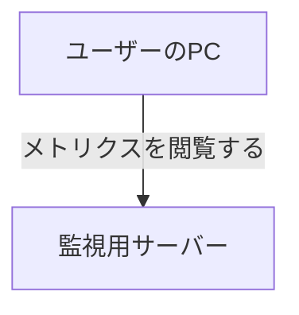

# MDX の規約

このブログは Hono (HonoX) + MDX で構築されている。記事は `app/routes/posts/<slug>/index.mdx`。

## ディレクトリと slug

```
app/routes/posts/<slug>/
├── index.mdx
├── score.png        記事内で使う画像は同じディレクトリに置く
└── ogp.jpg          OGP 画像 (任意)
```

slug は英小文字とハイフンのみ。内容が推測できる短い語にする。

- 良い: `migrate-to-hono`、`go-base62`、`keep-inbox-empty`、`vercel-cloud-run-iam`
- 悪い: `20250905-blog-post`、`my-new-article`

## frontmatter

型定義は `app/routes/posts/types.ts` にある。

```yaml
---
title: Claude Code ActionにPRのCode Suggestionをしてもらうプロンプト
date: 2025-07-14T19:00:00
description: Claude Code ActionでPRの Code Suggestionをしてもらうプロンプトを作成したので紹介します。
categories:
  - 生成AI
tags:
  - Claude Code
  - GitHub
---
```

| フィールド | 必須 | 内容 |
|---|---|---|
| `title` | 必須 | 記事タイトル。コロンを含む場合はダブルクォートで囲む |
| `date` | 必須 | `YYYY-MM-DDTHH:MM:SS` 形式。並び順に使われる |
| `description` | 必須 | 1文。一覧ページと OGP の説明文に使われる |
| `categories` | 必須 | 配列。既存語彙から選ぶ ([`taxonomy.md`](taxonomy.md)) |
| `tags` | 任意 | 配列。既存語彙から選ぶ |
| `ogImage` | 任意 | ルートからのパス (例: `/posts/web-speed-hackathon-2024/ogp.jpg`) |

## more マーカー

```
{/* <!--more--> */}
```

**全 77 記事で必ず入っている。** `app/components/PostSummarySection.tsx` がこの文字列でテキストを分割し、前半をトップページの要約として表示する。導入の直後、最初の `##` 見出しの前に置く。

## コンポーネント

`app/lib/mdx-components.tsx` で登録されている。import は不要でそのまま書ける。

### ExLinkCard

外部リンクカード。全記事で 216 回使われており、最も多い。

```jsx
<ExLinkCard url="https://hono.dev/" />
```

参照した公式ドキュメント、他人の記事、リポジトリはこの形で貼る。OGP を取得してカード表示になる。**執筆時に Claude が自動で挿入してよい。** ただし URL は裏取り済みのものだけを使う。

### Twitter

ツイート埋め込み。60 回使われている。

```jsx
<Twitter url="https://twitter.com/p1ass/status/1158995483240439808"/>
```

URL は `twitter.com` 形式のまま渡す (コンポーネントがこの形式を期待している)。本文中のプロフィールリンクとは扱いが異なる点に注意。

### BlockLink

テキストリンクのブロック表示。23 回使われている。

```jsx
<BlockLink href="https://golang.org/ref/spec#Assignments">
  The Go Programming Language Specification
</BlockLink>
```

仕様書の特定セクションなど、OGP カードにすると情報が薄くなるリンクに使う。

### Note

補足ボックス。9 回使われている。

```jsx
<Note>
  この問いはレイヤードアーキテクチャや DDD の優劣を決めるものではありません。
</Note>
```

本筋から外れるが読者に伝えておきたい注意書きや前提の限定に使う。

## 画像

```markdown

_4 位 187,577 　釜中の鯖_
```

- パスは `./` 始まりの相対パス。ファイルは記事と同じディレクトリに置く
- **直下の行に `_キャプション_`** を置く。`em` がキャプション用にスタイルされている (中央寄せ、グレー、小さめ)
- alt テキストには画像の内容を書く。「画像」のような語は避ける

**執筆時は画像をプレースホルダにする。** ファイルは筆者が後から置くため、パスとキャプションだけ書いて次の形で TODO を残す。

```markdown

_Claude Code が行指定で出した Suggestion_
<!-- TODO: 画像 suggestion.png を配置 -->
```

## リンクの書き分け

| 用途 | 書き方 |
|---|---|
| 本文中の X (Twitter) アカウント | `[@p1ass](https://x.com/p1ass)` — **新規記事は x.com** |
| ツイート埋め込み | `<Twitter url="https://twitter.com/..."/>` — twitter.com のまま |
| 参照した記事・ドキュメント | `<ExLinkCard url="..." />` |
| 文中の軽いリンク | `[Hono](https://hono.dev/)` |

既存 163 箇所は `twitter.com` のまま残す。過去記事の遡及修正は対象外とする。

## コードブロック

- 言語を必ず指定する (` ```go `、` ```yaml `、` ```bash `)
- ブロック内にバッククォート3連が入る場合は4連 (` ````yaml `) で囲む
- mermaid が使える (`rehype-mermaid`)

````markdown

````

## 見出し

- 本文の見出しは `##` から始める。`title` が h1 になる
- 本文の最上位は `##`、その下が `###`
- 締めは `## おわりに` でそろえる (既存は `## おわりに` 30 記事、`## 終わりに` 13 記事、`## まとめ` 10 記事)
