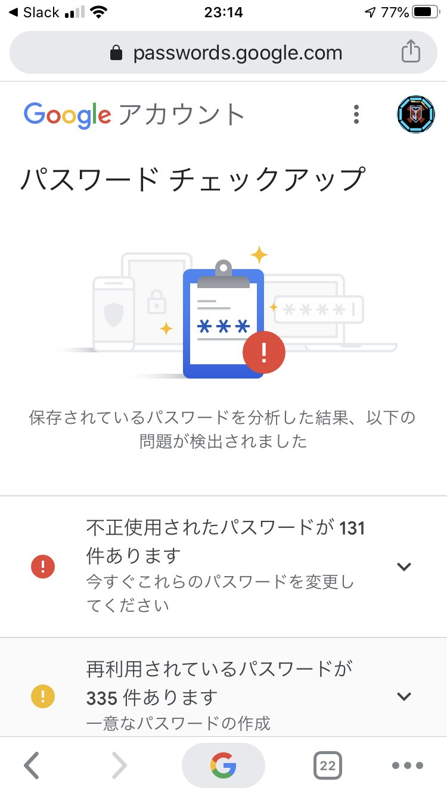

こんにちは、ぷらす([@p1ass](https://twitter.com/p1ass))です。

タイトルの通り、パスワードが漏れていたので 1Password を導入しました。この記事では、パスワード漏洩の発覚の経緯から 1Password の導入までを導入までを（ほぼ）時系列で紹介します。

## 事の始まり : Instagram の不正ログイン

大学で試験勉強をしていると、ふと Instagram からログイン通知のメールが届きました。

「あれ？今ログインなんかしてないのに 🤔」と思いながらメールを見ると、イタリアからのログイン通知でした。

「パスワード漏れたのかなぁ、でもインスタのパスワードは他で使い回してないよな...？」と思いながらよくメールを見ると、ログイン通知が来たアカウントは今メインで使っているアカウントではなく、5 年以上放置しているアカウントでした。

{/* <!--more--> */}

この時点で **「あっヤバイ」** となりました。

というのも、現在もよく使っているアカウント(Google, GitHub など)のパスワードはユニークになるように工夫していたのですが、2~7 年前に作ったアカウントはほとんど同じパスワードを使い回していたのです。そして今回不正ログインされた Instagram のパスワードはこの使い回していたパスワードでした。

「このままでは色々なアカウントに不正ログインされてしまう、、、」となり、急いで様々なサービスのパスワードを変更することにしました。

## パスワード流失の確認

本当にパスワードが漏れたのか確認する必要があると感じたので、友人に教えてもらった[Have I Been Pwned](https://haveibeenpwned.com/)を使ってみました。

Have I Been Pwned は過去の個人情報流出や情報漏洩事件の情報を元にメールアドレスを入力するだけで個人情報やパスワード漏洩を確認することができるサイトです。

結果は Red で漏洩していました。

_Have I Been Pwned でメールアドレスを入力したときの結果_

次に Google のパスワードチェックアップでパスワードの不正使用を確認しました。今までパスワードの管理は全て Google に任せていて自分が作成したアカウントのパスワードは全て登録されているので、どれだけパスワードを使い回しているか分かると思ったからです。

結果は不正使用されたパスワードが 131 件、再利用されているパスワードが 335 件でした。

流石に数が多すぎて自分でもドン引きしました。登録されているパスワードが 523 件だったので過半数以上が再利用されていました。

## 対策方針

この状況を放置しておくわけにはいかないので対策を考えます。パッと思いついた方針は以下の 2 つでした。

- Google のパスワードマネージャーを使いながら再利用しているパスワードを変更する
- 1Password を導入する

今回は

- 全てのパスワードを変えたい
- パスワードジェネレータで作成したパスワードにしたい
- iPhone でも楽に入力できるようにしたい

の要件を満たせそうな 1Password を導入することにしました。プラットフォーマーから独立しているサービスの方が今後も使い勝手が良さそうに感じたのも理由の一つです。

## 移行作業

まずは 1Password のアカウントを作成して、サブスクリプションに登録しました。月\$2.99 なら安いですね。

次に Google のパスワードマネージャに登録されているパスワードを一括エクスポートして、1Password にインポートしました。方法は以下の公式サポートが参考になりました。

<BlockLink href="https://support.1password.com/import-chrome/">
  https://support.1password.com/import-chrome/
</BlockLink>

移行が終わった時点で 1Password に登録されたパスワードは **523 件** した。しかしよく見てみると、ドメイン違いで同じサービスのパスワードが複数登録されている様子が確認できました。(api.twittter.com と twitter.com で同じアカウントが登録されているなど)

そこで、重複したパスワードや既にサービスが終了したパスワードを削除したところ登録件数が **254 件** で下がりました。ちなみにですが、重複パスワードの削除はインポートしてからではなく、エクスポートした csv をテキストエディタで開いて、検索しながら削除する方が効率が良いです。この作業だけでかなりの時間がかかってしましました。

その後、全てのパスワードを変更してました。基本は 20 文字、英数字記号全てを使ったパスワードにし、それができないものは制限に合うように変更しました。(中にはパスワード数字 4 桁のサービスがあるのですが、それらは変更するのを諦めました。)

2 日ほどかけて全てのパスワードを変更して、移行作業は終了です。

## おわりに

パスワードは使い回さないことが大事というのは頭では理解している人が多いと思うのですが、実際にそれを実行に移せている人は少ないように感じます。

面倒くさいとは思いますが、まずは Have I Been Pwned などで漏洩を確認し、早めにパスワードマネージャを導入することをオススメにします。
