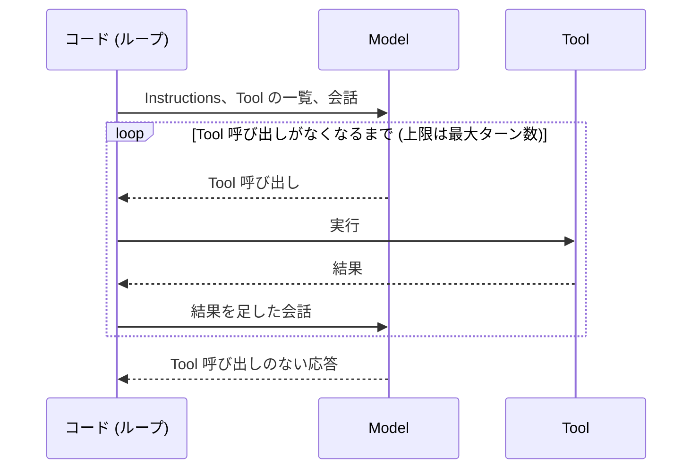
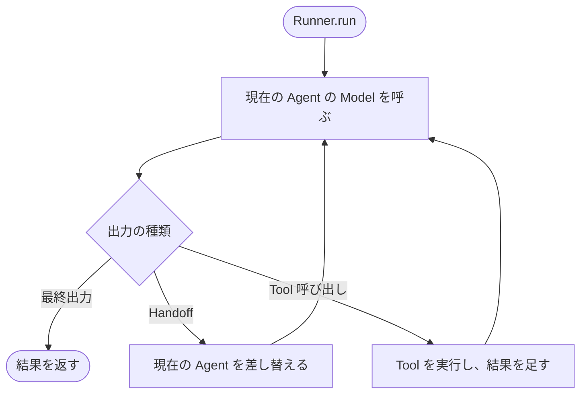
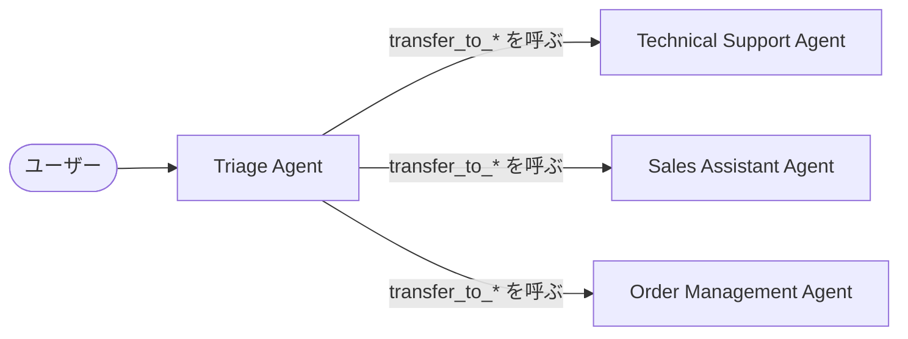
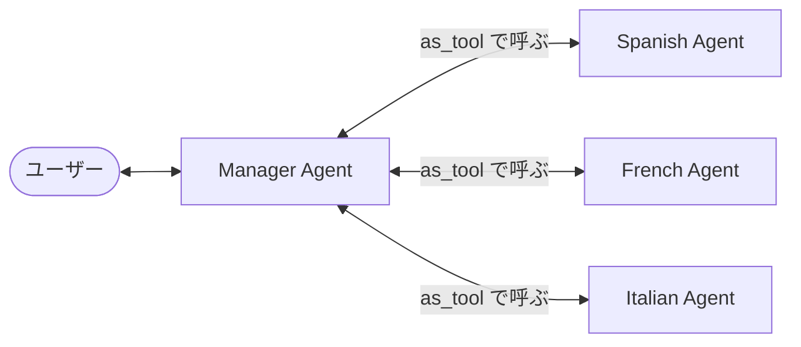
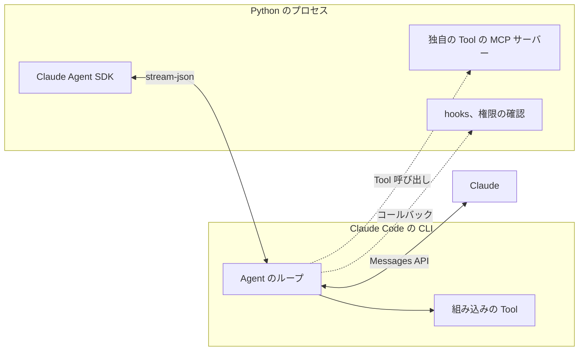

こんにちは、ぷらす([@p1ass](https://x.com/p1ass))です。

これから Agent の開発について連載記事を書いていくにあたり、まずは基礎知識を 3 本の記事で整理します。この記事はその 1 本目です。

OpenAI と Anthropic はそれぞれ別々に Agent SDK を開発していますが、2 つの SDK の中にある Agent の捉え方はほぼ同じです。
どちらも「Model、Instructions、Tool を持ち、Tool 呼び出しがなくなるまでループを回す」という形で Agent を組み立てています。
この形を最もまとまった形で説明しているのが、OpenAI が公開しているガイドです。

この記事では、まず Agent を理解する前提となる Tool 呼び出しの仕組みを確認し、OpenAI のガイドから Agent のモデルを整理します。
そのうえで、OpenAI Agents SDK と Claude Agent SDK がそのモデルをどう表現しているのかを比較し、最後に Go で API を直接呼び出す最小限の Agent を実装します。

2 社の SDK の概念を同じモデルに対応付けられること、そして SDK がどの処理を代わりに担っているのかを見分けられることが、この記事のゴールです。

{/* <!--more--> */}

## 前提となる Tool 呼び出しの仕組み

Agent は Tool 呼び出しを繰り返す仕組みとして説明されることが多いため、先に Tool 呼び出しの仕組みを確認します。

LLM は単体では最新の情報を調べたり、外部のシステムを操作したりできません。Tool は、LLM に外部の関数や API を呼び出させるための仕組みです。
OpenAI の function calling や Anthropic の tool use のように、主要な LLM の API が同様の仕組みを提供しています。この記事では、これらを総称して Tool と呼びます。

Model 自身は Tool を実行しません。
Model はどの Tool をどんな引数で呼び出すかを、構造化データとして返すだけです。アプリケーション側のコードがその Tool を実行し、結果をもう一度 Model に渡すことで、Model はその結果を踏まえて応答を生成します。


_Tool 呼び出しの 1 往復。Model は呼び出しを指定するだけで、実行はアプリケーションが担う_

この往復を 1 回で終わらせず、Model が Tool 呼び出しを返さなくなるまで繰り返すと、Agent のループになります。

## OpenAI のガイドが示す Agent のモデル

ガイドはこの形を新しく提案したものではなく、それまでの API や SDK で使われてきた形をまとめたものです。ガイドでは Agent を次のように説明しています。

<ExLinkCard url="https://openai.com/business/guides-and-resources/a-practical-guide-to-building-ai-agents/" />

> Agents are systems that independently accomplish tasks on your behalf.

ガイドはあわせて、処理の進め方を LLM が制御しないアプリケーションは Agent ではないとしています。例として、単純なチャットボット、単発の LLM 呼び出し、感情分類器が挙げられています。
次に何をするかを LLM が決めるかどうかが、Agent とそれ以外を分ける基準です。

### Model、Instructions、Tool の 3 要素

ガイドは最も基本的な形の Agent を 3 つの要素で説明しています。

| 要素 | ガイドの説明 |
| --- | --- |
| Model | The LLM powering the agent's reasoning and decision-making |
| Tool | External functions or APIs the agent can use to take action |
| Instructions | Explicit guidelines and guardrails defining how the agent behaves |

Tool の種類としては、情報を取得する Data と外部に作用する Action のほかに、別の Agent を Tool として呼び出す Orchestration も挙げられています。
Agent 自身が別の Agent の Tool になるという考え方は、後半の SDK で委譲の仕組みとして現れます。

### 終了条件まで回るループ

ガイドは Agent の実行を、終了条件を満たすまで回すループとして説明しています。
終了条件は特定の Tool 呼び出し、特定の構造化出力、エラー、最大ターン数への到達の 4 つです。

> This concept of a while loop is central to the functioning of an agent.

Anthropic も Building effective agents で、Agent を次の 1 文で説明しています。

<ExLinkCard url="https://www.anthropic.com/engineering/building-effective-agents" />

> They are typically just LLMs using tools based on environmental feedback in a loop.

どちらも、最初のセクションで見た Tool 呼び出しの往復を、LLM が自分で判断しながら繰り返すループを Agent の中心に置いています。

### Manager と Handoff による委譲

ガイドはまずシングル Agent の能力を最大限に引き出すよう勧めつつ、マルチ Agent の構成として 2 つのパターンを挙げています。

| パターン | 内容 |
| --- | --- |
| Manager | 中心の Manager が、専門の Agent を Tool として呼び出す |
| Decentralized | 対等な Agent 同士が、専門に応じて処理を Handoff で引き渡す |

Handoff は「引き継ぎ」を意味する語で、ここでは会話と実行の担当を、別の Agent に丸ごと引き渡すことを指します。
引き渡した側の Agent は処理に戻らず、それ以降は受け取った側の Agent がユーザーとやり取りします。

> In the manager pattern, edges represent tool calls whereas in the decentralized pattern, edges represent handoffs that transfer execution between agents.

### Agent のモデルのまとめ

ここまでの内容をまとめると、Agent は次のように組み立てられます。

- Model に Instructions と使える Tool の一覧を渡す
- Model が Tool 呼び出しを返したら、コードがそれを実行し、その結果を会話に含めてもう一度 Model を呼ぶ
- Model が Tool 呼び出しのない応答を返したら終わる。無限に回らないよう最大ターン数を設ける
- 別の Agent への委譲は、Agent を Tool として呼ぶ (Manager) か、会話ごと引き渡す (Handoff)



_Agent のループ_

以降ではこのまとめを「Agent のモデル」と呼び、2 つの SDK をこれに当てはめて読んでいきます。

## OpenAI Agents SDK での表現

OpenAI Agents SDK は、実験的に公開されていた Swarm の後継にあたる SDK です。公式ドキュメントでは Agent を次のように説明しています。

<ExLinkCard url="https://openai.github.io/openai-agents-python/" />

> An agent is a large language model (LLM) configured with instructions, tools, and optional runtime behavior such as handoffs, guardrails, and structured outputs.

ガイドの 3 要素が、そのまま `Agent` クラスのフィールドになっています。`Agent` は `model`、`instructions`、`tools` に加えて、Handoff する先の Agent (`handoffs`)、入力と出力のチェック (`input_guardrails`、`output_guardrails`)、最終出力の型 (`output_type`) を持ちます。
`Agent` は設定を持つだけのオブジェクトで、ループを回すのは `Runner` です。Go の実装と同じ `get_weather` を持つ Agent は次のようになります。

```python
from agents import Agent, Runner, function_tool


@function_tool
def get_weather(city: str) -> str:
    """指定した都市の現在の天気を返す"""
    return f"{city} は晴れ、気温は 24 度"


agent = Agent(
    name="Weather agent",
    instructions="あなたは天気を答えるアシスタントです。天気は必ず get_weather で調べてください。",
    tools=[get_weather],
)

result = Runner.run_sync(agent, "東京と大阪の天気を教えてください", max_turns=10)
print(result.final_output)
```

`@function_tool` は関数のシグネチャと docstring から Tool の定義 (名前、説明、引数の JSON Schema) を作ります。
`Runner.run_sync` は 1 ターンごとに Model を呼び出し、その出力に応じて次の 3 つに分岐します。



_Runner のループ。ターン数が max_turns を超えると MaxTurnsExceeded を送出する_

`max_turns` の既定値は 10 です。ドキュメントでは、Tool 呼び出しがなく、指定した型のテキストを出力した時点を最終出力としています。
Agent のモデルのループに、Handoff の分岐が 1 つ加わった形です。

### 委譲も Tool 呼び出しとして表す

ガイドの 2 つのパターンは、どちらも Tool 呼び出しとして実装されています。

Handoff は、Model からは普通の Tool に見えます。

> Handoffs are represented as tools to the LLM. So if there's a handoff to an agent named `Refund Agent`, the tool would be named `transfer_to_refund_agent`.

Model が `transfer_to_refund_agent` を呼び出すと、`Runner` は現在の Agent を Refund Agent に差し替えてループを続けます。
ガイドでは問い合わせを振り分ける Triage Agent を例にしています。



_Handoff。引き渡した後は、引き継いだ Agent がユーザーとやり取りする_

Manager にあたるのは、Agent を Tool として呼び出す `Agent.as_tool()` です。docstring では、Handoff との違いが次の 2 点にまとめられています。

> 1. In handoffs, the new agent receives the conversation history. In this tool, the new agent receives generated input.
> 2. In handoffs, the new agent takes over the conversation. In this tool, the new agent is called as a tool, and the conversation is continued by the original agent.



_Manager。呼び出した側が会話の主導権を持ち続ける_

## Claude Agent SDK での表現

Claude Agent SDK は、Claude Code SDK から改名された SDK です。公式ドキュメントでは Agent を次のように説明しています。

<ExLinkCard url="https://code.claude.com/docs/en/agent-sdk/overview" />

> An agent is an application that completes a task by planning its own steps and calling tools that read files, run commands, or edit code.

コーディング向けに具体化されていますが、ループについての説明は Agent のモデルと同じです。

> Claude continues calling tools and processing results until it produces a response with no tool calls.

### 3 要素を持つ ClaudeAgentOptions

Claude Agent SDK には `Agent` クラスがありません。Model、Instructions、Tool は `ClaudeAgentOptions` にまとめ、`ClaudeSDKClient` に渡します。
独自の Tool は、プロセス内で動く MCP サーバーとして渡します。Model からは `mcp__<サーバー名>__<Tool 名>` という名前の Tool に見えます。OpenAI Agents SDK の例と同じ Agent は次のようになります。

```python
import anyio
from claude_agent_sdk import ClaudeAgentOptions, ClaudeSDKClient, create_sdk_mcp_server, tool


@tool("get_weather", "指定した都市の現在の天気を返す", {"city": str})
async def get_weather(args):
    return {"content": [{"type": "text", "text": f"{args['city']} は晴れ、気温は 24 度"}]}


weather = create_sdk_mcp_server(name="weather", version="1.0.0", tools=[get_weather])

options = ClaudeAgentOptions(
    model="sonnet",
    system_prompt="あなたは天気を答えるアシスタントです。天気は必ず get_weather で調べてください。",
    mcp_servers={"weather": weather},
    allowed_tools=["mcp__weather__get_weather"],
    max_turns=10,
)


async def main():
    async with ClaudeSDKClient(options=options) as client:
        await client.query("東京と大阪の天気を教えてください")
        async for message in client.receive_response():
            print(message)


anyio.run(main)
```

`model`、`system_prompt`、Tool の 3 つが、ガイドの Model、Instructions、Tool にあたります。`allowed_tools` は Tool を実行するたびに許可を求めないための設定です。

### ループは Claude Code の CLI で回る

OpenAI Agents SDK と大きく違うのは、ループを回す場所です。
Claude Agent SDK は、パッケージに同梱された Claude Code の CLI をサブプロセスとして起動し、標準入出力を介して JSON 形式のメッセージをやり取りします。ループと組み込みの Tool は CLI 側で動作します。



_Claude Agent SDK の構成。点線は CLI が Python 側を呼び出す箇所_

Python 側で動くのは、独自の Tool と hooks、Tool の実行を許可するかを決めるコールバックだけです。
OpenAI Agents SDK が Agent をオブジェクトとして組み立てて `Runner` で動かすのに対し、Claude Agent SDK は Claude Code という完成した Agent を `ClaudeAgentOptions` で設定して動かします。

### サブ Agent による委譲

委譲にはサブ Agent (subagent) を使います。`ClaudeAgentOptions` の `agents` に `AgentDefinition` を渡すと、Model は `Agent` という Tool を通してサブ Agent を呼び出します。

```python
from claude_agent_sdk import AgentDefinition

options = ClaudeAgentOptions(
    agents={
        "weather": AgentDefinition(
            description="天気に関する質問に答える",
            prompt="あなたは天気を答えるアシスタントです。天気は必ず get_weather で調べてください。",
            tools=["mcp__weather__get_weather"],
            model="haiku",
        ),
    },
    mcp_servers={"weather": weather},
)
```

`AgentDefinition` は Claude Agent SDK で 1 つの Agent を表す唯一の型です。そのフィールドは `prompt` (Instructions)、`tools`、`model` と、呼び出す側の Model に見せる `description` で、ここにもガイドの 3 要素がそのまま現れています。
呼び出した側が会話を続けるので、`as_tool()` と同じく Manager のパターンです。Handoff にあたる、会話ごと引き渡す仕組みはありません。

## 2 つの SDK の対応

Agent のモデルの要素ごとに、2 つの SDK を並べると次のようになります。

| Agent のモデル | OpenAI Agents SDK | Claude Agent SDK |
| --- | --- | --- |
| Model | `Agent.model` | `ClaudeAgentOptions.model`、`AgentDefinition.model` |
| Instructions | `Agent.instructions` | `ClaudeAgentOptions.system_prompt`、`AgentDefinition.prompt` |
| Tool | `@function_tool` で定義した関数 | 組み込みの Tool と、`@tool` で定義した MCP の Tool |
| ループを回す場所 | Python の `Runner` | Claude Code の CLI |
| 最大ターン数 | `max_turns` (既定値 10) | `max_turns` (Tool を使うターンを数える) |
| Manager | `as_tool()` | `Agent` Tool で呼ぶサブ Agent |
| Handoff | `handoffs` (`transfer_to_*` という Tool) | なし |
| 実行前後のチェックと制御 | Guardrails | hooks、権限モード |

要素の名前は違っていても、ほとんどの要素が 1 対 1 に対応します。
違いは Agent をオブジェクトとして組み立てるか、完成した Agent を設定するかという点と、それに伴って Handoff の有無が分かれる点です。どちらの SDK も、別の Agent への委譲を Tool 呼び出しとして表しています。

## Go による最小の Agent の実装

2 つの SDK が隠しているループを Go で実装し、Agent のモデルがそのままコードになることを確かめます。
Go には両社の Agent SDK が用意されていないため、Anthropic と OpenAI のクライアント SDK で API を直接呼び出します。環境は次のとおりです。

- Go 1.27.1
- github.com/anthropics/anthropic-sdk-go v1.74.0
- github.com/openai/openai-go/v3 v3.64.0

題材として、固定の天気を返す `get_weather` という Tool を 1 つ持つ Agent を作ります。「東京と大阪の天気を教えてください」と頼み、Tool 呼び出しがなくなるまでループを回します。
コードの全体は [GitHub](https://github.com/p1ass/blog/tree/main/app/routes/posts/agent-concepts-and-modeling/minimal-agent) にあります。

### Anthropic Messages API 版

Anthropic 版では、Instructions を `System` に、Tool の定義を `Tools` に渡します。Tool の引数は JSON Schema で定義します。

```go
tools := []anthropic.ToolUnionParam{{OfTool: &anthropic.ToolParam{
	Name:        "get_weather",
	Description: anthropic.String("指定した都市の現在の天気を返す"),
	InputSchema: anthropic.ToolInputSchemaParam{
		Properties: map[string]any{"city": map[string]string{"type": "string"}},
		Required:   []string{"city"},
	},
}}}
params := anthropic.MessageNewParams{
	Model:     anthropic.ModelClaudeSonnet5,
	MaxTokens: 1024,
	System:    []anthropic.TextBlockParam{{Text: instructions}},
	Messages:  []anthropic.MessageParam{anthropic.NewUserMessage(anthropic.NewTextBlock(prompt))},
	Tools:     tools,
}

for turn := 1; turn <= maxTurns; turn++ {
	resp, err := client.Messages.New(ctx, params)
	if err != nil {
		log.Fatal(err)
	}
	params.Messages = append(params.Messages, resp.ToParam())

	var results []anthropic.ContentBlockParamUnion
	for _, block := range resp.Content {
		call, ok := block.AsAny().(anthropic.ToolUseBlock)
		if !ok {
			continue
		}
		log.Printf("turn %d: %s %s", turn, call.Name, call.Input)
		out, err := runTool(call.Name, call.Input)
		isError := err != nil
		if isError {
			out = err.Error()
		}
		results = append(results, anthropic.NewToolResultBlock(call.ID, out, isError))
	}

	if len(results) == 0 {
		for _, block := range resp.Content {
			if text, ok := block.AsAny().(anthropic.TextBlock); ok {
				fmt.Println(text.Text)
			}
		}
		return
	}

	params.Messages = append(params.Messages, anthropic.NewUserMessage(results...))
}
log.Fatalf("max turns (%d) exceeded", maxTurns)
```

Tool の実行は、Tool の名前で分岐する関数にまとめました。

```go
func runTool(name string, input []byte) (string, error) {
	switch name {
	case "get_weather":
		var args struct {
			City string `json:"city"`
		}
		if err := json.Unmarshal(input, &args); err != nil {
			return "", err
		}
		return fmt.Sprintf("%s は晴れ、気温は 24 度", args.City), nil
	default:
		return "", fmt.Errorf("unknown tool: %s", name)
	}
}
```

コードの各部分は、Agent のモデルに次のように対応します。

| Agent のモデル | コード |
| --- | --- |
| Model | `Model` |
| Instructions | `System` |
| Tool | `Tools` と `runTool` |
| 会話 | `params.Messages` |
| ループ | `for` 文 |
| 終了条件 | Tool 呼び出しがなければ `return`、`maxTurns` を超えたら終了 |

Model の応答と Tool の実行結果を `params.Messages` に蓄積し、次のリクエストで会話全体を送り直します。
Tool の実行結果は、`tool_result` ブロックとして user のメッセージに入れて返します。

### OpenAI Responses API 版

OpenAI 版では、Instructions を `Instructions` に、Tool の定義を `Tools` に渡します。`runTool` は Anthropic 版と同じです。

```go
tools := []responses.ToolUnionParam{{OfFunction: &responses.FunctionToolParam{
	Name:        "get_weather",
	Description: openai.String("指定した都市の現在の天気を返す"),
	Parameters: map[string]any{
		"type":       "object",
		"properties": map[string]any{"city": map[string]string{"type": "string"}},
		"required":   []string{"city"},
	},
}}}
params := responses.ResponseNewParams{
	Model:        openai.ChatModelGPT5_6Luna,
	Instructions: openai.String(instructions),
	Input:        responses.ResponseNewParamsInputUnion{OfString: openai.String(prompt)},
	Tools:        tools,
}

for turn := 1; turn <= maxTurns; turn++ {
	resp, err := client.Responses.New(ctx, params)
	if err != nil {
		log.Fatal(err)
	}
	params.PreviousResponseID = openai.String(resp.ID)

	var results responses.ResponseInputParam
	for _, item := range resp.Output {
		if item.Type != "function_call" {
			continue
		}
		call := item.AsFunctionCall()
		log.Printf("turn %d: %s %s", turn, call.Name, call.Arguments)
		out, err := runTool(call.Name, []byte(call.Arguments))
		if err != nil {
			out = err.Error()
		}
		result := responses.ResponseInputItemParamOfFunctionCallOutput(out)
		result.OfFunctionCallOutput.CallID = openai.String(call.CallID)
		results = append(results, result)
	}

	if len(results) == 0 {
		fmt.Println(resp.OutputText())
		return
	}

	params.Input = responses.ResponseNewParamsInputUnion{OfInputItemList: results}
}
log.Fatalf("max turns (%d) exceeded", maxTurns)
```

ループの基本的な形は Anthropic 版と同じです。
Responses API は会話をサーバー側に保存するため、次のリクエストでは `previous_response_id` で前の応答を指定し、Tool の実行結果だけを送ります。

### 2 つの API の違い

2 つの実装の違いは、次の 3 点です。

| 観点 | Anthropic Messages API | OpenAI Responses API |
| --- | --- | --- |
| 会話の持ち方 | クライアントが全体を持ち、毎回送る | サーバーが保存し、`previous_response_id` で続ける |
| Tool 呼び出しと結果の対応 | `tool_use` の `id` と `tool_result` の `tool_use_id` | `function_call` の `call_id` と `function_call_output` の `call_id` |
| Tool のエラーの伝え方 | `tool_result` の `is_error` | 専用のフィールドはなく、エラー文を結果として返す |

どちらの API でも、Tool の定義を含めて main 関数はおよそ 50 行に収まります。
SDK の価値の多くは、Handoff、Guardrails、トレースといった、この最小のループが持たない機能にあります。

{/* TODO: API キーを設定して実行し、実行ログを載せる */}

## おわりに

OpenAI Agents SDK と Claude Agent SDK は、どちらも OpenAI のガイドが示した Agent のモデルで読み解けます。Model、Instructions、Tool を持ち、Tool 呼び出しがなくなるまでループを回し、別の Agent への委譲も Tool 呼び出しとして表します。
違いは OpenAI Agents SDK が Agent をオブジェクトとして組み立てて `Runner` で動かすのに対し、Claude Agent SDK は Claude Code という完成した Agent を設定して動かす点です。

2 社の捉え方が似ている理由は、各社の API の Tool 呼び出しが同じ形をしているためだと私は考えています。Model が Tool 呼び出しを返し、コードがそれを実行して結果を返すという往復は、OpenAI、Anthropic、Google の API で共通です。Agent のループはこの往復を繰り返すだけなので、その上に組み立てる SDK の形も似てきます。
実際、ループそのものは Go で数十行のコードで実装できます。SDK を選ぶときは、Handoff や Guardrails、トレースなど、ループに含まれない機能を比べることになります。

2 社は [Claude Managed Agents](https://www.anthropic.com/engineering/managed-agents) や Agents API で、実行環境や状態といったループの外側まで含めて Agent をモデル化し始めています。この話と、ループのどこまでをコードで固定し、どこから LLM に任せるかは、今後の記事で扱う予定です。
