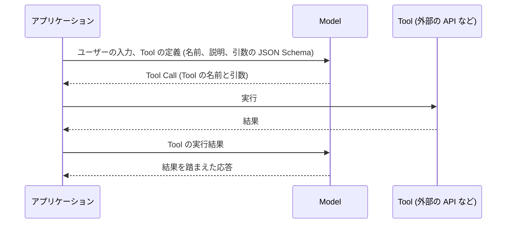
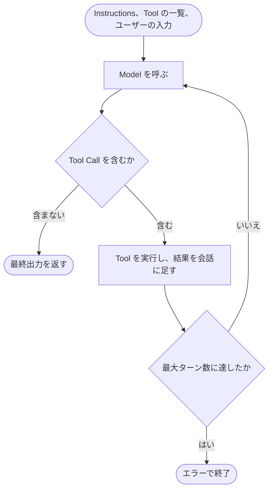
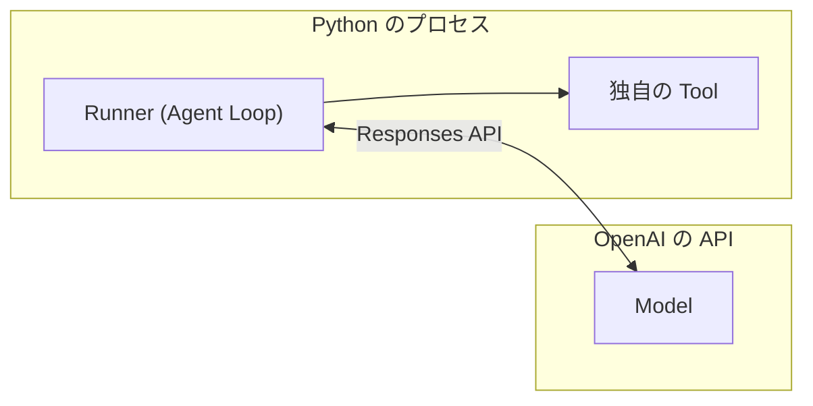
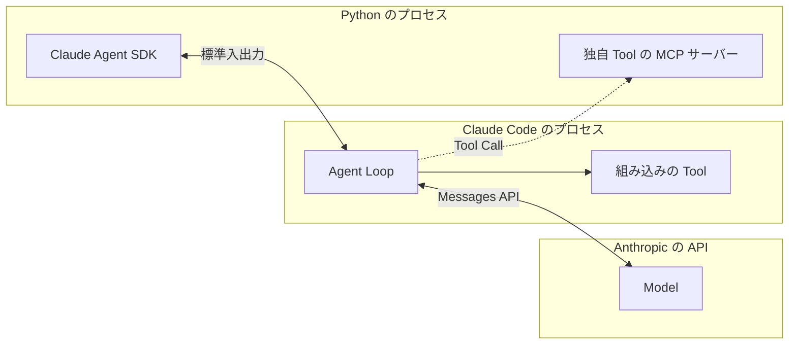

こんにちは、ぷらす([@p1ass](https://x.com/p1ass))です。

最近、Agent を「使う側」ではなく「作る側」に興味を持ち始めています。
色々と新しい学びが多いなぁと感じているので、せっかくなので自分が学んだ Agent の開発について、何回かに分けて記事を書いていこうと思います。

現在予定しているテーマは次の 7 つです。

1. Agent の基本構成 (この記事)
2. Tool の設計
3. コンテキスト管理
4. ハーネス
5. Multi-Agent
6. Workflow と Guardrails
7. Observability と Eval

この記事はその 1 本目で、Agent を構成する要素など Agent の全体像を整理します。

---

OpenAI と Anthropic はそれぞれ Agent SDK を開発していますが、2 つの SDK における Agent の捉え方はほぼ同じです。
どちらも「Model、Instructions、Tool を備え、最終出力を返すまでループを回す」という形で Agent を組み立てています。

この記事では、まず Agent を理解する前提となる Tool Call の仕組みを確認し、OpenAI が公開しているドキュメントを元に Agent の基本構成を整理します。
そのうえで、OpenAI Agents SDK と Claude Agent SDK がその構成をどう表現しているのかを比較し、最後に Go で API を直接呼び出す最小限の Agent を実装します。

{/* <!--more--> */}

## Tool Call の仕組み

Tool Call は、LLM が外部の関数や API の呼び出しを要求できるようにする仕組みです。

LLM は単体では最新情報の取得や、外部システムの操作ができません。
そこで処理を Tool として切り出し、アプリケーション側のコードがその Tool を実行することで、Model がその結果を踏まえて応答を生成できるようにします。

Model の役割はどの Tool をどんな引数で呼び出すかを判断し、構造化データ (一般的には JSON Schema に基づいたデータ)を生成することです。



_Tool Call の 1 往復。Model は Tool の呼び出しを指定するだけで、実行はアプリケーションが担う_

この Tool Call を 1 回実行するだけなら、ただの関数呼び出しに過ぎません。
Agent の真骨頂は Model が Tool Call を何度も繰り返していく(ループする)ことで、複雑な処理をこなしていくことにあります。

## Agent の基本構成

Agent の基本構成を理解するうえで、OpenAI の「A practical guide to building agents」というドキュメントが参考になります。

<ExLinkCard url="https://openai.com/business/guides-and-resources/a-practical-guide-to-building-ai-agents/" />

### Model、Instructions、Tool の 3 要素

このドキュメントでは、Model、Instructions、Tool を備えてループを回す構造を Agent の基本設計として整理しています。

| 要素         | ドキュメントの説明                                                |
| ------------ | ----------------------------------------------------------------- |
| Model        | The LLM powering the agent's reasoning and decision-making        |
| Tool         | External functions or APIs the agent can use to take action       |
| Instructions | Explicit guidelines and guardrails defining how the agent behaves |

### Agent Loop

ドキュメントでは Agent の実行を終了条件を満たすまで回す処理を Agent Loop と定義しています。
指定された出力形式やエラー、最大ターン数への到達といった終了条件を満たすまでループを回し、与えられた指示を遂行します。

OpenAI はこのループを次のように表現しています。

> This concept of a while loop is central to the functioning of an agent.

なお、Anthropic も「Building effective agents」というドキュメントの中で、Agent を次の 1 文で説明しています。

> They are typically just LLMs using tools based on environmental feedback in a loop.

<ExLinkCard url="https://www.anthropic.com/engineering/building-effective-agents" />

どちらの説明も、LLM が最初のセクションで見た Tool Call の往復を自分で判断しながら繰り返すループ構造を Agent の中心に据えています。

### ここまでのまとめ

ここまでの内容をまとめると、Agent は次のように組み立てられます。

- Model に Instructions と使える Tool の一覧を渡す
- Model が Tool Call を返したら、コードがそれを実行し、その結果を会話に含めてもう一度 Model を呼ぶ
- Model が終了条件を満たしたら終了する。無限に回らないよう最大ターン数を設ける



_Agent Loop_

以降ではこのまとめを「Agent の基本構成」と呼び、2 つの SDK をこれに当てはめて見ていきます。

## OpenAI Agents SDK の Agent

OpenAI Agents SDK の公式ドキュメントでは、Agent を次のように説明しています。

> An agent is a large language model (LLM) configured with instructions, tools, and optional runtime behavior such as handoffs, guardrails, and structured outputs.

<ExLinkCard url="https://openai.github.io/openai-agents-python/" />

### 3 要素を持つ Agent クラス

OpenAI のドキュメントの 3 要素は、そのまま `Agent` クラスのフィールドに対応しています。
`Agent` は `model`、`instructions`、`tools` を保持しています。

例として、固定の天気を返す `get_weather` という Tool を 1 つ持つ Agent を作ります。

```python
from agents import Agent, Runner, function_tool


# 関数のシグネチャと docstring から Tool の定義 (名前、説明、引数の JSON Schema) を生成するアノテーション
@function_tool
def get_weather(city: str) -> str:
    """指定した都市の現在の天気を返す"""
    return f"{city} は晴れ、気温は 24 度"


agent = Agent(
    name="Weather agent",
    instructions="あなたは天気を答えるアシスタントです。天気は必ず get_weather で調べてください。",
    tools=[get_weather],
)

result = Runner.run_sync(agent, "東京と大阪の天気を教えてください", max_turns=10)
print(result.final_output)
```

### Agent Loop の実装

`Agent` 自体は設定を保持するだけのオブジェクトで、実際にループを回す処理は `Runner` が担っています。
ループも Tool の実行も、すべて Python のプロセスの中で動きます。ターン数が `max_turns` を超えると、`Runner` は `MaxTurnsExceeded` を送出します。



_OpenAI Agents SDK の構成。ループと Tool はどちらも Python のプロセスで動く_

## Claude Agent SDK の Agent

次に、Claude Agent SDK を使った実装も見ていきます。

<ExLinkCard url="https://code.claude.com/docs/en/agent-sdk/overview" />

ループについての説明は先程の OpenAI の Agent の基本構成と同じです。

> Claude continues calling tools and processing results until it produces a response with no tool calls.

### 3 要素を持つ ClaudeAgentOptions

Claude Agent SDK には `Agent` クラスがありません。Model、Instructions、Tool は `ClaudeAgentOptions` にまとめ、`ClaudeSDKClient` に渡します。

独自の Tool は、プロセス内で動く MCP サーバーとして登録します。Model からは `mcp__<サーバー名>__<Tool 名>` という名前の Tool として認識されます。
独特な設計ですね。

OpenAI Agents SDK の例と同様の Agent を実装すると、次のようになります。

```python
import anyio
from claude_agent_sdk import (
    ClaudeAgentOptions,
    ClaudeSDKClient,
    ResultMessage,
    create_sdk_mcp_server,
    tool,
)


@tool("get_weather", "指定した都市の現在の天気を返す", {"city": str})
async def get_weather(args):
    return {"content": [{"type": "text", "text": f"{args['city']} は晴れ、気温は 24 度"}]}


weather = create_sdk_mcp_server(name="weather", version="1.0.0", tools=[get_weather])

options = ClaudeAgentOptions(
    model="sonnet",
    system_prompt="あなたは天気を答えるアシスタントです。天気は必ず get_weather で調べてください。",
    mcp_servers={"weather": weather},
    allowed_tools=["mcp__weather__get_weather"],
    max_turns=10,
)


async def main():
    async with ClaudeSDKClient(options=options) as client:
        await client.query("東京と大阪の天気を教えてください")
        async for message in client.receive_response():
            if isinstance(message, ResultMessage) and message.subtype == "success":
                print(message.result)


anyio.run(main)
```

### Claude Code の CLI で実行する Agent Loop

Claude Agent SDK は OpenAI Agents SDK とループの実行方法が大きく異なります。
Claude Agent SDK は、パッケージに同梱された Claude Code の CLI をサブプロセスとして起動し、標準入出力を介して JSON 形式のメッセージをやり取りします。



_Claude Agent SDK の構成_

OpenAI Agents SDK が Agent をオブジェクトとして組み立てて `Runner` で動かすのに対し、Claude Agent SDK は Claude Code という完成した Agent を `ClaudeAgentOptions` で設定して動かします。

## 2 つの SDK の対応

Agent の基本構成の要素ごとに、2 つの SDK を並べると次のようになります。

| Agent の基本構成 | OpenAI Agents SDK               | Claude Agent SDK                        |
| ---------------- | ------------------------------- | --------------------------------------- |
| Model            | `Agent.model`                   | `ClaudeAgentOptions.model`              |
| Instructions     | `Agent.instructions`            | `ClaudeAgentOptions.system_prompt`      |
| Tool             | `@function_tool` で定義した関数 | `@tool` で定義した MCP の Tool          |
| ループを回す場所 | Python の `Runner`              | Claude Code の CLI                      |
| 最終出力         | `RunResult.final_output`        | `ResultMessage.result`                  |
| 最大ターン数     | `max_turns`                     | `max_turns` (Tool を使うターンを数える) |

要素の名前は違っても、主要な要素は対応が取れます。
両者の大きな違いは、Agent をオブジェクトとして組み立てるか、完成した Agent を設定して動かすかという点にあります。

<Note>
  Agent の基本構成には含めていませんが、どちらの SDK にも Agent
  の実行前後に処理を差し込む仕組みがあります。OpenAI Agents SDK では
  Guardrails、Claude Agent SDK では hooks
  と権限モードがその役割を担います。詳細は今後の記事で紹介します。
</Note>

## Go で最小の Agent を実装する

最後に、2 つの SDK が提供している Agent Loop を自分で再実装してみます。環境は次のとおりです。

- Go 1.27.1
- [github.com/openai/openai-go/v3](https://pkg.go.dev/github.com/openai/openai-go/v3) v3.64.0
- [github.com/anthropics/anthropic-sdk-go](https://pkg.go.dev/github.com/anthropics/anthropic-sdk-go) v1.74.0

題材はこれまでと同じく `get_weather` を持つ Agent です。「東京と大阪の天気を教えてください」と頼み、最終出力を返すまでループを回します。
コードの全体は [GitHub](https://github.com/p1ass/blog/tree/main/app/routes/posts/agent-foundations/minimal-agent) にあります。

### OpenAI Responses API 版

OpenAI 版では、Instructions を `Instructions` に、Tool の定義を `Tools` に渡します。Tool の引数は JSON Schema で定義します。

```go
tools := []responses.ToolUnionParam{{OfFunction: &responses.FunctionToolParam{
	Name:        "get_weather",
	Description: openai.String("指定した都市の現在の天気を返す"),
	Parameters: map[string]any{
		"type":       "object",
		"properties": map[string]any{"city": map[string]string{"type": "string"}},
		"required":   []string{"city"},
	},
}}}
params := responses.ResponseNewParams{
	Model:        openai.ChatModelGPT5_6Luna,
	Instructions: openai.String(instructions),
	Input: responses.ResponseNewParamsInputUnion{OfInputItemList: responses.ResponseInputParam{
		responses.ResponseInputItemParamOfMessage(prompt, responses.EasyInputMessageRoleUser),
	}},
	Tools: tools,
	Store: openai.Bool(false),
}

for turn := range maxTurns {
	resp, err := client.Responses.New(ctx, params)
	if err != nil {
		log.Fatal(err)
	}
	output, err := outputAsInput(resp.Output)
	if err != nil {
		log.Fatal(err)
	}
	params.Input.OfInputItemList = append(params.Input.OfInputItemList, output...)

	var results responses.ResponseInputParam
	for _, item := range resp.Output {
		if item.Type != "function_call" {
			continue
		}
		call := item.AsFunctionCall()
		log.Printf("turn %d: %s %s", turn+1, call.Name, call.Arguments)
		out, err := runTool(call.Name, []byte(call.Arguments))
		if err != nil {
			out = err.Error()
		}
		result := responses.ResponseInputItemParamOfFunctionCallOutput(out)
		result.OfFunctionCallOutput.CallID = openai.String(call.CallID)
		results = append(results, result)
	}

	if len(results) == 0 {
		fmt.Println(resp.OutputText())
		return
	}

	params.Input.OfInputItemList = append(params.Input.OfInputItemList, results...)
}
log.Fatalf("max turns (%d) exceeded", maxTurns)

// Go の SDK には応答を次の入力に変換する関数がないため、JSON を経由して変換する。
func outputAsInput(output []responses.ResponseOutputItemUnion) (responses.ResponseInputParam, error) {
	input := make(responses.ResponseInputParam, 0, len(output))
	for _, item := range output {
		var converted responses.ResponseInputItemUnion
		if err := json.Unmarshal([]byte(item.RawJSON()), &converted); err != nil {
			return nil, err
		}
		input = append(input, converted.ToParam())
	}
	return input, nil
}
```

Tool の実行は、Tool 名で分岐する関数にまとめました。

```go
func runTool(name string, input []byte) (string, error) {
	switch name {
	case "get_weather":
		var args struct {
			City string `json:"city"`
		}
		if err := json.Unmarshal(input, &args); err != nil {
			return "", err
		}
		return fmt.Sprintf("%s は晴れ、気温は 24 度", args.City), nil
	default:
		return "", fmt.Errorf("unknown tool: %s", name)
	}
}
```

Model の出力と Tool の実行結果を `Input` に追加し、次のリクエストで会話履歴全体を送り直します。
「東京と大阪の天気」のように、Model は 1 回の応答で複数の Tool Call を返すことがあります。そのため、応答に含まれる Tool Call をすべて実行し、それぞれの結果を `function_call_output` のアイテムとして追加します。

### Anthropic Messages API 版

Anthropic 版では、Instructions を `System` に、Tool の定義を `Tools` に渡します。`runTool` の実装は OpenAI 版と共通です。

```go
tools := []anthropic.ToolUnionParam{{OfTool: &anthropic.ToolParam{
	Name:        "get_weather",
	Description: anthropic.String("指定した都市の現在の天気を返す"),
	InputSchema: anthropic.ToolInputSchemaParam{
		Properties: map[string]any{"city": map[string]string{"type": "string"}},
		Required:   []string{"city"},
	},
}}}
params := anthropic.MessageNewParams{
	Model:     anthropic.ModelClaudeSonnet5,
	MaxTokens: 1024,
	System:    []anthropic.TextBlockParam{{Text: instructions}},
	Messages:  []anthropic.MessageParam{anthropic.NewUserMessage(anthropic.NewTextBlock(prompt))},
	Tools:     tools,
}

for turn := range maxTurns {
	resp, err := client.Messages.New(ctx, params)
	if err != nil {
		log.Fatal(err)
	}
	params.Messages = append(params.Messages, resp.ToParam())

	var results []anthropic.ContentBlockParamUnion
	for _, block := range resp.Content {
		call, ok := block.AsAny().(anthropic.ToolUseBlock)
		if !ok {
			continue
		}
		log.Printf("turn %d: %s %s", turn+1, call.Name, call.Input)
		out, err := runTool(call.Name, call.Input)
		isError := err != nil
		if isError {
			out = err.Error()
		}
		results = append(results, anthropic.NewToolResultBlock(call.ID, out, isError))
	}

	if len(results) == 0 {
		for _, block := range resp.Content {
			if text, ok := block.AsAny().(anthropic.TextBlock); ok {
				fmt.Println(text.Text)
			}
		}
		return
	}

	params.Messages = append(params.Messages, anthropic.NewUserMessage(results...))
}
log.Fatalf("max turns (%d) exceeded", maxTurns)
```

ループの基本的な構造は OpenAI 版と同じで、Model の応答と Tool の実行結果を `params.Messages` に蓄積し、次のリクエストで会話履歴全体を送り直します。
Tool の実行結果は、`tool_result` ブロックとして 1 つの user メッセージにまとめて返します。

### Agent の基本構成との対応

2 つの実装を Agent の基本構成の要素ごとに並べると、次のようになります。

| Agent の基本構成 | OpenAI Responses API 版                          | Anthropic Messages API 版                        |
| ---------------- | ------------------------------------------------ | ------------------------------------------------ |
| Model            | `Model`                                          | `Model`                                          |
| Instructions     | `Instructions`                                   | `System`                                         |
| Tool             | `Tools` と `runTool`                             | `Tools` と `runTool`                             |
| 会話             | `params.Input`                                   | `params.Messages`                                |
| Agent Loop       | `for` 文                                         | `for` 文                                         |
| 終了条件         | 最終出力なら `return`、`maxTurns` を超えたら終了 | 最終出力なら `return`、`maxTurns` を超えたら終了 |

API に違いはあっても、Agent Loop の実装はほとんど同じです。
違いは Tool の実行結果を独立したアイテムとして送るか user メッセージに入れるか、失敗を文面で伝えるか `is_error` で伝えるかといった、API ごとの細かな作法にとどまります。
どちらの API でも、Tool の定義を含めて `main` 関数は 60 行ほどに収まります。

{/* TODO: API キーを設定して実行し、実行ログを載せる */}

## おわりに

この記事では、OpenAI のドキュメントをもとに、Agent を Model、Instructions、Tool と、最終出力を返すまで回る Agent Loop として整理しました。

OpenAI Agents SDK と Claude Agent SDK はどちらもこの構造を基本としています。違いは Agent をオブジェクトとして組み立てて `Runner` で動かすか、Claude Code という完成した Agent を設定して動かすかという点程度です。

今後の記事では、ここで整理した要素やその周辺のテーマを 1 つずつ取り上げます。
次回は Tool の設計を扱い、その後はコンテキスト管理、ハーネス、Multi-Agent、Workflow と Guardrails、Observability と Eval の順に進める予定です。
