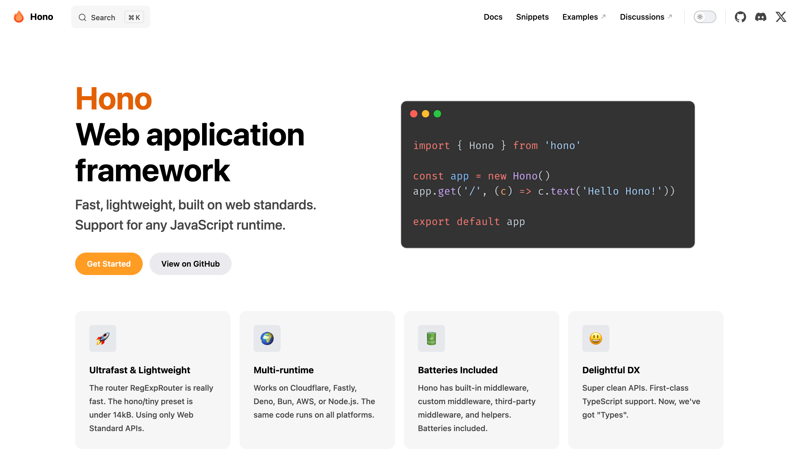

こんにちは、[@p1ass](https://twitter.com/p1ass)です。
先日、本ブログの静的サイトジェネレーター (SSG) を[Hugo](https://gohugo.io/)から[Hono](https://hono.dev/)に切り替えました。

旧Hugoのブログは2019年に作成したものなので、おおよそ5年間ほど使い続けていたことになります。

<ExLinkCard url="https://blog.p1ass.com/posts/hatena-to-hugo-one-year/"/>

この記事では、長く使っていたHugoをやめる決断をしたモチベーションや、Honoを採用した理由、実際にHonoを使っていく上で工夫したポイントについて紹介します。


{/* <!--more--> */}

## Hugoをやめるモチベーション

### テンプレートエンジンがそろそろ辛くなってきた

Hugoは静的サイトジェネレーターの1つです。
ビルドが高速である点や、ブログで役に立つ機能が多く含まれていた点が魅力的で、2019年に採用しました。

<ExLinkCard url="https://gohugo.io/"/>

当初は便利に使っていたものの、月日が経つにつれてスタイル面でのカスタマイズに不便さを感じるようになりました。
HugoはGo製のツールということもあり、HTMLのカスタマイズはほぼほぼGoの[html/template](https://pkg.go.dev/html/template)と同じ仕組みが使われています。

html/templateはよくあるテンプレートエンジンです。`{{ }}` で囲まれたブロックを使って条件分岐やループをしながら、HTMLを生成することができます。

```html
{{ if .IsNamedParams }}
<div style="padding-bottom:16px">
<a href="{{ .Get "href" }}" target="_blank" rel="noopener noreferrer">{{ if .Get "text"}}{{ .Get "text" }}{{ else }}{{ .Get "href"}}{{ end }}</a>
</div>
{{ else }}
<div style="padding-bottom:16px">
<a href="{{ .Get 0 }}" target="_blank" rel="noopener noreferrer">{{ .Get 0 }}</a>
{{ end }}
</div>
```
_旧Hugoで作られたブログのコードの一部_

Hugoでブログを作った当時はブログをがっつりカスタマイズする予定がなく、テンプレートエンジンで十分だと考えていました。
しかし、実際にはブログのカスタマイズが楽しくなっちゃって、どんどんテンプレートエンジンのコードが増えていきました...。

テンプレートエンジンのコードはコード補完や型の恩恵を受けづらく、開発者体験が良くないです。
ブログ以外の活動ではReact (JSX)を使ったコードを書くことが多く、**JSXと比較したときに「つらいな〜」** と感じていました。

また、npmのエコシステムとの相性が悪く、便利なサードパーティーライブラリを入れるのにも苦労していました。
「今更 `<script>` でライブラリを読み込むの...?」という気持ちになり、脱テンプレートエンジンの機運が高まってきました。

こういった事情があり、Hugoを脱することとしました。

## Honoとは？

HonoはJavaScriptのWebフレームワークです。
[@yusukebe](https://twitter.com/yusukebe)さんが開発しているOSSで、今勢いのあるフレームワークの1つです。


_Honoの公式ドキュメントのトップページ_

詳しい説明は公式ドキュメントやyusukebeさんの記事をご覧ください。

<ExLinkCard url="https://hono.dev/"/>

<ExLinkCard url="https://zenn.dev/yusukebe/articles/0c7fed0949e6f7"/>

<ExLinkCard url="https://zenn.dev/yusukebe/articles/724940fa3f2450"/>

## Honoを採用した理由

### マルチランタイムのコンセプトが良いと感じていた

Honoの特徴の1つに複数のJavaScriptランタイムで動くというものがあります。
JavaScriptのランタイムと言えばNode.jsが一般的ですが、Honoでは新興ランタイムである[Deno](https://deno.com/)や[Bun](https://bun.sh/)など複数のランタイムに対応しています。
そのため、私達開発者は1度コードを書けば、どののランタイムで動作させることができます。

このような「1つのインターフェース (今回はHono) を満たしておけば、詳細な実装が差し替え可能」という仕組みは、
PerlのPSGI・Plackを初めて知ったときに感心し、似たような思想を持つHonoも同様に良さそうと感じました。
(今回はSSGしちゃってるのでランタイムはあまり関係なくなってしまいましたが...)

<ExLinkCard url="https://gihyo.jp/dev/serial/01/perl-hackers-hub/002401"/>


### サーバサイドを軸にしている点がサーバーサイドエンジニアである私とマッチする

私の中では、Honoはサーバーサイドのエコシステムから派生したものだと認識しています。
ExpressやKoaといったNode.jsのサーバーフレームワークから進化したものといったイメージでしょうか。
そのため、サーバーサイドエンジニアである私から見ると、Honoはとっつきやすく、今後の活用のチャンスも見込めそうに感じました。

### JSXが使え、SSGもできる

一方で、HonoはWebフロントエンドの機能にも力をいれており、JSXをレンダリングしたり、SSGでHTMLファイルを生成することも可能です。
Hono v4でこの機能が追加されたことで、HugoからHonoに置き換える気持ちがぐんっと高まりました。

<ExLinkCard url="https://hono.dev/guides/jsx"/>
<ExLinkCard url="https://hono.dev/helpers/ssg"/>

## Honoを使っていく上で工夫したポイント

### URLの互換性を保つために

ブログにおいて、URLの互換性を保ち続けることは非常に大事なことです。
互換が崩れてしまうとリンク切れを起こしてしまうので、Hono移行で記事ページのURLの互換性が崩れないことは必須の条件として対応しました。

本ブログの記事URLのパスは `https://blog.p1ass.com/posts/${postId}/` という形式になっています。
そのため、この形式で配信するには、`dist/posts/${postId}/index.html` をビルド時に生成する必要があります。

しかし、HonoのメタフレームワークであるHonoXを使ったファイルベースルーティングでSSGをすると、 `./posts/${postId}.html` というファイルが生成されてしまうことがわかりました。
これだと先ほど示したURLとは異なる形式になってしまい、URLの互換性を保つことができません。

```shell
$ tree ./dist

dist
├── posts
│   ├── postId.html # これが生成されてしまう
│   └── postId
│      └── index.html # 理想はこれ
└── tags
```

どうしたもんかとしばらく悩んだ後、HonoXのissueに書き込みをしたところ、すぐにyusukebeさんから返信があり、このユースケースに対応したオプションを追加してくださいました！
爆速対応で驚きです。ありがとうございました 🙏

<ExLinkCard url="https://github.com/honojs/honox/issues/123"/>

### MDX内の画像パスを良い感じに解決する

記事内で表示する画像は `index.mdx` と同じディレクトリにコロケーションする形で配置しています。

```shell
$ tree app/routes/posts/migrate-to-hono

app/routes/posts/migrate-to-hono
├── hono_top_page.png # こんな感じ
└── index.mdx
```

このような配置にしているとき、マークダウンファイルでは次のような相対パスの書き方をしたくなります。

```markdown

```

しかし、このような書き方をしてしまうと、HTMLとしてレンダリングされるときにも、同じように相対パスで入力されてしまいます。

```html
<!-- /posts/migrate-to-hono/index.html -->

```

パット見問題なさそうに見えますが、2つ問題があります。

- ビルド時にコロケーションしている画像がコピーされないため、`dist` 内に画像がない
- 開発モードでサーバーを起動したときに、静的ファイルの配信URLが正しく解決されない

まずビルド時に画像がコピーされない件については、Viteのプラグインである[vite-plugin-static-copy](https://github.com/sapphi-red/vite-plugin-static-copy/tree/main)を使って画像をコピーするようにしました。

<ExLinkCard url="https://github.com/sapphi-red/vite-plugin-static-copy/tree/main"/>

```typescript
import { normalizePath } from 'vite'

// 記事内でco-locationして配置している画像たちを `dist/posts` にコピーする
viteStaticCopy({
  targets: [
    {
      src: [
        './app/routes/posts/**/*.png',
        './app/routes/posts/**/*.jpg',
        './app/routes/posts/**/*.jpeg',
        './app/routes/posts/**/*.webp',
      ],
      dest: 'posts',
      rename: (
        fileName: string,
        fileExtension: string,
        fullPath: string,
      ) => {
        const destPath = normalizePath(path.relative(__dirname, fullPath).replaceAll('app/routes/posts/', ''))
        return destPath
      },
      // 普通のviteのビルドで生成したファイルを消さないようにする
      overwrite: false,
    },
  ],
}),
```

次に、開発モードでサーバーを起動したときに、静的ファイルの配信URLが正しく解決されない件です。
こちらは期待している画像パスと実際に配信されている画像のパスが違うために発生します。

- 期待している画像パス: `/posts/migrate-to-hono/hono_top_page.png`
- 開発サーバーで配信される実際の画像のパス: `/app/routes/posts/migrate-to-hono/hono_top_page.png`

このようにパスが違うため、単に `./aaa.png` のような書き方をすると画像が404になってしまいます。
また、上記のような `/app/routes` が含まれる形で画像が配信されるのは開発モードのときのみのため、`import.meta.env.PROD` で処理を分岐する必要があります。
(本番環境ではvite-plugin-static-copyによって正しいパスに画像をコピーしているため)

この問題は、MDXの `img` タグに対してカスタムコンポーネントをアタッチするようにし、そのカスタムコンポーネント内で、画像パスを書き換えることで対応しました。

<ExLinkCard url="https://mdxjs.com/guides/injecting-components/"/>


### JSX RendererでOGP情報を動的に埋め込む

HonoでJSXをRenderingするには、JSX Rendererを使います。
HonoXでは、`_renderer.tsx` ファイルを用意し、その中で `jsxRenderer` を呼び出せば、そのディレクトリ配下に対応するHTTPパスのレンダリング時に自動的にJSX Rendererが使われるようになります。

```typescript jsx
// app/routes/_renderer.tsx。この場合全てのパスで使われる。
import { jsxRenderer } from 'hono/jsx-renderer'

export default jsxRenderer(({ children, title }) => {
  return (
    <html lang='en'>
      <head>
        <meta charset='UTF-8' />
        <meta name='viewport' content='width=device-width, initial-scale=1.0' />
        {title ? <title>{title}</title> : <></>}
      </head>
      <body>{children}</body>
    </html>
  )
})
```

この機能はいわゆるLayoutやTemplateといった機能と同様に、ページをまたいで使うHTMLタグを差し込んでおくのに便利です。
本ブログでは、`og:url` や `og:image` といったOGP用のタグを挿入するために、`jsxRenderer`を使っています。

```typescript jsx
export default jsxRenderer(({ children }, c /* ←これ */) => {
    return (
      // ...
      <meta property='og:url' content={`https://blog.p1ass.com${c.req.path}`}/>
      // ..
    )
```

少し前のバージョンでは、`jsxRenderer` でContextを取れないために、動的に `og:url` を設定することが難しかったのですが、Issueを起票したところこちらも対応してくださりました。🙏

<ExLinkCard url="https://github.com/honojs/honox/issues/132"/>


## おわりに

5年ぶりにブログを刷新しましたが、新しい技術を楽しみつつ、開発者体験も向上させることができました。
ただ、全ページちゃんとうまく動いているか確認が持てていないので、なにか不具合があればご連絡ください。

次の5年後にどうなっているか楽しみですね。
