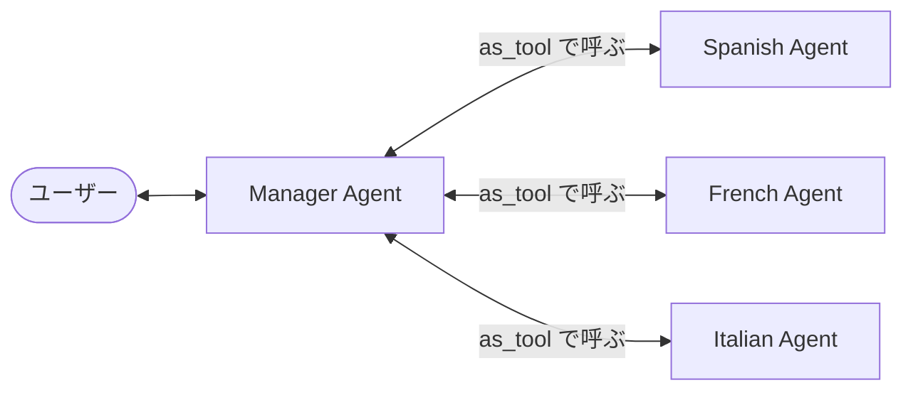

{/* <!--more--> */}

## メモ: 1 本目から移した内容

ガイドはまずシングル Agent の能力を最大限に引き出すよう勧めています。

ガイドでは問い合わせを振り分ける Triage Agent を例にしています。

_Handoff。引き渡した後は、引き継いだ Agent がユーザーとやり取りする_

Manager にあたるのは、Agent を Tool として呼び出す `Agent.as_tool()` です。docstring では、Handoff との違いが次の 2 点にまとめられています。

> 1. In handoffs, the new agent receives the conversation history. In this tool, the new agent receives generated input.
> 2. In handoffs, the new agent takes over the conversation. In this tool, the new agent is called as a tool, and the conversation is continued by the original agent.

_Manager。呼び出した側が会話の主導権を持ち続ける_
