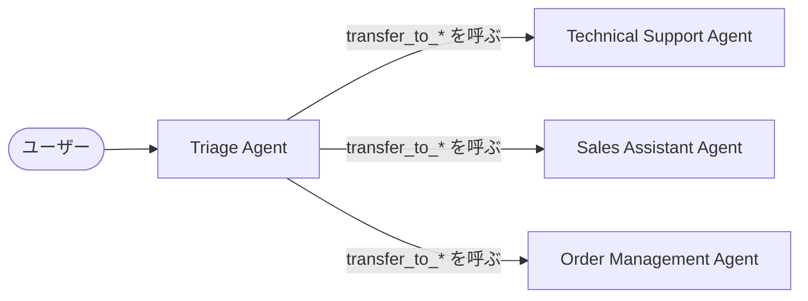

{/* <!--more--> */}

## メモ: 1 本目から移した内容

ガイドはまずシングル Agent の能力を最大限に引き出すよう勧めています。

ガイドでは問い合わせを振り分ける Triage Agent を例にしています。



_Handoff。引き渡した後は、引き継いだ Agent がユーザーとやり取りする_

Manager にあたるのは、Agent を Tool として呼び出す `Agent.as_tool()` です。docstring では、Handoff との違いが次の 2 点にまとめられています。

> 1. In handoffs, the new agent receives the conversation history. In this tool, the new agent receives generated input.
> 2. In handoffs, the new agent takes over the conversation. In this tool, the new agent is called as a tool, and the conversation is continued by the original agent.


_Manager。呼び出した側が会話の主導権を持ち続ける_

## メモ: 1 本目から移した内容 (委譲のセクション一式)

Tool の種類としては、情報を取得する Data と外部に作用する Action のほかに、別の Agent を Tool として呼び出す Orchestration も挙げられています。
Agent 自身が別の Agent の Tool になるという考え方は、後半の SDK で委譲の仕組みとして現れます。

### Manager と Handoff による委譲

ガイドはマルチ Agent の構成として 2 つのパターンを挙げています。

| パターン | 内容 |
| --- | --- |
| Manager | 中心の Manager が、専門の Agent を Tool として呼び出す |
| Decentralized | 対等な Agent 同士が、専門に応じて処理を Handoff で引き渡す |

Handoff は「引き継ぎ」を意味する語で、ここでは会話と実行の担当を、別の Agent に丸ごと引き渡すことを指します。
引き渡した側の Agent は処理に戻らず、それ以降は受け取った側の Agent がユーザーとやり取りします。

> In the manager pattern, edges represent tool calls whereas in the decentralized pattern, edges represent handoffs that transfer execution between agents.

- 別の Agent への委譲は、Agent を Tool として呼ぶ (Manager) か、会話ごと引き渡す (Handoff)

  kind -->|Handoff| swap[現在の Agent を差し替える]
  swap --> invoke

Agent のモデルのループに、Handoff の分岐が 1 つ加わった形です。

### 委譲も Tool Call として表す

ガイドの 2 つのパターンは、どちらも Tool Call として実装されています。

Handoff は、Model からは普通の Tool に見えます。

> Handoffs are represented as tools to the LLM. So if there's a handoff to an agent named `Refund Agent`, the tool would be named `transfer_to_refund_agent`.

Model が `transfer_to_refund_agent` を呼び出すと、`Runner` は現在の Agent を Refund Agent に差し替えてループを続けます。
Manager にあたるのは、Agent を Tool として呼び出す `Agent.as_tool()` です。呼び出された Agent は結果を Tool の結果として返し、会話は呼び出した側の Agent が続けます。

### サブ Agent による委譲

委譲にはサブ Agent (subagent) を使います。`ClaudeAgentOptions` の `agents` に `AgentDefinition` を渡すと、Model は `Agent` という Tool を通してサブ Agent を呼び出します。

```python
from claude_agent_sdk import AgentDefinition

options = ClaudeAgentOptions(
    agents={
        "weather": AgentDefinition(
            description="天気に関する質問に答える",
            prompt="あなたは天気を答えるアシスタントです。天気は必ず get_weather で調べてください。",
            tools=["mcp__weather__get_weather"],
            model="haiku",
        ),
    },
    mcp_servers={"weather": weather},
)
```

`AgentDefinition` は Claude Agent SDK で 1 つの Agent を表す唯一の型です。そのフィールドは `prompt` (Instructions)、`tools`、`model` と、呼び出す側の Model に見せる `description` で、ここにもガイドの 3 要素がそのまま現れています。
呼び出した側が会話を続けるので、`as_tool()` と同じく Manager のパターンです。Handoff にあたる、会話ごと引き渡す仕組みはありません。

| Manager | `as_tool()` | `Agent` Tool で呼ぶサブ Agent |
| Handoff | `handoffs` (`transfer_to_*` という Tool) | なし |

違いは Agent をオブジェクトとして組み立てるか、完成した Agent を設定するかという点と、それに伴って Handoff の有無が分かれる点です。どちらの SDK も、別の Agent への委譲を Tool Call として表しています。

Model、Instructions、Tool を持ち、最終出力を返すまでループを回し、別の Agent への委譲も Tool Call として表します。

委譲の仕組みも同じではなく、Handoff は OpenAI Agents SDK にしかありません。Manager と Handoff をどう使い分けるかは、マルチ Agent を扱う回で詳しく取り上げます。
