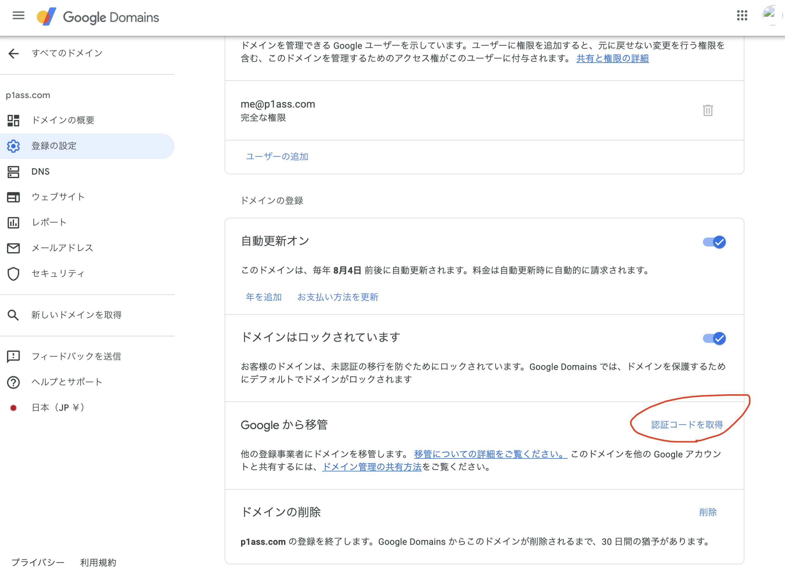
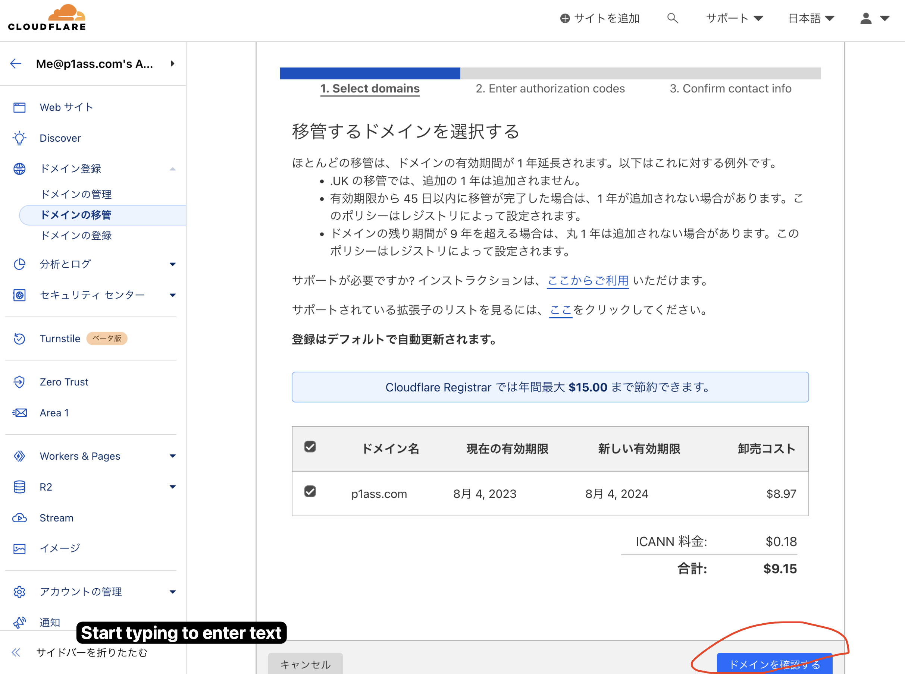
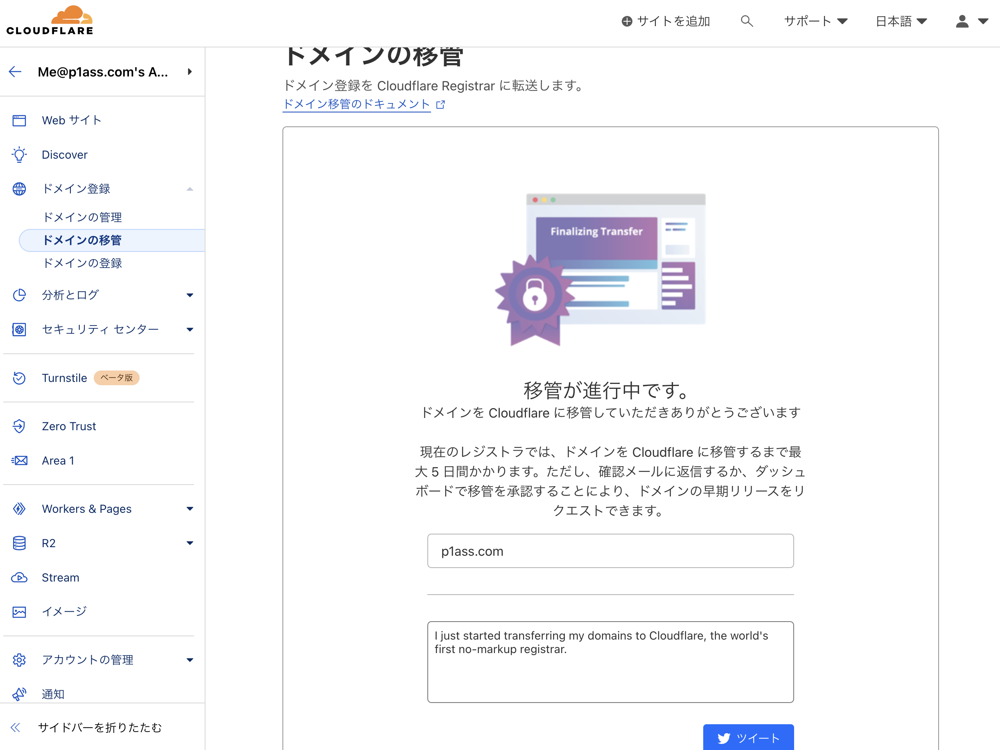
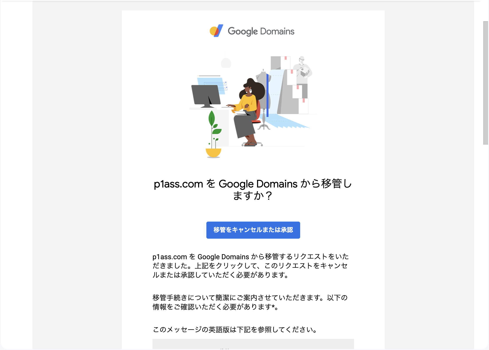

こんにちは、[@p1ass](https://twitter.com)です。

先日、Google から Google Domains を Squarespace に譲渡すると発表されました。
(Edited(2023/06/18): Squarespace のスペルが間違っていました。)

<ExLinkCard url="https://internet.watch.impress.co.jp/docs/news/1509243.html"/>

何もせずともドメインを失うことはないですが、良い機会なのでドメインを Cloudflare に移管することにしました。
Cloudflare を選んだ理由は、既にネームサーバーとして Cloudflare を利用していたからです。

{/* <!--more--> */}

## 移管の手順

私は既にネームサーバーとして Cloudflare を利用しているので作業手順が少ないです。
Google Domains のままの方はネームサーバーの変更を先に行う必要があります。

<ExLinkCard
    url="https://developers.cloudflare.com/registrar/get-started/transfer-domain-to-cloudflare/"/>

### Google Domain 側で移管の準備する

まず [Google Domains](https://domains.google.com/registrar) を開き、「登録の設定」画面を開きます。
その中に、「Google から移管」という項目があるので、「認証コードを取得」をクリック。

すると、ドメインロックの解除のモーダルが出てくるので、「ロックを解除して続行」をクリック。

認証コードが表示されるので、コードをコピっておきます。
Google Domains 側での作業は終了です。

### Cloudflare 側で移管作業をする

Cloudflare にログインし、「[ドメインの移管](https://dash.cloudflare.com/?to=/:account/domains/transfer)」を開きます。
ただし、ロックを解除した直後だと、まだドメインの移管作業ができない可能性があります。
その場合は少し待ちます。

数時間後に確認すると、移管を開始できるようになっていました。
「ドメインを確認する」をクリックします。

認証コードの入力画面になるので、先程コピっておいた認証コードを入力して、先に進みます。

最後に WHOIS 用の連絡先を入力します。
なお WHOIS 情報は Google Domains と同様に保護されます。

<ExLinkCard url="https://developers.cloudflare.com/registrar/get-started/whois-redaction/"/>

これで Cloudflare 側の設定は完了です。

メールボックスを確認すると、Google Domains から移管の承認を求めるメールが届いています。

リンクを開いて「移管」します。

これにて完了です。
Cloudflare からも移管が完了したことを示すメールが届いています。

以上で移管作業は完了です。

## 終わりに

初めてドメインの移管作業をしましたが、結構簡単ですね。
