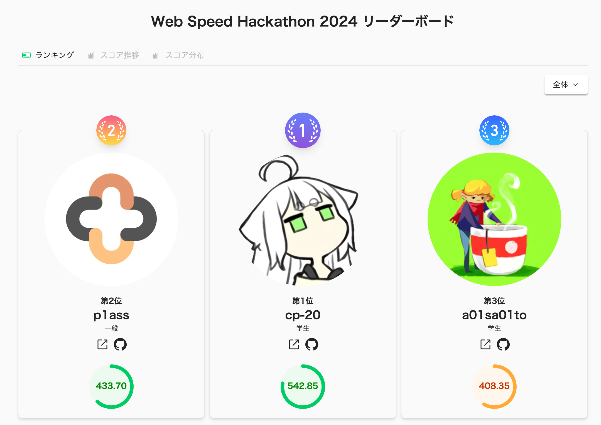

_abemaくんとトロフィー_

こんにちは、[@p1ass](https://twitter.com/p1ass)です。

先日、Web Speed Hackathon 2024 というイベントに参加しました。

<ExLinkCard url="https://cyberagent.connpass.com/event/300386/"/>


{/* <!--more--> */}

## Web Speed Hackathonとは?


[公式のconnpass](https://cyberagent.connpass.com/event/300386/)から引用します。

> Web Speed Hackathonとは、予め準備してあるWebアプリケーションのパフォーマンスを改善することで競い合うハッカソンです。
> 主にWeb技術（フロントエンドおよびNode.js）に関するチューニングを出題いたします。 表示に非常に時間がかかるサービスをどこまで高速化できるかを競います。

端的に言えば、**ISUCONのWebフロント版**です。
ISUCONは主にバックエンドのAPIなどWebサーバーのレスポンスを高速化することに主眼を置いています。
そのため、基本的にHTMLやCSS、JavaScriptはチューニングの対象外になっています。

一方で、Web Speed HackathonはWebブラウザの表示の高速化に主眼を置いています。
APIサーバーの高速化だけでなく、ブラウザのレンダリングの最適化やダウンロードするファイル容量の削減といったブラウザの表示に関するチューニングに競技性を持たせている点が特徴です。

## Web Speed Hackathon 2024のテーマ

今年の問題のテーマは **「漫画サイト」** でした。
すごくそれっぽい。


_トップページ_


_エピソード一覧ページ_


_漫画ビューワー_

## チューニング内容

ここまでWeb Speed Hackathonについて簡単に紹介してきました。
ここからは競技時間中に行った具体的な改善について紹介します。

詳細な実装はGitHubのリポジトリからコードを見れるので、気になる方はそちらを参照してください。

<ExLinkCard url="https://github.com/p1ass/web-speed-hackathon-2024"/>

また、スコア遷移は次のGitHub Issueから確認できます。

<ExLinkCard
    url="https://github.com/CyberAgentHack/web-speed-hackathon-2024-scoring-tool/issues/130"/>

### SQLite のテーブルにインデックスを貼る

「いきなりSQLかよ！」と思われるかもしれませんが、僕はバックエンド・インフラ領域が主戦場なソフトウェアエンジニアです。
そこで、「せっかくならバックエンドのコードから直そうかな〜」と思い、でバックエンドから改善していくことにしました。
(ISUCONでは、しっかりと計測してボトルネックを探してから改善にあたるのですが、今回はラフに！)

今回のコードベースでは、ORMとしてDrizzleが使われていました。


_Drizzle ORM_

<ExLinkCard url="https://orm.drizzle.team/"/>

Drizzleは初見でしたが、ドキュメントにインデックスの貼り方が書かれていたので、その通りに実装しました。
また、既存実装ではSQLiteのmigrationの仕組みが用意されていなかったので、合わせてmigrationを実行できるようにする対応も同時に行っています。

<ExLinkCard url="https://orm.drizzle.team/docs/indexes-constraints#indexes"/>

### API の呼び出し回数の最適化

開発環境でWebページを開くと無駄にAPIリクエストが飛んでいる様子が見て取れました。
よく見ると、クライアント・サーバー間でN+1問題が発生していました。

各コンポーネントごとにAPIを叩くのではなく、一括で取得した値をReactのPropsとして渡すことで、不必要にAPIを叩かないようにしました。

#### Before

```typescript jsx
type Props = {
  bookId: string;
};

const RankingCard: React.FC<Props> = ({ bookId }) => {
  // ここでAPI呼び出しが走るので、ランキングのBookの数だけAPIが呼び出されてしまう
  const { data: book } = useBook({ params: { bookId } });
  // ....
}
```

#### After

```typescript jsx
type Props = {
  book: Book;
};

// 親コンポーネントでランキングを一括で取得し、そのデータをこのコンポーネントに渡す
const RankingCard: React.FC<Props> = ({ book }) => {
  // ....
}
```

この例では `RankingCard` でしたが、他にも似たような実装になっているコンポーネントがあったので一緒に直しています。

### アセットの配信時にCache-Controlヘッダーをつけるようにする

今回のサーバーは [Hono](https://hono.dev/) を使って書かれていたのですが、そのカスタムミドルウェアで `Cache-Control` を常に `no-store` にするような実装が入っていました。

アセットや画像はキャッシュされて問題ないので、キャッシュして良い場合はキャッシュするような分岐を入れました。

```diff
export const cacheControlMiddleware = createMiddleware(async (c, next) => {
  await next();

+  if (c.req.path.includes("/assets")){
+    c.res.headers.append('Cache-Control', 'public, max-age=1000000');
+    return
  }
  c.res.headers.append('Cache-Control', 'private');
  c.res.headers.append('Cache-Control', 'no-store');
});
```

### 不要なWeb フォントの読み込みを消す

index.htmlでNoto Sans JPを読み込んでいたのですが、どこでも使われていなさそうだったのでバサッと削除しました。
(本当に使われていないのか自信ない😇)

### 意味もなく canvas を使っている部分をやめる

`useImage` フックのコードを見ると、画像URLを取得したあとになぜかcanvasを使って描画している箇所がありました。

競技中に具体的なコードは読み解かなかったのですが、コメントやUIを見る限り単に `object-fit: cover` 相当の表示をしているだけだったので、canvasの実装を全部消してCSSで表示を整えるようにしました。

<script
    src="https://emgithub.com/embed-v2.js?target=https%3A%2F%2Fgithub.com%2FCyberAgentHack%2Fweb-speed-hackathon-2024%2Fblob%2Fmain%2Fworkspaces%2Fapp%2Fsrc%2Ffoundation%2Fhooks%2FuseImage.ts%23L5-L46&style=atom-one-light&type=code&showLineNumbers=on&showFileMeta=on&showFullPath=on&showCopy=on"></script>

### 画像の WebP 化 & 適切ななサイズに事前リサイズ

今回の実装では、クエリパラメーターで指定されたサイズに画像をリサイズして返す実装が用意されていました。

<script
    src="https://emgithub.com/embed-v2.js?target=https%3A%2F%2Fgithub.com%2FCyberAgentHack%2Fweb-speed-hackathon-2024%2Fblob%2Fmain%2Fworkspaces%2Fserver%2Fsrc%2Froutes%2Fimage%2Findex.ts%23L109-L119&style=atom-one-light&type=code&showLineNumbers=on&showFileMeta=on&showFullPath=on&showCopy=on"></script>

しかし、画像のリアルタイム変換はCPU負荷もメモリ負荷も高いので、あらかじめ必要な画像を作成しておき、ランタイムではその画像をそのまま返すようにしました。
ついでにファイル形式をWebP(非可逆圧縮)にしています。

画像の変換スクリプトはChatGPTに作ってもらいました。

### ヒーロー画像が意味もなくdata-url形式で埋め込まれいたので、普通の画像として扱う

ヒーロー画像がdata-urlの文字列としてTypeScriptのコードに埋め込まれていました。
さらに、それをなぜかThree.jsを使って画像をレンダリングしていました。

<script
    src="https://emgithub.com/embed-v2.js?target=https%3A%2F%2Fgithub.com%2FCyberAgentHack%2Fweb-speed-hackathon-2024%2Fblob%2Fmain%2Fworkspaces%2Fapp%2Fsrc%2Fpages%2FTopPage%2Finternal%2FHeroImage.tsx%23L50-L70&style=atom-one-light&type=code&showLineNumbers=on&showFileMeta=on&showFullPath=on&showCopy=on"></script>

Three.js のコードが長々書かれていたのですがこんなことをする必要はないので、普通の画像タグ(``)で表示させるようにしました。
(未だにどういう実装なのか分かってない)

### 全てのレスポンスをzstdで圧縮をしていたのでやめる

よくよくコードを見ると、Service Workerで `fetch` リクエストをインターセプトして、独自の `zstdFetch` という関数を使うような実装が入っていました。
内容を読むと、全てのレスポンスをzstdで圧縮していることがわかりました。

#### クライアント側

<script
    src="https://emgithub.com/embed-v2.js?target=https%3A%2F%2Fgithub.com%2FCyberAgentHack%2Fweb-speed-hackathon-2024%2Fblob%2Fmain%2Fworkspaces%2Fclient%2Fsrc%2Fserviceworker%2FzstdFetch.ts%23L3-L33&style=atom-one-light&type=code&showLineNumbers=on&showFileMeta=on&showFullPath=on&showCopy=on"></script>

#### サーバー側

<script
    src="https://emgithub.com/embed-v2.js?target=https%3A%2F%2Fgithub.com%2FCyberAgentHack%2Fweb-speed-hackathon-2024%2Fblob%2Fmain%2Fworkspaces%2Fserver%2Fsrc%2Fmiddlewares%2FcompressMiddleware.ts%23L7-L26&style=atom-one-light&type=code&showLineNumbers=on&showFileMeta=on&showFullPath=on&showCopy=on"></script>

確かに、レスポンスを圧縮することでレスポンスサイズを削減することはできますが、ランタイムで毎回圧縮しているとCPUとメモリを消費します。
また、今回の競技用のサーバーは0.1vCPU、メモリが512MBとインスタンスタイプが非常に小さいので、圧縮処理がボトルネックになってしまいます。

そのため、zstd関連のコードは全部コメントアウトして消しました。

### クライアントのバンドルをViteに移行する

今回の初期実装のバンドラーはtsupでした。

<ExLinkCard url="https://github.com/egoist/tsup"/>

tsupはライブラリやサーバーのバンドルには便利ですが、バンドル結果をチャンク分割する機能がサポートされていませんでした。
(少なくとも今回のユースケースにおいては)

色々と悩んだのですが、最終的にクライアントのバンドルのみViteに移行し、チャンク分割をできるようにしました。

この移行作業はかなり難航しました。Bufferのポリフィルが必要だっだりと、Nodeのエコシステム関連のエラーに悩まされました。
普段業務でNodeを書くことはほどんどないので、知見もなく大変でした...。

最終的には次のような `vite.confg.ts` でビルドできるようになりました。(もっとシンプルに書けるかもしれません)

```typescript
export default defineConfig({
  build: {
    assetsDir: './',
    minify: 'esbuild',
    outDir: OUTPUT_DIR,
    rollupOptions: {
      plugins: [
        inject({
          "globalThis.Buffer": ["buffer", "Buffer"],
        }),
        visualizer(),
      ]
    },
    sourcemap: true,
    target: 'esnext',
  },
  define: {
    global: 'globalThis',
  },
  optimizeDeps: {
    esbuildOptions: {
      define: {
        global: 'globalThis'
      },
    }
  },
  plugins: [
    react(),
    nodePolyfills({
      globals: {
        Buffer: true,
      },
      include: ["buffer"],
    }),
  ],
});
```

### 利用規約など超長文のテキストを表示するコンポーネントをReact.lazyで読み込む

利用規約などのテキストがバカでかく、1 ~ 2MBありました。
既存実装では、これが `index.js` に含まれちゃっていてバンドルサイズが肥大化していました。

サーバーからAPIでデータを返す案と、React.lazyで読み込む案で悩んだのですが、Vite移行によって簡単にチャンク分割ができるようになったので、後者のやり方で対応しました。

### `@mui/icons-material` をnamed exportで読み込む

必要なファイルだけバンドルされるようにアイコンをnamed exportで読み込むようにしました。

### 内部遷移をReact RouterのLinkでやるようにする

既存実装ではaタグを使ってナビゲーションしていたのですが、クライアント側でやっても良くね？と思い、React RouterのLinkを使うようにしました。
これが正しかったのかはいまいち分かっていません。

### jitter を消す

サーバーの負荷を軽減するという名目で500ms以上のjitterが `fetch` に差さっていたのですが、これまでの改善でサーバーの負荷はかなり下がっていたので、まるっと削除しました。

<script
    src="https://emgithub.com/embed-v2.js?target=https%3A%2F%2Fgithub.com%2FCyberAgentHack%2Fweb-speed-hackathon-2024%2Fblob%2Fmain%2Fworkspaces%2Fclient%2Fsrc%2Fserviceworker%2Fjitter.ts%23L1-L3&style=atom-one-light&type=code&showLineNumbers=on&showFileMeta=on&showFullPath=on&showCopy=on"></script>

### いらないライブラリを消す

バンドルサイズがでかいライブラリ群を消して、素直な実装に置き換えました。
消したのは次のライブラリらです。

- moment-timezone
- magika
- unicode-collation-algorithm2

### 検索画面でユーザーの入力を少し待つようにする

ユーザーが1文字打つたびにAPIリクエストが飛んでいたので、数百ms待ってからAPIリクエストするようにしました。

### 世界の変化についていく必要はない

漫画ビューワーで世界の変化についていくために 2 \*\* 12 回のループが回っていたのですが、そんなに世界の変化に追従する必要はないので、ループ回数を減らしました。

<script
    src="https://emgithub.com/embed-v2.js?target=https%3A%2F%2Fgithub.com%2FCyberAgentHack%2Fweb-speed-hackathon-2024%2Fblob%2F1337939986070d89da3e28da82c441dcbe2a7625%2Fworkspaces%2Fapp%2Fsrc%2Ffeatures%2Fviewer%2Fcomponents%2FComicViewerCore.tsx%23L30-L35&style=atom-one-light&type=code&showLineNumbers=on&showFileMeta=on&showFullPath=on&showCopy=on"></script>

### ログイン画面の正規表現をやめる

ログイン画面の正規表現がクソ重いものになっていました。
ユーザー向けのメッセージを見る限り、単純な判定しかしなくて良さそうだったので、シンプルな実装に変更しました。

<script
    src="https://emgithub.com/embed-v2.js?target=https%3A%2F%2Fgithub.com%2FCyberAgentHack%2Fweb-speed-hackathon-2024%2Fblob%2F1337939986070d89da3e28da82c441dcbe2a7625%2Fworkspaces%2Fadmin%2Fsrc%2Fpages%2FAuthPage%2Finternal%2FLoginContent.tsx%23L20-L34&style=atom-one-light&type=code&showLineNumbers=on&showFileMeta=on&showFullPath=on&showCopy=on"></script>

#### 改善後の実装

```typescript
validationSchema: yup.object().shape({
  email: yup
    .string()
    .required('メールアドレスを入力してください')
    .test({
      message: 'メールアドレスには @ を含めてください',
      test: (v) => v.includes('@'),
    }),
  password: yup
    .string()
    .required('パスワードを入力してください')
    .test({
      message: 'パスワードには記号を含めてください',
      test: (v) => /[^a-zA-Z0-9]/.test(v),
    }),
```

### CLSの改善を試みようとするが諦める

CLSのスコアを上げるために、スケルトンを追加したり頑張っていたのですが、時間もあまり無かったて数カ所だけ改善して、作業を終えることにしました。

### 結果

最終スコアは次の通りです。

| テスト項目                    |            スコア |
|--------------------------|---------------:|
| [App] ホームを開く             | 70.35 / 100.00 |
| [App] 作者詳細を開く            | 74.10 / 100.00 |
| [App] 作品詳細を開く            | 64.15 / 100.00 |
| [App] エピソード詳細を開く         | 25.10 / 100.00 |
| [App] 作品を検索する            |  25.75 / 50.00 |
| [App] 漫画をスクロールして読む       |  50.00 / 50.00 |
| [App] 利用規約を開く            |  50.00 / 50.00 |
| [Admin] ログインする           |  49.25 / 50.00 |
| [Admin] 作品の情報を編集する       |   0.75 / 50.00 |
| [Admin] 作品に新しいエピソードを追加する |  24.25 / 50.00 |


**合計 433.70 / 700.00 （暫定 12 位）**

暫定結果では12位たっだのですが、結果発表時に上位勢がFAILしたため、繰り上げで2位となりました 🎉


_最終的なリーダーボード_

## 感想

### ISUCONと違って、無駄に複雑化しているものをシンプルな実装に戻すことが多かった

ISUCONでは、「シンプルに実装すると重くなっちゃうよね、さあどう工夫しようか？」と悩むことが多いと感じています。
一方で今回の問題は **「悪意を持って無駄に複雑になっているコードを読み解いて、本当の意図を理解し、どう簡単に実装しなおせるか」** という観点で問題に取り組んでいました。

あくまで傾向の話であり、一方が他方の傾向を持つ課題もあるのですが、ISUCONとは逆のメンタルモデルで問題を解いている気分になり、新鮮だな〜と感じました。

## 終わりに

Web Speed Hackathon 2024に参加しましたが、想像以上に楽しくことができました。
運営の方々本当にありがとうございました！
