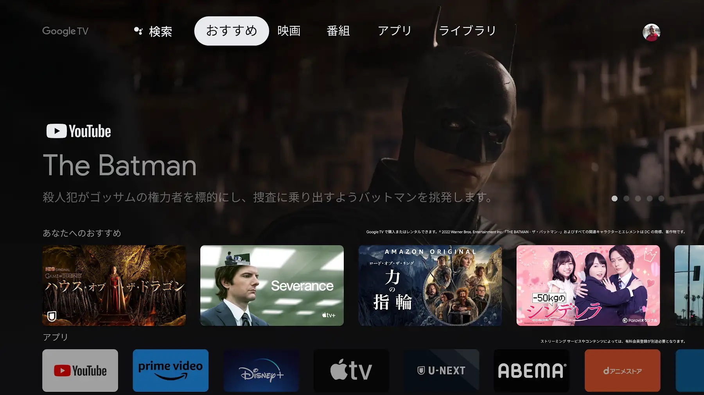
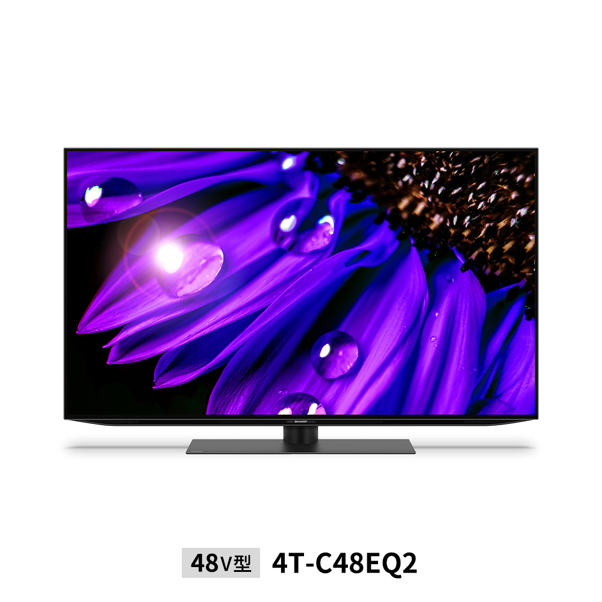
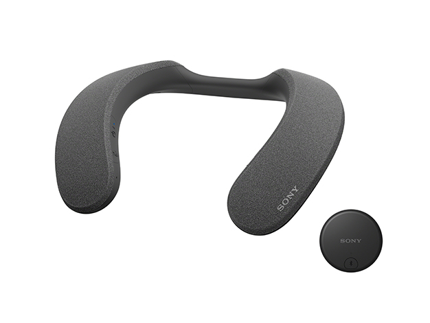
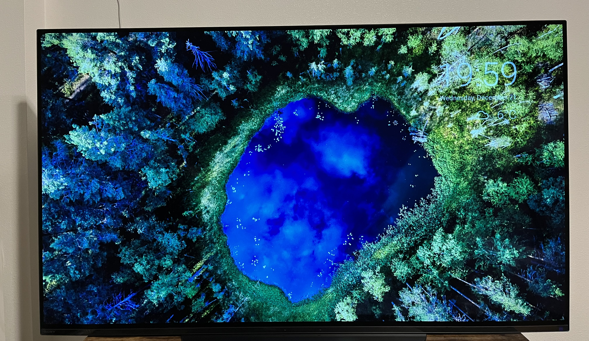
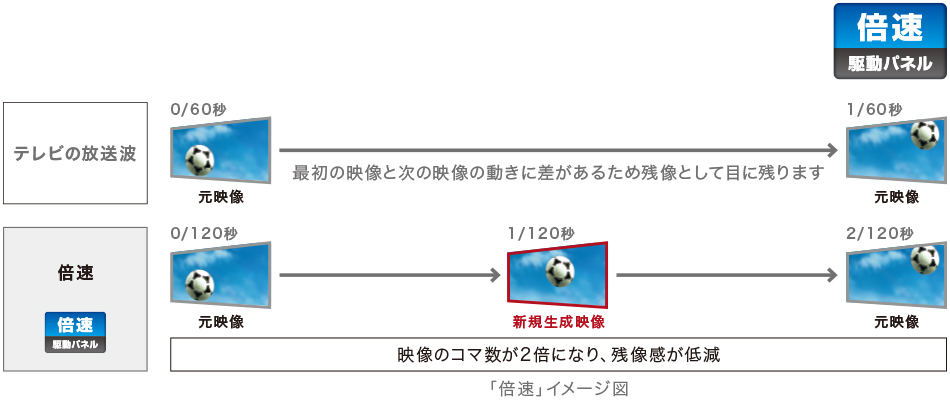
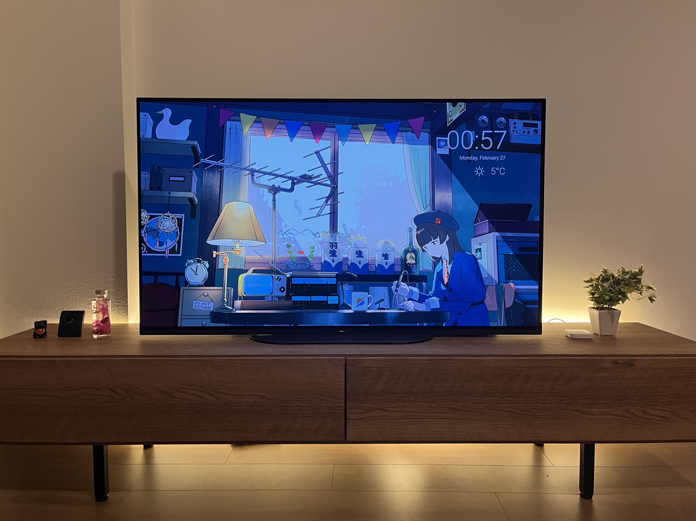

こんにちは、[@p1ass](https://twitter.com/p1ass)です。

タイトルの通り、数ヶ月前に有機 EL テレビを買いました。
高い買い物でしたが、非常に満足しています！
このブログでは、テレビを買った経緯や使い心地、テレビを買うために調べたことなどを紹介します。

{/* <!--more--> */}

## テレビを買った経緯

テレビを購入しようと思ったきっかけは引っ越しでした。

私は大学時代から数ヶ月前まで 6 年近く、ずっと 1K の賃貸で暮らしていました。
6 ~ 8 畳しかない小さい部屋に、ベッドや仕事用のデスクなど全てを詰め込むと、テレビを置くスペースはあまりありません。
**狭い部屋では本当に必要なものしか置きづらい**のです。
そのため、テレビを積極的に購入しようと思うことはありませんでした。

しかし、この状況は引っ越したことで大きく変わりました。
部屋数が増えたことで、デスクやベッドが置いてある部屋とは別に、リビング用の部屋が作れるようになりました。
リビングができるということは、今までは余裕がなくて作れなかった、**くつろぐ空間・リラックスできる空間**を作れるようになります。
実際に引っ越してみたところ、ソファやテレビを置く余裕がありそうだということが分かり、テレビの購入を検討することになりました。

## 買うテレビを決める

### テレビに求めているものを言語化する

テレビを買うことにしたので、買うテレビの機種を選ばなければなりません。
テレビはピンキリで沢山の機種が存在するので、闇雲に探しても時間を消費するだけです。
そこで、まずはテレビに求めている条件を洗い出すことにしました。

最初に書いたように、テレビを買う目的は「くつろぐ空間をつくること」です。そのため、単純に映像が見れれば良いというわけではなく、その**クオリティ**にもこだわりたいです。
テレビのクオリティを測るベクトルはいくつかありますが、テレビならやはり画質でしょう。
元々映画を結構な頻度で見ますし、シアターの種類を選択できる場合は IMAX や Dolby Cinema を積極的に選ぶタイプです。
そこで、**液晶テレビよりも画質が良い有機 EL テレビ** をメインの候補とすることにしました。

また、テレビを選ぶ上でその大きさも重要です。
有機 EL テレビの大きさは液晶テレビよりも限られていて、55 インチが最も多く、下は 48・42 インチと続きます。
部屋のサイズを考えると、**48 インチ(横幅が 100cm ちょい)** が丁度よいサイズ感そうでした。

その他の細かい点でいくと、**Google TV** が載っていると嬉しいです。
Android ベースなので Google Play ストアで配信されている好きなアプリをインストールすることができます。
また、家全体が Google Home で IoT 化されているので、Google アシスタントがついている Google TV だと相性が良いです。

_Google TV (公式サイトより)_

以上をまとめると、テレビに求めているものは次のようになりました。

- **目的**: くつろいでリラックスできる空間を作ること
- **種類**: 有機 EL テレビ
- **大きさ**: 48 インチ
- **OS**: Google TV

### 候補の TV を調べる

ある程度要件がまとまったので、条件にあったテレビを探します。
有機 EL テレビ・48 インチのものを価格.com で調べつつ Notion に候補をまとめていきました。

_Notion にまとめたテレビ候補 (1 つだけ違うサイズが混ざっていた)_

調べた結果、次の 5 つまで絞り込みました。

- [TVS REGZA 48X8900L](https://www.regza.com/tv/lineup/x8900l)
- [Panasonic VIERA TH-48LZ1800](https://panasonic.jp/viera/products/lz1800.html)
- [LG OLED48C2PJA](https://www.lg.com/jp/tv/lg-oled48c2pja)
- [SHARP AQUOS OLED 4T-C48EQ2](https://jp.sharp/aquos/products/eq1/?prod-variation=48v)
- [SONY BRAVIA XRJ-48A90K](https://www.sony.jp/bravia/products/XRJ-A90K/)

なお、価格.com には型落ちのモデルも掲載されていますが、家電量販店での購入を前提としていたため、在庫がないことが考えられる型落ちモデルは省いています。

_価格情報も同時に調査_

また、調査のタイミングで各種ネット通販の価格も調べました。
調べて初めて知ったのですが、**ポイント還元などを加味すると、家電量販店の通販価格は横並び**のようです。
家電量販店ごとの差をつけるには、保証などの付帯サービスや現地での値引き交渉で差を付ける必要がありそうです。

これらの調査を元に、それぞれのテレビの特徴を調べました。調査時点で Google TV が搭載されているのは、次の 2 機種であることが分かりました。

- SONY BRAVIA XRJ-48A90K
- SHARP AQUOS OLED 4T-C48EQ2

_SONY BRAVIA XRJ-48A90K (公式サイトより)_

_SHARP AQUOS OLED 4T-C48EQ2 (公式サイトより)_

その中でも SONY BRAVIA XRJ-48A90K は [BRAVIA CORE](https://www.sony.jp/bravia/bravia-core/) による映画コンテンツが楽しめる点や Apple AirPlay で Mac の画面をテレビに映せる点がメリットに感じました。
最終的には家電量販店で実物を見てみないことにはわかりませんが、調査段階では「BRAVIA 欲しいな〜」となっていました。

## 良い家電を安く買うために

高い買い物をするわけなので、どうせなら良い家電を安く買いたいです。
そのための細かい TIPS を調べることにしました。

### 価格が安くなる時期

日本の大型家電の多くは時間の経過と共に価格が下落します。
家電は 1 年ごとにモデルチェンジが行われることが多いので、**新製品が出る 5・6 月に型落ちの商品を狙う**と良いようです。
今回は型落ちまで待つほどではないと判断し、特に気にしないことにしました。

{/*{<ex-link url="https://total-myhouse.com/otoku/okaidoku-ziki/">}*/}

また、セールの時期もチェックすると良いようです。
家電量販店の大きいセールは、決算セールとボーナス時期のセール、年末年始のセールです。
今回は 12 月末の冬のボーナス・年末セールを狙うことにしました。

{/*{<ex-link url="https://total-myhouse.com/camera-av/tv-recorder/tv-yasuiziki/">}*/}

ミクロな視点だと、**家電量販店に行くのは平日よりも土日の方が良い**ようです。
なんとなくの体感をお持ちの方も多いかと思いますが、土日の方が店側の気合が入っています。
積極的な接客や値引き交渉をしやすいらしいので、私は日曜日に行くことにしました。

### 家電量販店ごとの保証の差を意識する

家電量販店ごとに保証サービスは大きく異なります。
基本的に都市型の店舗 (ヨドバシカメラ・ビックカメラ)が弱く、郊外型の店舗 (ヤマダデンキ・ケーズデンキ)の方がサービスが手厚いです。

テレビぐらいの価格帯になってくると都市型の店舗でも保証料が無料になる商品が多いので、かかる費用の差は小さくなってきますが、内容は全く異なるので注意しましょう。
少なくともヨドバシカメラでは買わないほうが良さそうです。

<iframe width="100%" height="100%" src="https://www.youtube.com/embed/dzM24PM2A1Q" title="YouTube video player" frameborder="0" allow="accelerometer; autoplay; clipboard-write; encrypted-media; gyroscope; picture-in-picture; web-share" allowfullscreen style="aspect-ratio: 16 / 9;"></iframe>

## いざ家電量販店へ、そして購入

ある程度調査しきったタイミングで家電量販店へ向かいました。
SONY BRAVIA XRJ-48A90K の値札を見てみると、274,800 円のようです。ポイントを加味すると**実質 247,320 円**でした。

_SONY BRAVIA XRJ-48A90K の値札_

価格.com の最安値が 225,000 円だったので「ちょっと高いかな〜」と思いながら見ていると、SONY から来たと思われる販売員の方に声をかけられ、**「税込みで約 23 万円まで下げられますよ」** とのこと。
こちらから値下げ交渉の話をしていないのに値段を下げてきてくれました。
話を聞いたところ、前日(土曜)に来た客が価格交渉をしていて、その値段まで値切っていたようです。
その週であれば同じ値段で売っても良いとのこと。
「土日の方が良い」という事前調査がクリティカルヒットした瞬間でした。

この時点で、**ポイントを加味すると価格.com の最安値より安くなる**というバグった価格設定で、かなりアリだなという印象です。
実物を見たり触ったりしましたが、画質も体験も良かったのでこのテレビを買う方針で価格交渉することにしました。
「予算が 20 万なので 20 万切ったら嬉しいなぁ〜」という形で交渉したところ、

- ポイント還元: **10% → 13%**
- クレジットカード利用によるポイント還元の減少: **-2% → 0%**

に落ち着き、**実質 195,100 円** で購入できました。(最初の声掛けから色々と説明を聞いて 1 時間弱経過していた)

また、おまけに SONY のネックスピーカーである [SRS-NS7](https://www.sony.jp/active-speaker/products/SRS-NS7/) を無料でいただきました。
レシートを確認すると、TV・スピーカー同時購入キャンペーンによる割引が書かれており、この割引を使うために配布しているようでした。
家電の割引スキームは難しい。

_SRS-NS7 (公式サイトより)_

## テレビの良い点

### めちゃくちゃ画質がきれい

期待していた通り、画質はめちゃくちゃきれいです。
4K の液晶モニターも持っていますが、比較しても発色が良く鮮やかです。

4K の映像がきれいなのはもちろんですが、4K ではない普通の FHD の映像もきれいに見えます。
[4K アップスケーリング機能](https://www.sony.jp/bravia/products/XRJ-A90K/feature_1.html)が搭載されているので、YouTube やアニメの映像も繊細です。
同じソースでもこんなに違うんだ...」ってなりました。

_発色のきれいさを写真に収めるのが難しい_

### 倍速駆動でヌルヌル動く

今回買ったテレビは倍速駆動と呼ばれる機能が搭載されています。
この機能は、コマとコマの間の画像を生成することで 120fps で映像を表示する機能です。
120fps まで上がるのでめっちゃヌルヌルになります。
ダンス系の MV なんかを見るとよく分かります。

_倍速駆動 (公式サイトより)_

### テレビを Atmoph Window のように使える

今回購入したテレビには、テレビの大画面を大きなフォトフレームや時計として使える便利アプリである「リビングデコ」が搭載されています。
この機能はスクリーンセーバーのように、テレビを操作していないときに自動で起動するので、Atmoph Window のように素敵な景色を楽しむことができます。

また、YouTube で配信されている Chill ミュージックのラジオである [サクラビーツ](https://www.youtube.com/watch?v=hH6sHhSgEsc) もリビングデコに対応しているので、リビングを心地よい空間にする役割も担ってくれます。

_サクラビーツ_

### 自宅で映像コンテンツを見る回数が増えた

これはテレビそのものの良さというより、テレビを買ったことによる生活の変化なのですが、自宅で映像コンテンツを楽しむ機会が増えました。
逆に PC デスクの前にいる時間は減りました。

## 微妙だった点

### ゲームモードでも、ほんの少しだけ遅延を感じる

Splatoon3 をテレビでやっていると、液晶モニターでプレイするときに比べてほんの少しだけ遅延を感じます。
プレイに支障が出るほどではないですが、予め注意しておいた方が良いでしょう。
(そもそもシューティングゲームをテレビでやるのが間違っている)

TVS の REGZA はゲームモードに力を入れているらしいので、テレビでゲームをしたい方は REGZA を狙ってみるのも良いかと思います。

{/*{<ex-link url="https://www.regza.com/charm/tv-game">}*/}

### テレビの設置は頼んだ方が良い

購入時にテレビの設置を依頼することもできましたが、有料なので自分で設置することにしました。
設置自体は 2 人で行ったのでなんとかなりましたが、残ったダンボールや発泡スチロールの処分がだるかったです。
余裕があるなら設置を依頼した方が良さそうです。(1 人なら尚更)

_届いたテレビ (でかい)_

## 終わりに

テレビを買って不満に思ったことは一度もなくとても満足しています。
今どきのテレビは地上波を一切見ない人でも意味のあるものとして設計されているので、ネットの映像コンテンツを頻繁に見る人は購入を検討してみてはいかがでしょうか？
