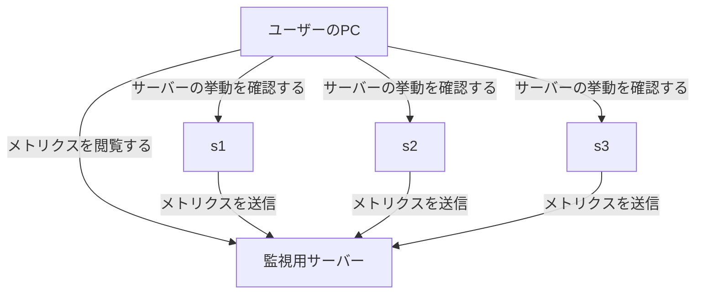
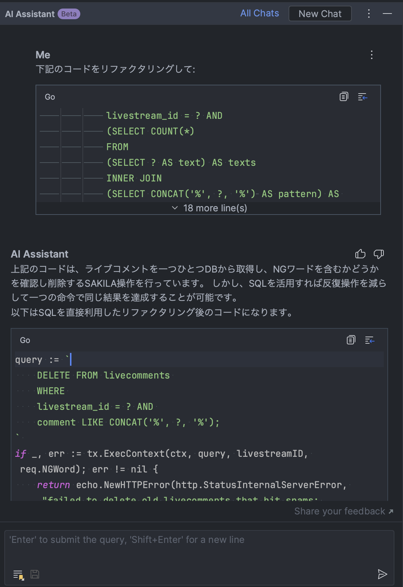

こんにちは、[@p1ass](https://twitter.com/p1ass) です。

去年に引き続き、 [@km_conner](https://twitter.com/km_conner) と [@atrn0](https://twitter.com/atrn0) と一緒にチーム「釜中の鯖」として ISUCON13 に参加しました。
結果は**187,577 点で総合 4 位**になりました。わいわい 🙌


_4 位 187,577 　釜中の鯖_

{/* <!--more--> */}

## 今年新たに導入した文明の利器

毎年 ISUCON に参加している我々ですが、ISUCON で使うツール群はあまりアップデートされていませんでした。
しかし、時代は移り変わり、世の中には便利なツールがたくさん増えていたようです。
そこで、今年から新たに 3 つのツールを導入して ISUCON に挑むことにしました。

### Tailscale

[Tailscale](https://tailscale.com/)は Wireguard プロトコルを使った VPN SaaS です。
Tailscale を使うとほんの少しの設定だけで Mac や Linux、Docker コンテナといった様々なデバイスやリソースを VPN に追加することができます。

我々のチームでは、

- メンバーのローカル PC
- 競技用インスタンス
- 自前で用意した監視用サーバー

を VPN に接続し、相互に通信できるようにしました。



このような構成にすることにより、手元の PC から競技用インスタンスの Nginx を開いたり、MySQL サーバーに接続したりできるようになります。
(事前に `bind-address`を変更しています)

今年初めて使いましたが、SSH でポートフォワーディングする手間もなく全てののポートにアクセスして色々挙動を確かめられて便利でした。
提案してくれた@atrn0、ありがとう。

### GitHub Copilot・JetBrains AI Assistant

トレンドには乗っかろうの精神で、LLM 系のツールを導入しました。
GitHub Copilot は言わずもながですが、加えて[JetBrains AI Assistant](https://blog.jetbrains.com/ja/idea/2023/06/ai-assistant-in-jetbrains-ides/)も使ってみました。

<ExLinkCard url="https://blog.jetbrains.com/ja/idea/2023/06/ai-assistant-in-jetbrains-ides/" />

JetBrains AI Assistant はちょうどよいタイミングで早期プレビューの案内が来たこと、JetBrain IDE で GitHub Copilot Chat を使えなかったことを加味して利用を決めました。
(プレビュー段階であるためチームメンバー全員が使えたわけではなかったです)

コードの概要説明やリファクタリングの示唆を貰うための手段として有用でしたが、使いこなせたかというと正直微妙でした...。
頭で考えていることをそのままダンプしてくれる GitHub Copilot の方が便利だと感じました。


_JetBrains AI Assistant に「NG ワードを含むコメント削除の実装のリファクタリング」を任せてみた様子_

### OpenTelemetry

ISUCON では「推測するな、計測せよ。」という格言が広く知られています。
我々もその格言にのっとり、HTTP ログやスローログをもとにパフォーマンスの改善点を発見してします。

しかし、今までのフローでは「推測」してしまっている部分がありました。
HTTP ログを集計し、改善対象となる EP を特定したとしても、**アプリケーションコードのどの部分を改善すべきか？** という点は推測するしかありませんでした。

そこで今年から OpenTelemetry を用いたトレーシングを導入し、ある EP においてどの部分にどれだけ時間がかかっているか可視化できるようにしました。
集計したデータは Tailscale の VPN を通じ監視用サーバーに送られ、そこに立っている[Jaeger](https://github.com/jaegertracing/jaeger)の UI を用いて分析しています。
Tailscale のおかげで競技用インスタンスに色々準備する必要がなくて楽ちんでした。


_fillLivestreamResponse が N 回呼ばれている様子_


_発行されている SQL も確認できる_

トレースはチームメンバーにも好評でした。
HTTP ログやスローログは良くも悪くも統計データとして丸められてしまいます。
一方で、トレースデータは 1 リクエストごとに細かく記録されているため、あるリクエストでどのような処理が走っているのかを詳細に確認できます。
統計データを用いて改善対象を見定め、トレースデータを用いて改善対象の箇所を特定するという使い分けをするのが良さそうです。

## 競技中に行った改善

さて、ここからは競技中に行った改善について紹介します。
当日のコードは GitHub で公開しています。

<ExLinkCard url="https://github.com/saba-in-the-kettle/isucon13" />

### 10:51 App 用の MySQL を 2 台目に移行 (5,333 点)

我々のチームでは、アプリケーションサーバーと MySQL は初動で必ず分離するという方針をとっています。
その方針にのっとり、今年も初手から MySQL を分離しました。

### 11:02 fillLivestreamResponse の N+1 を解消 (7,188 点)

`livestream_tags` と `tags` を JOIN して取ってくるようにしました。

### 11:08 search の N+1 を一部解消 (7,447 点)

`livestreams` を `WHERE IN` で取ってくるようにしました。
ついでにいくつかのインデックスを貼ってます。

### 11:12 MySQL と Nginx の設定に秘伝のタレを追加 (7,212 点)

いつも入れている設定を流し込みました。

### 11:35 `fillLivestreamResponse` と `fillUserResponse` のバルクバージョンを用意 (7,993 点)

search EP を見ていく中で、これらの関数はループ内で何度も呼ばれていることがトレースから分かっていました。
そこで、複数の ID を渡すと一度に全てのデータを取ってくる関数を用意し、そちらに乗り換えることにしました。

### 11:39 コメント取得 API の N+1 を解消 (10,034 点)

コメントの取得の N+1 を改善しました。

### 12:22 icon のハッシュ計算を icon 投稿時に行うようにする (19,325 点)

pprof を見ると、icon のハッシュ計算で CPU を食っていることが分かりました。
icon のハッシュ値は一度計算したあとは変わらないので、icon 投稿時に計算して DB に保存しておくことにしました。

### 12:54 N+1 を修正したときに埋め込んだバグを修正

ユーザーとテーマとアイコンを一気に取ってくるために次のような構造体を用意していました。

```go
type UserAndIconAndTheme struct {
  UserModel
  // Theme
  ID        int64          `db:"theme_id"`
  DarkMode  bool           `db:"dark_mode"`
  // Icon
  ImageHash sql.NullString `db:"image_hash"`
}
```

ベンチは通っていたので最初気づかなかったのですが、後々おかしい挙動をしていると報告を受けました。
原因を調べてみると、`UserModel` にも `ID` が含まれていたため、 `ID` フィールドが重複してしまっていたのです。
そのため、 `&UserAndIconAndTheme{}.ID` としたときにユーザー ID ではなくテーマ ID が返ってきてしまっていました。

ここでかなりの時間を使っちゃいました...。
埋め込みはバグらせがちだから注意しましょう！

### 13:29 リアクション取得 API の N+1 を解消 (24,412 点)

最初はそこまで重くなかったリアクション系の API が HTTP ログの上位に上がってきたので対応しました。

### 14:28 PowerDNS をやめてアプリケーションサーバーで DNS を解決するようにする (26,685 点)

PowerDNS が使う MySQL の負荷がずっと高いと話題になっていました。
そこで、お昼を食べながら@KMConner に「いい感じにしといて」くらいの雑フリをしといたら、MySQL を全く使わない形で書き直してくれました。

途中途中で実装方針の説明を受けていたのですが、DNS の仕組みをあまり知らないので「良い感じになるならそれでいいや」くらいの返事をしていました。
後々実装を読んだのですが、miekg/dns という OSS を使って自前で DNS サーバーを実装していました。すごい。

<ExLinkCard url="https://github.com/miekg/dns" />

### 15:35 NG ワードのチェックを Go でやる (25,261 点)

NG ワードのチェックを LIKE を使ってやっていましたが、アプリケーションで実装できそうだなと思い、Go で実装し直しました。
あまり点数が伸びていませんが、N+1 が残っていて、後半で改善したときに点数が伸びています。

### 15:52 貼られていないインデックスがあったので貼る (31,553 点)

今年の問題はインデックスがほとんどありませんでした。
気づいたタイミングで随時貼っていたのですが、まだまだあったようです。

### 15:59 統計情報の N+1 を一部改善 (35,046 点)

スローログの大半を統計 EP で使わているクエリが締めていました。
N+1 でクエリが発行されていたので、一部改善しました。

### 16:04 GOGC やファイルディスクリプタの調整 (40,800 点)

このあたりから pprof に GC に関するフレームグラフが出てくるようになりました。
忘れないうちに設定値を変更しています。

### 16:35 icon を Nginx から配信する (54,047 点)

この時点で pprof のフレームグラフを見ていると、icon の配信がボトルネックになっていることが分かりました。
そこで、icon の配信をアプリケーションから Nginx に移しました。

この実装は元々僕がやっていたのですが途中で投げ出してしまい、@KMConner が引き継いでくれました。ありがとう。

### 16:53 DNS 関係の EP とそれ以外の EP を別インスタンスでホスティングする (65,663 点)

DNS サーバーをアプリケーションで実装したことで、DNS 水責め攻撃の負荷が上がり、かなりの CPU を食っていました。
現時点で 3 台目の用途がなかったので、そこに DNS に関係のない普通の EP を移しました。

### 17:09 統計情報の残りの N+1 を解消 (143,119 点)

統計情報の残りの N+1 がスロークエリの上位を占めていたので解消しました。
ここで一気にスコアが爆上がりしました。めちゃめちゃ熱い展開。

### 17:?? 再起動試験

この辺で再起動試験をしておきます。
去年の二の舞いにならないように、UI 上での動作確認も行いました。

だた、UI ではなぜか動かない機能が多く「初期実装が悪いのか、俺らが悪いのか...?」と頭を悩ませていました。
感想を見ているとどうやら初期実装の不具合のようでした。良かった...。

### 17:43 ログや計測系のツールを消す (186,373 点)

諸々のログを削除しました。4 万点もあがってラッキー。

### 17:53 MySQL のパラメータを調整 (187,577 点)

最後のあがきで MySQL のパラメータを少し調整しました。

ここで競技終了です！

## 感想

我々のチームは去年の ISUCON12 本選で FAIL という無念の結果で終わってしまったため、今年は最低でもスコアを残そうと思っていましたが、その目標は無事達成できました。

また、4 位という上位のスコアを取れたのも素直に嬉しいです。
競技前にチームメンバーから言われていた「目指すは優勝」を達成できなかった悔しさもありますが、それでも十分すぎる好順位でした。

## 来年にむけて

ここまで来たので、**目指すべきは優勝**しかありません！
ただ、NaruseJun が強すぎるので優勝の糸口は全く見えていません。来年に向けてゆっくり策を考えようと思います。

## 終わりに

毎年になりますが、ISUCON の作問や運営に携われた方々のお陰により、ISUCON というお祭りを楽しむことができました。
本当にありがとうございました！！
