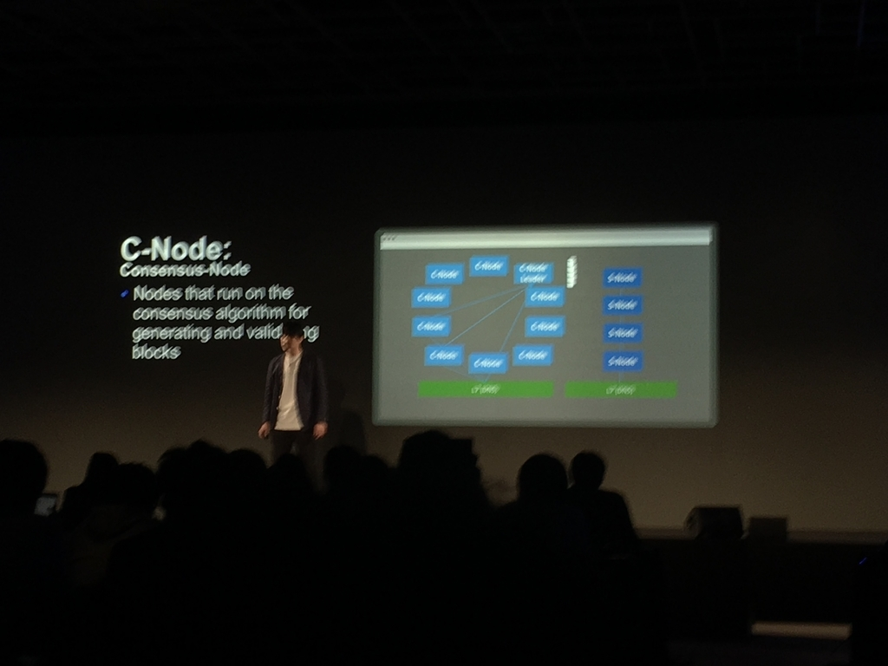
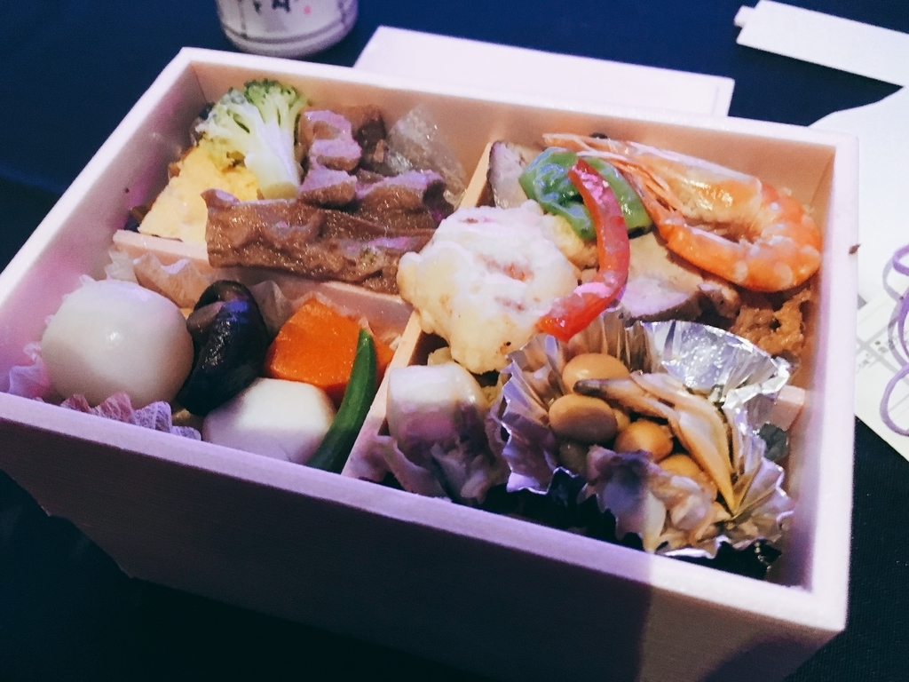
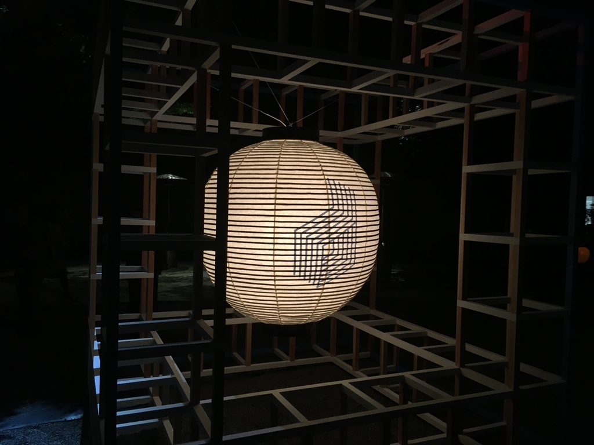

## LINE DEVELOPER DAY 2018 参加してきました

2018 年 11 月 21 日、八芳園で開催された LINE DEVELOPER DAY 2018 に参加してきました！

以前にも LINE Developer Meetup や他社さんの勉強会等に参加したことはあったのですが、ここまで大きなイベントに参加したことはなかったので、面白かったトピックを抜き出して紹介しようと思います。

~~私は時間の都合で懇親会に参加できなかったので、帰りの新幹線の中で泣きながら書いてます。~~

{/* <!--more--> */}

## LINE DEVELOPER DAY とは

{/*{<ex-link url="https://linedevday.linecorp.com/jp/2018/" >}*/}

> 「LINE DEVELOPER DAY」は、コミュニケーションアプリ「LINE」をはじめ、当社が運営する様々なサービスの技術領域でのチャレンジや取り組みなどをご紹介するエンジニア向け技術カンファレンスです。
> 今年は、「Next LINE」をコンセプトに、当社が投資する新たな技術領域におけるチャレンジや、それを支える LINE のエンジニアの技術的知見や経験、挑戦などを通して、当社が目指すビジョンをご紹介いたします。

公式サイトに書かれている通り、LINE が現在取り組んでいるサービスや技術などを紹介する大きなカンファレンスです。

以前はヒカリエで開催されていたそうですが、今年は場所を変えて八芳園で開催されました。

## 面白かったセッション

ここからは自分が聞いたセッションの中で面白かったのをピックアップして紹介したいと思います。

### 実演：LINE API 新機能の総まとめ＆新機能全部入りの chat bot デモンストレーション

こちらのセッションは、福岡市の粗大ゴミ回収に使える LINE Bot を例に chat bot の機能をユーサー側・デベロッパー側から解説するというものでした。

タイトルにインパクトがあることもあり、会場は満員御礼で立ち見が出るほど人気のセッションでした。

私は Flex Messsage や LIFF (LINE Frontend Framework)を触ったことがない人間なので、とても参考になりました。

### "Clova Inside" の裏側 -いつでもどこでもサポートしてくれる自然言語理解の仕組み

次は Clova の音声認識についてのセッションです。
人間が話した言葉を Clova はどのように解釈しているのかという点について話されていました。

特に Clova の自然言語理解は 5 つの属性によって判別してるという話は印象に残りました。

- Domain
- Intention
- Main Goal
- Place
- Time

### LINE サマーインターンシップの舞台裏と狙い

こちらはカフェで開催された LT になります。

私は夏に LINE のサマーインターンシップエンジニアスクールコースに参加させていただいたので、どういった経緯でインターンシップが開催されているか気になったので聞いてきました。

インターンシップに参加できるのは上位数%だとか、技術テストで 8~9 割のテストケースを通さないとパスできないという話を聞いて、「よく受かったな俺」という気持ちになりました。

### ホワイトペーパーに書いていない LINE Token Economy の裏側

最後は Blockchain 関連のセッションです。

最初の Keynote で、「LINE は AI と Blockchain」に力を入れていくと話しており、このセッションも濃い内容となっていました。

LINE が作るプライベートブロックチェーンである LINK Chain やそのコンセンサスノード、コンセンサスアルゴリズムについても詳細に語られていました。

(写真が見にくいのはごめんなさい、、、）

## まとめ

初めて大規模なカンファレンスに参加しましたが、普段の勉強会とは異なる濃いセッションを多く聞けてよかったです。
LINE が今後どういったものに投資していくのか、どういった技術を使っていくのかということをよく知ることができました。
また機会があれば、他のカンファレンス等にも参加してみたいと思います。

~~(懇親会の寿司食べたかったなぁ〜)~~

_入館証_

_お弁当_

_八芳園のエモさ_

_LINE Dev Day_
