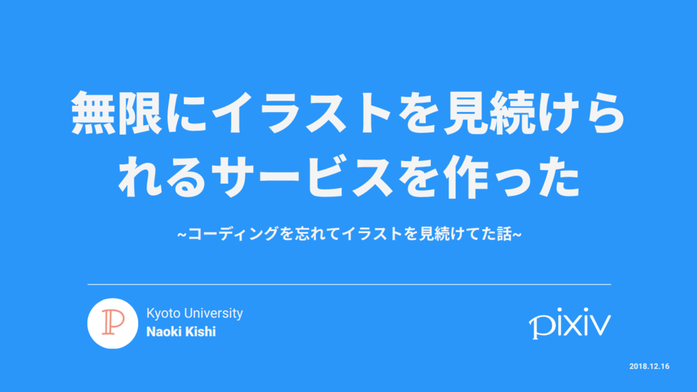
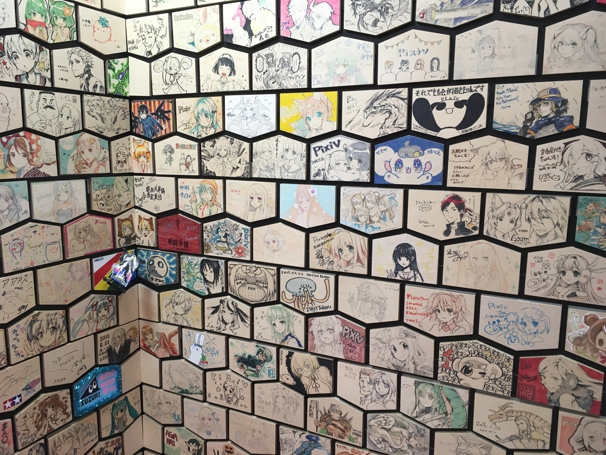
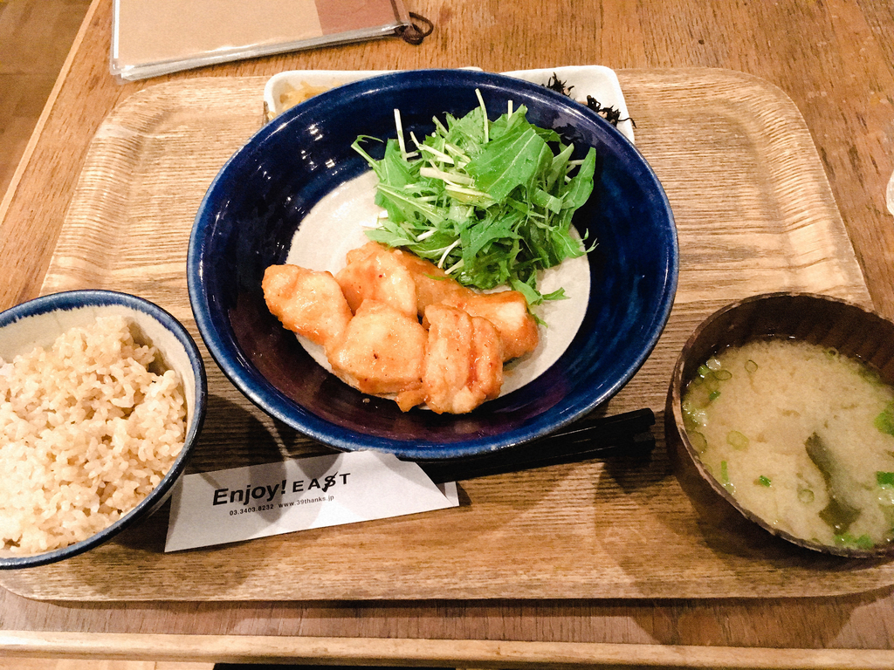
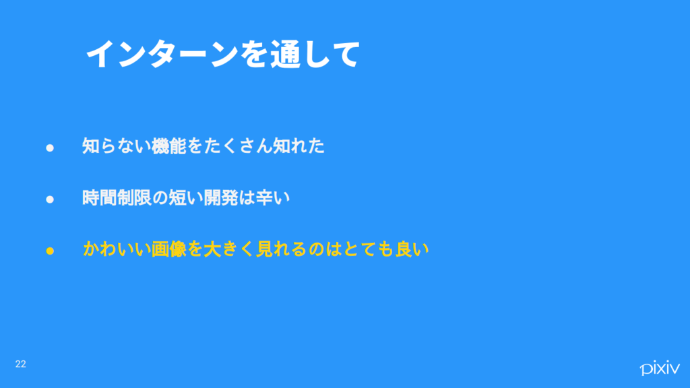
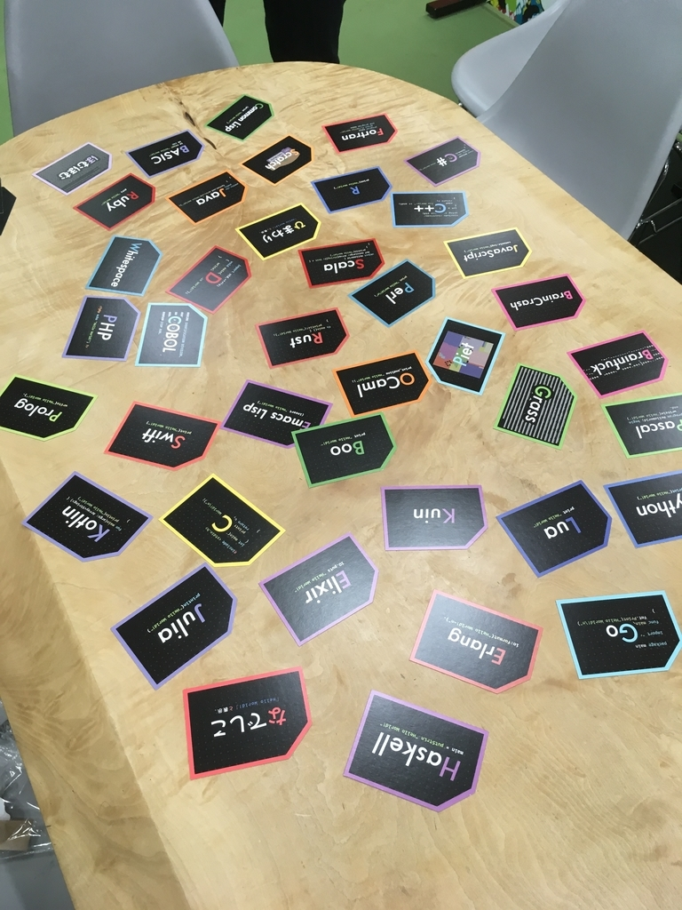

こんにちは、ぷらす([@p1ass](https://twitter.com/p1ass))です。

この度、pixiv さんの 2018 年冬インターンシップ **「君だけの pixiv を開発（つく）れ！」** 参加させていただきました！

今回のような **ハッカソン形式のイベントには参加したことがなかった** ですが、とても勉強になる 2 日間となりました。

このブログでは、インターンへの応募から、インターン最終日までの出来事をつらつら書いていこうと思います。

{/* <!--more--> */}

_インターン最終日の成果発表のタイトルスライド_

_告知サイト_

## 作ったもの

先に今回のインターンで作ったものを紹介したいと思います。

今回作ったサービスは **「marshiv」**です。これは「沼(marsh)」x「pixiv」の造語で、ユーザーを**pixiv のイラスト沼に落とし込めよう** いう意味が込められています 💪

_ビューワー(著作権の関係でいらすとやを使っています)_

_画像をクリックしたときのモーダル_

marshiv には以下の機能を実装しました。

- レンガブロックスタイルのイラストビューワー
- 遅延読み込みを用いた無限スクロール
- 週間ランキングの上位作品を過去に遡って表示
- 各ユーザーの投稿イラスト一覧
- タグ検索と、**関連するタグを用いた疑似レコメンドシステム**

完全に **自分が使いたい** うに作ったので、非常に満足できるものを作り上げることができました。
~~動作チェックと言いながら、イラストに魅入ってたのは内緒。~~

## 応募〜前日まで

### 応募のきっかけ

今回のインターンは Twitter のタイムラインに流れてきた告知のツイートを見て知りました。

丁度、 **「どこかのインターンに行きたいなぁ」** 思っていたところだったので、すぐにチェックしました。
こういったインターンは学部 3 回生以上のみで、学部 2 回だと参加条件に満たないことが多いです。
しかし、今回のインターンは **学部 2 回**でも参加でき、その記述を見た時は**「よっしゃ行けるやん！」** 言ってしまいました。

{/* {<twitter url="https://twitter.com/pixiv_corp/status/1061820244526682114" >} */}

さて、今回のインターンの内容は次のようなものでした。

> このインターンでは、「pixiv」の Web・アプリケーションで実際に利用している技術を使用し、参加者自身の考える **最高** イラストコミュニケーションサービスをメンターと一緒に作り、その順位を競って頂きます。ピクシブが持つサービスを日々開発しているエンジニアがメンターになりますので、全く同じ目線でリアルなプロダクト開発を体験してください。

> ([告知サイト](https://recruit.pixiv.net/intern/tech/)より引用)

コースとしては、 **「Web 開発」**と**「アプリ開発」** あり、自分に合ったコース(メンター)を選んで応募する方式でした。
私は最近フロントエンド開発をやっていたので、 **「Web 開発」コース** 選択することにしました。

選考には、 **「通常選考」**と**「GitHub 選考」** ありましたが、GitHub だけで通る自信がなかったので、通常選考で申し込みました。
エントリーフォームの内容はエンジニア系のインターンでよく聞かれることが多かったです。
自分の作った作品等の欄には[「ポートフォリオサイト」](https://p1ass.github.io)や[「えもじっく」](https://emojic.ch) などを書きました。

{/* {<twitter url="https://twitter.com/p1ass/status/1063430022151557120" >} */}

### 面接

エントリーをしてから数日経つと、 **書類選考をパスした旨** 連絡をいただきました 🎉

その数日後にはビデオ面接を行いました。
面接の内容に関してあまり詳しいことは書けないですが、エントリーシートに書いたことなどを聞かれました。
私は結構 **喋りたがりの人間** ので、面接官の質問に対してベラベラ話してた記憶があります。

同時に行われたコーディングテストは、思っていたよりも **簡単** ものでした。
共有エディタ上で、与えられた仕様に沿ったコードを書くスタイルでした。しかし、自分の書いた Vue.js のコードは普通に 2,3 点間違っていました、、、(簡単とは 🤔)

間違いには面接が終わってから気づいたので、ベッドに向かって **「ああああああやらかしたあああああ」** 叫んでました 😇

なんやかんだしているうちに、面接の結果が返ってきました。大体インターン日の 1 週間前くらいだったと思います。
ビクビクしながらメールを開いて見ると、そこには**参加できる旨が書かれていました！**

{/* {<twitter url="https://twitter.com/p1ass/status/1071012726325923841" >} */}

(一週間ぶりなのは、前の週に別の春インターンに受かっていたからです)

**こうして晴れてインターンに参加できることになりました 🎉**

### 当日まで

今回のインターンのテーマは、 **「君だけの pixiv を開発（つく）れ！」** ったので、「どんな pixiv だったら自分にとって使いやすいか」を少し考えていました。

私は **pixiv 歴 4 年**くらいなのですが、ここ最近の**レコメンド機能の進化が凄まじく** それを使ったサービスが作りたいなぁとかぼんやりと思ってました。
また、pixiv の PC 版の表示は、画像の表示サイズが小さいので、「その UI を大胆に変更したらまた違ったものになるんじゃないか」とも考えていました。

## インターン 1 日目

### 出発 ~ インターン開始まで

朝 5 時前に起きて京都から東京へ向かいます 🚅

{/* {<twitter url="https://twitter.com/p1ass/status/1073563484737007617" >} */}

朝起きれるか心配でしたが、なんとか起きることができました。

オフィスの前に到着すると、どうやら一番乗りだったようで誰もいませんでした。
少しオフィスの前をウロウロしてると、メンターさんに声を掛けていただき、先にオフィスに入ることになりました。

その時に、全員が集合するまでの間、pixiv 名物の絵馬を見ることが出来ました！

_知ってるイラストレーターさんの絵馬があって興奮した_

全員が集合した後は、諸々のインターンの説明や書類を書いたりしました。

### 午前中

準備が終わったらインターン開始です！

メンターさんと話ながら作りたいものを決めていきます。

私はなんとなく作りたいものを決めていたのですが、 **レコメンドの API が使えない** いうことで少し沼にハマってしまいました。

色々相談した結果、

- 画像をレンガスタイルで表示する
- スクロールするたびに新しい画像が表示される (無限スクロール)
- 新しく表示される画像は検索 API を使ってなんとかする (ここでは実装方針をしっかり決めてない)

という方針で進めていくことにしました。

また、開発は基本ペアプロスタイルで、私がドライバー、メンターさんがナビゲーターになって進めることにしました(なりました)。

使うフレームワークは、 **ある程度規約があった方が開発スピードを挙げられるだろう**ということで、**Nuxt.js** 採用しました。

午前中は Nuxt.js の initial commit をして終了です。

### お昼

お昼は釜飯をいただきました！

_美味しい(語彙力)_

### 午後

午後はゴリゴリ実装を進めていきました 💪

- API データを扱うための Vuex のストアの設計
- 画像をグリッド状に配置できるライブラリである **「Masonry」** 使って、API で取得した画像を表示
- 画像をクリックした時にモーダルやサイドバーを表示

あたりまで実装を進めました。(記憶があやふや)

この辺りの実装は自分の知識不足のため、手が詰まってしまうことが多々ありました。
ですが、メンターさんが簡単なところから丁寧に教えてくださり、なんとか進めていくことができました。

### 夕食

夕食はヘルシーな和食が食べられる Enjoy! EAST さんの定食をいただきました！

_美味しい(2 度目)_

### 夕食後~ホテル

夕食後はオフィスに戻ってモーダルの実装を進めていたのですが、時間の都合上、バグを残したまま次の日に作業を持ち越すことになりました。

ホテルにはインターン生みんなで帰り、**寝坊しないように slack でみんなの部屋番号を共有したりしました ✌**

## インターン 2 日目

### 午前中

危うく寝坊しそうでしたが、目覚ましをかけてたおかげで、なんとか起きることができました。他のインターン生も無事起きることができたみたいです 💪

オフィスに着いたら、メンターさんと 2 日目に行う作業を決めました。
2 日目は成果発表があり、スライドを作る必要がありました。そのため、実際に作業できるのは 14 時くらいまででした。
そこで、実装したいものの優先度を決めて、優先度が高いものから作業していくことにしました。

相談した結果、一番優先度が高かった **「タグ検索時の無限スクロール」** 実装を進めていくことにしました。

### タグを用いた疑似レコメンドシステム

ここで最初に少し触れた、 **関連するタグを用いた疑似レコメンドシステム** ついて説明したいと思います。

今回使う検索 API は、人気順にソートした場合、イラストを**20 件しか取得することができません。**
新着順にソートすれば、もっとたくさんのイラストを取得することはできますが、レコメンド API の代わりとして検索 API を使いたかったので、今回の用途とは合わなそうでした。

そこで、 **取得した 20 件に含まれる 、使用頻度の高い別のタグを用いて、人気順で検索する** いう簡単なレコメンドアルゴリズムを用いて、新しい画像をどんどん手に入れていくことにしました。

例 : 「海」というタグを検索すると、<i>「海」→ 「夏」→ 「花火」→ ...　</i>のように関連するタグの人気イラストを表示される

こうすることで、 **検索した結果と、ある程度関係のある画像を(ほぼ)無限に表示し続けることができる** うになりました。

### お昼

お昼は家系ラーメンを食べに行きました 🍜
スマホをオフィスに忘れたため写真はなしです。(無念)

### 午後

午後は全体の細かい調整やバグフィックを行いました。

しかし、時間ギリギリという状況で **「`master`ブランチに作業したコミットが含まれていない」** いう緊急事態に陥ってしましました 😨

「やばいやばい」言いながら原因を探った結果、一つトピックブランチを push し忘れてたのが原因でした。`cherry-pick`などを駆使してなんとか復旧することができました。流石にこの時はめっちゃ焦りました、、、😅

残りの時間は成果発表のスライドづくりに勤しみました。

_途中で頂いたケーキ_

### 成果発表

自分の発表は一番最後でした。
みんな面白いコンセプトだなぁと思いながら、心の中で発表で話す内容を考え、自分の番を待っていました。

発表では、スライドを作りすぎたせいもあって、巻きで喋ったのですが、予定の 10 分を少し超えてしまって、準備不足感が否めなかったです。

_コンセプトスライド_

_感想スライド(最後大事)_

### 結果発表

成果発表の後、結果発表が行われたのですが、なんと**優勝することが出来ました！！**

{/* {<twitter url="https://twitter.com/p1ass/status/1074234627064123394" >} */}

初めて参加したハッカソン形式のインターンで優勝できて、本当にびっくりしましたし、光栄です 😊

### 懇親会

諸々の書類やアンケートに答えた後は、懇親会です 🍻

{/* {<twitter url="https://twitter.com/p1ass/status/1074239620727005185" >} */}

{/* {<twitter url="https://twitter.com/p1ass/status/1074252331758178304" >} */}

懇親会では、他のインターン生や社員の方々とたくさんお話することができました。普段自分と異なることをやってる人の話はとても参考になりました。
自分ももっと頑張っていこうと思える良い会でした。

懇親会の途中には **プログラミング言語かるた** やりました ✌

_知らない言語多くてつらい_

### 東京 → 京都

楽しい懇親会でしたが、新幹線の時間もあり、先に抜けることになりました。
同じ京都勢だった[ちげ君](https://twitter.com/Chige12_)に急かされてなかったら、多分終電に間に合ってませんでした。ありがとう 🙏

## おわりに

初めてのハッカソン型のインターンでしたが、とても成長できる 2 日間となりました。

特に **時間制約のある開発が初めて** ったため、工数管理や手の速さがもっと必要だと感じました。

また、 **「学生エンジニアと職業エンジニアの技術力の差」** 感じることができました。
地方に住む自分にとって職業エンジニアの方と関わる機会は少ないです。仕事としてコードを書いてる人は知識量が桁違いです。 **自分の実力がまだまだだ** 知れたのは良い経験になったと思ってます。

最後になりますが、今回メンターをしていただいた[namazu](https://twitter.com/namazu510)さんをはじめ、pixiv 社員の方々には 2 日間とてもお世話になりました。
この 2 日間の経験を活かしてこれからも一人前のエンジニアを目指して頑張っていこうと思います。

最後までご覧いただきありがとうございました。

_優勝景品_

_お土産で頂いたクリアファイル_
