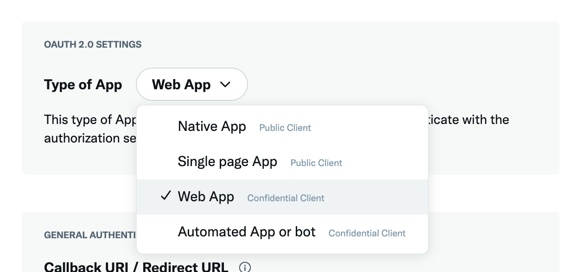
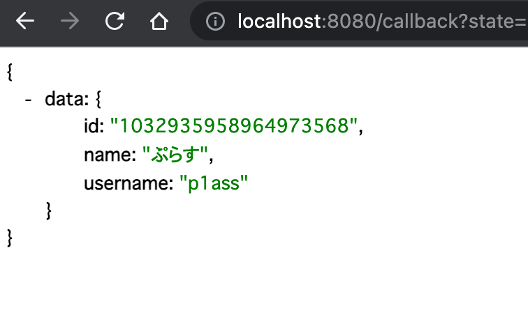

import { ExLinkCard } from "../../../components/ExLinkCard";

こんにちは、{/* {<link href="https://twitter.com/p1ass" text="@p1ass" >} */}です。

Twitter API の v2 が正式リリースされてから数ヶ月経ちました。

<ExLinkCard url="https://forest.watch.impress.co.jp/docs/news/1366790.html" />

Twitter API v2 では様々な API が追加されていますが、中でも注目すべきは OAuth 2.0 対応だと思います。

<ExLinkCard url="https://developer.twitter.com/en/docs/authentication/oauth-2-0/authorization-code" />

今までは OAuth 1.0a しか対応しておらず、他の OAuth 2.0 対応の認可サーバーと比較して使いづらいと感じていました。
今回の対応によって、OAuth 2.0 の Authorization Code Flow ( [RFC6749 Section4.1](https://www.rfc-editor.org/rfc/rfc6749.html#section-4.1))を利用した認可に対応し、より便利に認可をシステムに組み込めるようになりました。

また、スコープを細かく制御できるようになったため、**今までのように不用意に多くの権限を要求する必要がなくなりました！**
現在対応しているスコープは以下の通りで、非常に細かくスコープを制御できることが分かります。

- tweet.read
- tweet.write
- tweet.moderate.write
- users.read
- follows.read
- follows.write
- offline.access
- space.read
- mute.read
- mute.write
- like.read
- like.write
- list.read
- list.write
- block.read
- block.write

というわけで、せっかく OAuth 2.0 に対応したことなので、実際に Authorization Code Flow を試してみようと思います。

{/* <!--more--> */}

## Twitter Developer Portal で設定する

まずはじめに、Twitter の [Developer Portal](https://developer.twitter.com/en/portal/dashboard) でアプリの登録をします。
詳細は省きますが、OAuth2.0 の設定部分はピックアップします。


_Twitter の OAuth 設定画面_

よくある Callback URI の設定や Website URL などの登録があります。
中でも特筆すべき点は、Type of Apps でアプリケーションの種類を選択する点です。


_Type of App の設定_

ここでは、

- Native App
- Single page App
- Web App
- Automated App or bot

から、あなたのアプリケーションの種類を選択します。

これは Client Type( [RFC6749 Section2.1](https://www.rfc-editor.org/rfc/rfc6749.html#section-2.1))を判別するために使われます。
Client Secret を安全に保管できない Public Client の場合は、

> This type of App uses public clients as they’re usually running in a browser or on a mobile device and are unable to use your client secrets.

と表示され、Client Secret が使えなくなります。

そのため、Public Client のクライアント認証は PKCE で担保することになると思われますが、動作検証はしてないので未確認です。

今回は、Web App を選択します。
設定完了後、Client ID と Client Secret が表示されるので、メモっておきます。

## OAuth クライアントを実装する

クライアントの登録が完了したので、実際に認可を試してみます。
今回は Go を使って実装します。
デモ用のアプリケーションは以下の GitHub リポジトリに置いてあります。

<ExLinkCard url="https://github.com/p1ass/twitter-oauth-2-demo" />

### 認可 URL の生成

まずは、認可画面にリダイレクトするための URL を生成します。
Twitter API は、Proof Key for Code Exchange (PKCE) ( [RFC7636](https://datatracker.ietf.org/doc/html/rfc7636))に対応しているので、その処理も行います。

{/* {<note text="今回は検証用のため、stateやcode_verifierの保存は適当です。正しい処理はRFCを参考にしてください。">} */}

```go
package main

import "golang.org/x/oauth2"

// TODO: 本番では固定値ではなく、ブラウザごとに異なる値を生成して保存してください
// https://www.rfc-editor.org/rfc/rfc6749.html#section-10.12
// The binding value used for CSRF
// protection MUST contain a non-guessable value (as described in Section 10.10),
// and the user-agent's authenticated state (e.g., session cookie, HTML5 local storage) MUST be kept in a location
// accessible only to the client and the user-agent (i.e., protected by same-origin policy)
const state = "FIXME"

var config = oauth2.Config{
		ClientID:     os.Getenv("TWITTER_CLIENT_ID"),
		ClientSecret: os.Getenv("TWITTER_CLIENT_SECRET"),
		Endpoint: oauth2.Endpoint{
			AuthURL:   "https://twitter.com/i/oauth2/authorize",
			TokenURL:  "https://api.twitter.com/2/oauth2/token",
			AuthStyle: oauth2.AuthStyleInHeader,
		},
		RedirectURL: "http://localhost:8080/callback",
		Scopes:      []string{"tweet.read", "users.read", "tweet.write"},
	}

var codeVerifier string

func buildAuthorizationURL(config oauth2.Config) string {
	// PKCE 対応 https://datatracker.ietf.org/doc/html/rfc7636
	// TODO: 本番ではブラウザごとのセッションに保存してください
	codeVerifier = generateBase64Encoded32byteRandomString()
	h := sha256.New()
	h.Write([]byte(codeVerifier))
	hashed := h.Sum(nil)
	codeChallenge := base64.URLEncoding.WithPadding(base64.NoPadding).EncodeToString(hashed)

	url := config.AuthCodeURL(
		state,
		oauth2.SetAuthURLParam("code_challenge", codeChallenge),
		oauth2.SetAuthURLParam("code_challenge_method", "S256"))
	return url
}
```

URL を生成できるようになったら、GET のエンドポイントを生やしてリダイレクトされるようにします。

```go
func main() {
	r := mux.NewRouter()
	r.HandleFunc("/login", loginHandler).Methods("GET")
	srv := &http.Server{
		Handler: r,
		Addr:    "127.0.0.1:8080",
	}

	log.Println("Click the following link to login: http://localhost:8080/login")
	log.Fatal(srv.ListenAndServe())
}

func loginHandler(w http.ResponseWriter, r *http.Request) {
	url := buildAuthorizationURL(config)
	log.Println(url)
	w.Header().Set("Location", url)
	w.WriteHeader(http.StatusFound)
	return
}
```

ここまで実装したら、Web サーバーを立ち上げて、http://localhost:8080/login にアクセスします。
すると、今までの Twitter の認可画面とは異なる、新しい認可画面が表示されます。


_新しい認可画面_

認可画面を見ると、今回設定したスコープのみが表示されていることが分かります！

### コールバックの実装

次は、「アプリにアクセスを許可」ボタンを押した後にリダイレクトされるコールバックの処理を実装します。
今回はアクセストークンを取得したら、自分自身の情報を取得し、API の JSON のレスポンスをそのまま返します。

```go
func callbackHandler(w http.ResponseWriter, r *http.Request) {
	queryCode := r.URL.Query().Get("code")
	if queryCode == "" {
		log.Println("code not found")
		w.WriteHeader(http.StatusBadRequest)
		return
	}
	queryState := r.URL.Query().Get("state")
	if queryState == "" {
		log.Println("state not found")
		w.WriteHeader(http.StatusBadRequest)
		return
	}
	if queryState != state {
		log.Println("invalid state")
		w.WriteHeader(http.StatusBadRequest)
		return
	}

	token, err := config.Exchange(context.Background(), queryCode,
                          oauth2.SetAuthURLParam("code_verifier", codeVerifier))
	if err != nil {
		log.Printf("failed to exchange token: %v\n", err)
		w.WriteHeader(http.StatusBadRequest)
		return
	}
	log.Printf("token scope: %v\n", token.Extra("scope"))

	oAuthClient := oauth2.NewClient(r.Context(), oauth2.StaticTokenSource(token))

	// https://developer.twitter.com/en/docs/twitter-api/users/lookup/api-reference/get-users-me
	res, err := oAuthClient.Get("https://api.twitter.com/2/users/me")
	if err != nil {
		log.Printf("failed to get me: %v\n", err)
		w.WriteHeader(http.StatusInternalServerError)
		return
	}
	defer res.Body.Close()

	w.Header().Set("Content-Type", "application/json")
	_, _ = io.Copy(w, res.Body)
}

func main() {
	r := mux.NewRouter()
	r.HandleFunc("/login", loginHandler).Methods("GET")
	r.HandleFunc("/callback", callbackHandler).Methods("GET") // 追加

	srv := &http.Server{
		Handler: r,
		Addr:    "127.0.0.1:8080",
	}

	log.Println("Click the following link to login: http://localhost:8080/login")
	log.Fatal(srv.ListenAndServe())
}
```

プロセスを再起動し、認可をしてみます。

すると、コンソールには次のように表示され、指定したスコープを持つアクセストークンを取得できていることが分かります。

```text
token scope: tweet.write users.read tweet.read
```

また、ブラウザ上には、Twitter API のレスポンスが正しく表示されました 🎉


_v2 API のレスポンス_

## おわりに

今回は Twitter API v2 で追加された OAuth2.0 Authorization Code Flow を試しました。

今まで以上にスコープの自由度が広がり、今後どんどん広く使われていくようになると思います。
これで「〇〇アプリが不必要に権限を要求しようとしている！危ない！」みたいなツイートが減ると良いですね。
