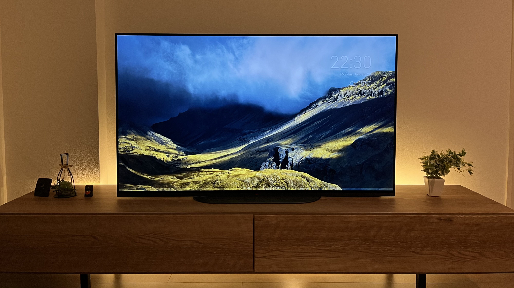

_間接照明でライトアップされたテレビ_

こんにちは、[@p1ass](https://twitter.com/p1ass)です。

タイトルの通り、数ヶ月前に有機 EL テレビを買いました。
自分の金で買った初めての大型家電だったのですが、とても満足しています！

このブログでは、テレビを買った経緯や使い心地、テレビを買うために調べたことなどをまとめて紹介します。

<!--more-->

## テレビを買った経緯

テレビを買った一番の要因は、引っ越したことでリビングが爆誕したことです。

私は大学時代から数ヶ月前まで 6 年近く、ずっと 1K の賃貸で 1 人暮らしをしていました。
6 畳 ~ 8 畳程度しかない小さい部屋に、ベッドから仕事用のデスクから何まで全てを詰め込むと、テレビを置くようなスペースはあまりありませんでした。
**狭い部屋では本当に必要なもの、機能性が重視されるものしか置きづらい**のです。

この状況は引っ越したことで大きく変わりました。
部屋数が増えたことで、デスクやベッドがおいてある部屋とは別に、いわゆるリビング用の部屋が作れるようになりました。
リビングができるということは、今までは余裕がなくて作れなかった、**くつろぐ空間・リラックスできる空間**が作れるようになります。
実際に引っ越してみたところ、ソファやテレビを置く余裕がありそうだということが分かり、実際に購入を検討することにしました。

## 買うテレビを決める
