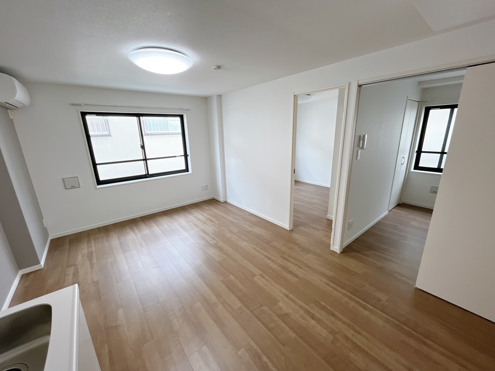
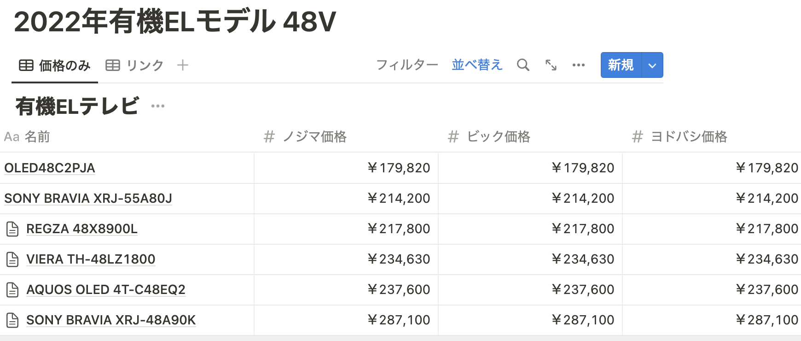
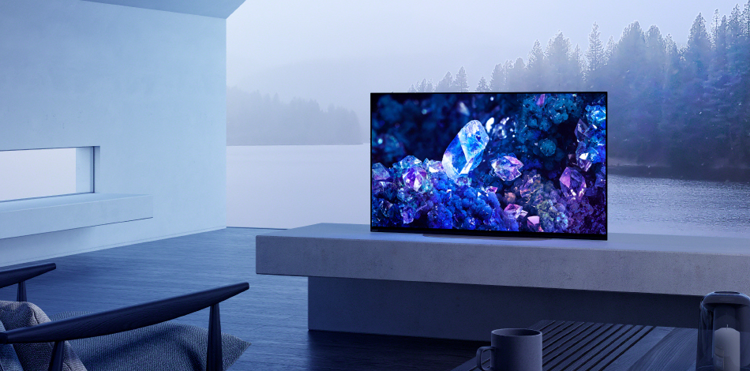
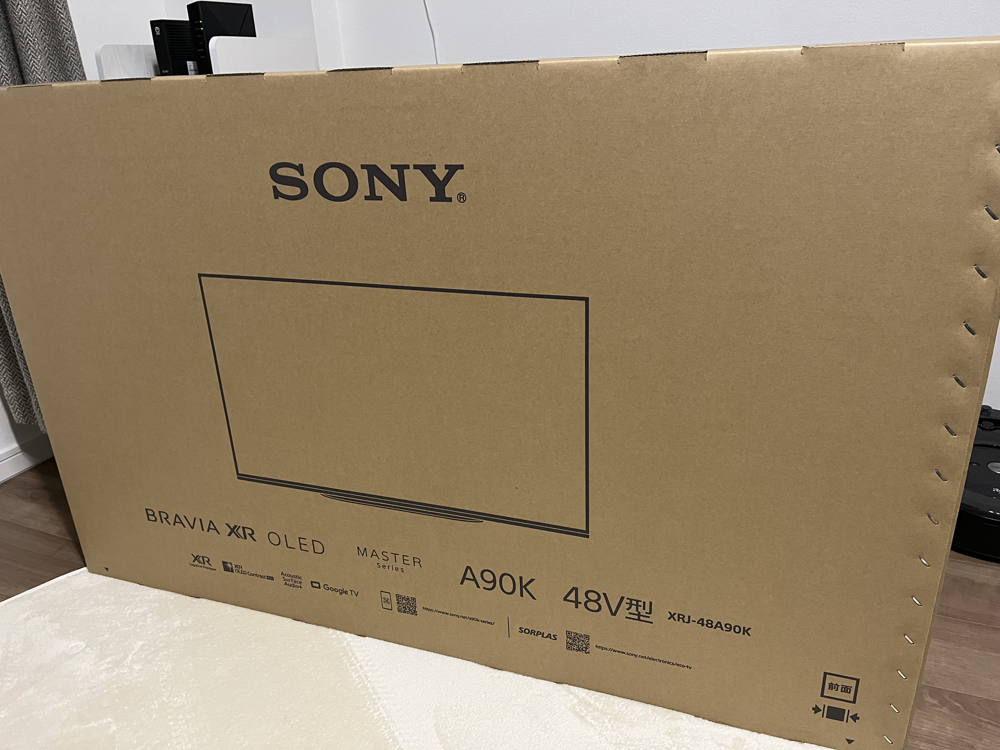

こんにちは、[@p1ass](https://twitter.com/p1ass)です。

タイトルの通り、数ヶ月前に有機 EL テレビを買いました。
自分の金で買った初めての大型家電だったのですが、とても満足しています！

このブログでは、テレビを買った経緯や使い心地、テレビを買うために調べたことなどをまとめて紹介します。

<!--more-->

## テレビを買った経緯

テレビを買った一番の要因は、引っ越したことでリビングが爆誕したことです。

私は大学時代から数ヶ月前まで 6 年近く、ずっと 1K の賃貸で 1 人暮らしをしていました。
6 畳 ~ 8 畳程度しかない小さい部屋に、ベッドから仕事用のデスクから何まで全てを詰め込むと、テレビを置くようなスペースはあまりありませんでした。
**狭い部屋では本当に必要なもの、機能性が重視されるものしか置きづらい**のです。

この状況は引っ越したことで大きく変わりました。
部屋数が増えたことで、デスクやベッドがおいてある部屋とは別に、いわゆるリビング用の部屋が作れるようになりました。
リビングができるということは、今までは余裕がなくて作れなかった、**くつろぐ空間・リラックスできる空間**が作れるようになります。
実際に引っ越してみたところ、ソファやテレビを置く余裕がありそうだということが分かり、実際に購入を検討することにしました。

_何も置いてないリビング_

## 買うテレビを決める

### テレビに求めているものを言語化する

テレビを買うことにしたので、買うテレビの機種を選ばなければなりません。
テレビはピンキリで沢山の機種が存在するので闇雲に探しても時間を消費するだけです。
そこで、まずはテレビに求めている要件を洗い出すことにしました。

最初に書いたように、テレビを買う目的はくつろぐ空間をつくることです。そのため、単純に映像が見れれば良いというわけではなく、その**クオリティ**にもこだわりたいです。
テレビのクオリティを測るベクトルはいくつかありますが、テレビならやはり画質でしょう。
元々映画を結構な頻度で見ますし、IMAX や Dolby Cinema を積極的に選ぶタイプです。
そこで、**液晶テレビよりも画質が良い有機 EL テレビ** をメインの候補とすることにしました。

また、テレビを選ぶ上でその大きさも重要です。
有機 EL テレビの大きさは液晶テレビよりも限られていて、55 インチが最も多く、下は 48・42 インチと続きます。
部屋のサイズを考えると、**48 インチ(横幅が 100cm ちょい)** が丁度よいサイズ感そうでした。

その他の細かい点でいくと、**Google TV** が載っていると嬉しいです。
Android ベースなので Google Play ストアで配信されている好きなアプリをインストールすることができますし、TV メーカーの独自 OS にロックインされるよりも時代にあったコンテンツを楽しむことができます。

_Google TV (公式サイトより)_

以上をまとめると、テレビに求めているものは次のようになりました。

- **目的**: くつろいでリラックスできる空間を作ること
- **種類**: 有機 EL テレビ
- **大きさ**: 48 インチ
- **OS**: Google TV

### 候補の TV を調べる

ある程度要件がまとまったので、条件にあったテレビを探します。
有機 EL テレビ、48 インチのものを価格.com で調べつつ Notion に候補をまとめていきました。

_Notion にまとめたテレビ候補_

調べた結果、次の 5 つまで絞り込みました。

- [TVS REGZA 48X8900L](https://www.regza.com/tv/lineup/x8900l)
- [Panasonic VIERA TH-48LZ1800](https://panasonic.jp/viera/products/lz1800.html)
- [LG OLED48C2PJA](https://www.lg.com/jp/tv/lg-oled48c2pja)
- [SHARP AQUOS OLED 4T-C48EQ2](https://jp.sharp/aquos/products/eq1/?prod-variation=48v)
- [SONY BRAVIA XRJ-48A90K](https://www.sony.jp/bravia/products/XRJ-A90K/)

なお、価格.com には型落ちのモデルも掲載されていますが、家電量販店での購入を前提としていたため、在庫がないことも考えられる型落ちモデルは省いています。

_価格情報も同時に調査_

また、調査のタイミングで各種ネット通販の価格も調べてました。
調べて初めて知ったのですが、**ポイント還元などを加味すると、家電量販店の通販価格は横並び**のようです。
家電量販店ごとの差をつけるには、保証などの付帯サービスや現地での値引き交渉で差を付ける必要がありそうです。

これらの調査を元に、それぞれのテレビの特徴を調べました。調査時点で Google TV が搭載されているのは、次の 2 機種であることが分かりました。

- SONY BRAVIA XRJ-48A90K
- SHARP AQUOS OLED 4T-C48EQ2

_SONY BRAVIA XRJ-48A90K (公式サイトより)_

_SHARP AQUOS OLED 4T-C48EQ2 (公式サイトより)_

その中でも SONY BRAVIA XRJ-48A90K は [BRAVIA CORE](https://www.sony.jp/bravia/bravia-core/) による映画コンテンツが楽しめる点や Apple AirPlay で Mac の画面をテレビに映せる点がメリットに感じました。
最終的には家電量販店で実物を見てみないことにはわかりませんが、調査段階では「BRAVIA 欲しいな〜」となっていました。

## いざ家電量販店へ、そして購入

ある程度調査仕切ったタイミングで家電量販店へ向かいました。
SONY BRAVIA XRJ-48A90K の値札を見てみると、274,800 円のようです。ポイントを加味すると**実質 247,320 円**でした。

_SONY BRAVIA XRJ-48A90K の値札_

価格.com の最安値が 225,000 円だったので「ちょっと高いかな〜」と思いながら見ていると、SONY から来たと思われる販売員の方に声をかけられ、**「230,000 円まで下げられますよ」** とのこと。
こちらから値下げ交渉の話をしていないのに値段を下げてきてくれました。
話を聞いたところ、前日(土曜)に来た客が価格交渉をしていて、その値段まで値切っていたようです。
その週であれば同じ値段で売っても良いとのこと。
この時点で、**ポイントを加味すると価格.com の最安値より安くなる**というバグった価格設定で、かなりアリだなという印象でした。

実物を見たり触ったりしましたが、画質も体験も良かったのでこのテレビを買う方針で価格交渉することにしました。
「予算が 20 万なので 20 万切ったら嬉しいなぁ〜」という形で交渉したところ、

- ポイント還元: **10% → 13%**
- クレジットカード利用によるポイント還元の減少: **-2% → 0%**

に落ち着き、**実質 195,100 円** で購入することができました。

また、おまけに SONY のネックスピーカーである [SRS-NS7](https://www.sony.jp/active-speaker/products/SRS-NS7/) を無料でいただきました。
レシートを確認すると、TV・スピーカー同時購入キャンペーンによる割引が書かれており、この割引を使うために配布しているようでした。
家電の割引スキームは難しい。

_SRS-NS7 (公式サイトより)_

## テレビを買って感じたこと

### テレビの設置は頼んだほうが良い

購入の数日後、家にテレビが届きました。

_届いたテレビ_
