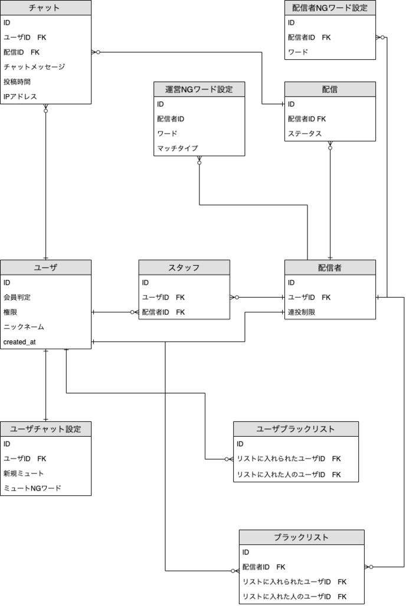

こんにちは、ぷらす([@p1ass](https://twitter.com/p1ass))です。

この度、Cyber Agent さんが開催された **「Architecture Challenge」** いうイベントに参加させていただきました！



個人開発をしていると、しっかりと考えることのないアーキテクチャについて考えることができる 2 日間となりました。

<!--more-->

## 概要

今回のインターンのテーマは **「架空のサービスのチャット機能部分のアーキテクチャを考える」** いうものでした。

_お題_

_評価基準_

**他にもめっちゃ細かい仕様書が渡された** ですが、ここで全部紹介するのはしんどいので省略します。

簡単なチャットサーバーは組んだことがあったのですが、スケールできる構成を考えたことがなかったので、どう構成するかかなり悩みました。

また、今回はコードを一切書かないイベントでした。スケールできる構成を考えないといけないにも関わらず、 **その計測ができない** で、ネットに転がっている情報を元に考える必要がありました。

## 作ったもの

今回は成果物として、ER 図とアーキテクチャ図を作りました。

_ER 図_

_アーキテクチャ図_

自分は主にアーキテクチャの方を担当したのですが、今思うと怪しいところが多かったなと反省しています。

- gRPC のロードバランスの難しさ
- L7LB と L4LB の違い

このあたりは、フワッとした知識しか持っていなかったので、かなり適当になってしまいました。

しかし、同時に多くのことを学ぶことができました。
特に、 **Redis**は使ったことがなく、ほとんど知識がなかったのですが、しっかり調査することができました。**Redis に PubSub 機能がある** 知れたのは良かったです。

## GraphQL Subscriptions と Redis PubSub を使ったリアルタイムチャットサーバー

インターン中は実際にコードを書くことが出来なかったので、後日 **GraphQL Subscriptions**と**Redis PubSub** 使ったリアルタイムチャットサーバーを作ってみました。



解説記事を Qiita に書いてのでよかったら読んでみてください。



## おわりに

インターンが始まる前はどうなるかなと思っていたのですが、終わってみると **参加してよかった** いう気持ちになりました。
これからも強いエンジニア目指して頑張っていきます！

最後までご覧いただき、ありがとうございました。

_お弁当_

_お弁当その２_

_お肉_
