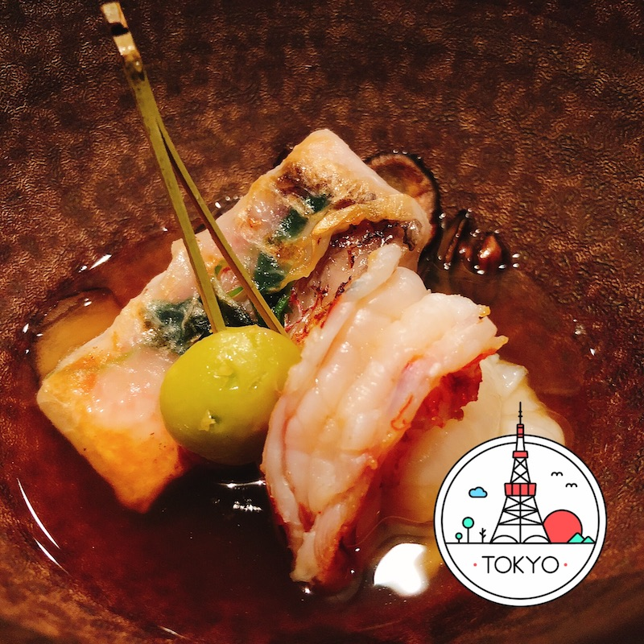
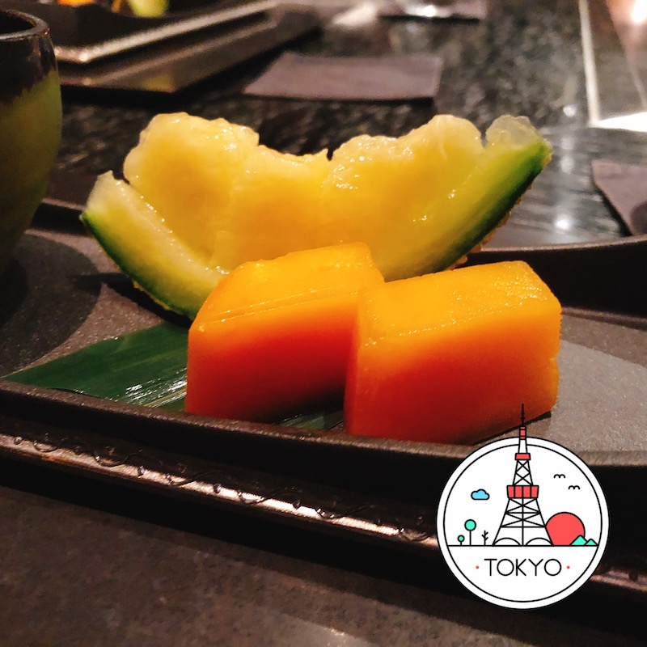

こんにちは、です。

この度、8 月 23 日~25 日に開催された DeNA のエンジニアサマーインターン プロダクト開発コースにサーバサイドエンジニアとして参加してきました！

「3 日間で最高のアプリに作り直す」というミッションが課せられていたインターンでしたが、最大限の力で最高のアプリに作り直し、**優勝することが出来ました 🎉**

<blockquote class="twitter-tweet">
DeNA サマーインターン プロダクト開発コースで優勝しました！！！<a href="https://twitter.com/hashtag/dena_summer?src=hash&amp;ref_src=twsrc%5Etfw">#dena_summer</a> <a href="https://t.co/WxI9HxIqzH">pic.twitter.com/WxI9HxIqzH</a>
&mdash; ぷらす (@p1ass) <a href="https://twitter.com/p1ass/status/1165553277435383808?ref_src=twsrc%5Etfw">August 25, 2019</a></blockquote> 

この記事では、インターンに参加した経緯や、インターンの詳しい内容などを紹介していきたいと思います。
来年申し込んでみようと考えている人にも役に立ちそうな内容を盛り込んでいるので、是非読んでいってください。

<!--more-->

## プロダクト開発コースとは

DeNA では様々なサマーインターンを開催していますが、その一つに**「プロダクト開発コース」**というものがあります。

このコースは DeNA が用意した伸びしろのあるアプリ、言い換えれば**クソアプリ**を 3 日間で良いアプリに作り直すという内容のインターンです。サーバサイドが 2 人、クライアント(iOS, Android, Web)が 2 人の 4 人チームで競い合います。今回 Android のチームのサーバサイドとして参加しました。

より詳しい話は DeNA の記事をご覧ください。



## 参加の経緯

実は、去年にも同じ DeNA のサマーインターンに申し込んでいました。
当時は**「報酬として 10 万円貰えるならとりあえず申し込むしかない！」**という軽い気持ちで申し込んでいました。
残念ながら選考は落ちてしまったのですが、かなり悔しくて「来年もう一度チャレンジするぞ」と 1 年間待ち続けていました。

そんな中 、3 月の終わり頃に DeNA のインターンの募集が始まっていることに気づき、その場で申し込みました。
DeNA が公式 Twitter 等で告知するよりも早くサイトを見つけて応募していたので、申込みはかなり早かった部類だと思います。

<blockquote class="twitter-tweet">
DeNAのサマーインターンの募集始まってるで  【DeNA サマーインターンシップ 2019 募集開始！】 <a href="https://t.co/iwc7gRiMgP">https://t.co/iwc7gRiMgP</a>
&mdash; ぷらす (@p1ass) <a href="https://twitter.com/p1ass/status/1110131164105207808?ref_src=twsrc%5Etfw">March 25, 2019</a></blockquote> 

## 選考について

選考は人によってバラバラでしたが、自分は CTO 面接の 1 回のみでした。

申し込んですぐに「今週末面接どう？」という電話がかかってきて、「今旅行中なんで無理です！」みたいな会話をした記憶があります。

その後予定を調整し、面接終了後にその場で合格をいただけました。
申し込んでから 10 日で合格が決まったのでほぼほぼ最速だったのではと思います。
人によっては面接から合格までかなり待ったという話があったので運が良かったです。

<blockquote class="twitter-tweet">
インターンの１次面接にCTOが出てくるのは驚きを隠せなかった
&mdash; ぷらす (@p1ass) <a href="https://twitter.com/p1ass/status/1114047882372378624?ref_src=twsrc%5Etfw">April 5, 2019</a></blockquote> 

面接の内容は他でも聞かれるような質問が多かったのですが、「プログラミングを始めたきかっけ」を根掘り葉掘り聞かれたのが印象に残っています。

「中学のころに C 言語で CUI のテトリスを作ったりして遊んでました」と回答したのですが、「どんなライブラリ使ってたの？」などを聞かれ、**「7 年近く前のことなんか覚えてないよ！」**と思いながら面接してました。

ここで後輩に向けてのアドバイスを少ししておくと、サーバサイドをやりたいなら

- 何かしらの言語での API を実装
- DB(特に MySQL)
- Docker
- クラウド(AWS or GCP)
- GitHub

あたりはできるようになっておいた方が良いと思います。
これは DeNA に限らず他の会社でも同じです。
これらを使った Web サービスでも作ったら話すネタにもなるし良いんじゃないかなと思います。

もう少し上を目指すなら

- ミドルウェア(Redis や Nginx)
- スケーラビリティを考慮した設計
- OSS 貢献

などをすれば良いと思います。

競プロなどのアルゴリズム系はコーディングテストが必要なインターンでは求められますが、DeNA では必要ありませんでした。

## 事前準備

インターンの 1 ヶ月前にキックオフイベントがあり、そこでチーム分けなどが発表されました。
クソアプリの仕様は当日まで公開されなかったのですが、「事前にこういうものを勉強してきてほしい」という話があり、事前にある程度調べることにしました。

クライアント側は使用するライブラリ等も細かく指定されていたのですが、サーバは**「Go で MySQL で CentOS だよ〜(o・∇・o)」**程度の情報量しかありませんでした。
流石にこれでは何も勉強しようがないので、キックオフイベント後の懇親会でもう少し話を聞いてみると、ISUCON8 の問題作成者が今回のインターンの問題作成に関わっているという情報を手に入れました。そのため、主にパフォーマンスチューニングの方面を重点的に調べることにしました。

調べた内容は全て HackMD にまとめて後からすぐ参照できるようにしました。
特に DB の調査は今まであまりしたことがなく、何も覚えていなかったので、これのおかげでスムーズに調査することが出来ました。やっぱり予習って大事ですね。







## インターン当日

さて、ここからはインターン当日の話です。

### 1 日目

<blockquote class="twitter-tweet">
DeNAに来た <a href="https://t.co/Rh7AVai6EX">pic.twitter.com/Rh7AVai6EX</a>
&mdash; ぷらす (@p1ass) <a href="https://twitter.com/p1ass/status/1164696651182641153?ref_src=twsrc%5Etfw">August 23, 2019</a></blockquote> 

まず初めに、インターンのクソアプリが生まれるまでの経緯の紹介(茶番?)がありました。

> 皆さんは DeNA のエンジニアです。とあるチャットアプリの開発チームとして緊急招集されました。
> チャットアプリは一度 S-in し多くのユーザが一気に利用するようなサービスになりましたが様々な問題により、メンテナンスに入っています。
> 2 日後の夜に大規模なマーケティングが開始されるため遅くとも 2 日後の 14:00 までにアプリを更新しなければビジネス上かなりの損失がでてしまいます。
> 皆さんのエンジニアリング力によりこの危機を乗り越えてください！

なかなか鬼畜な設定ですが、実際はこんなことは(ほとんど？)ないらしいです。

作業時間が始まったら実際のアプリの挙動を確認して駄目なところをピックアップしていき、重要度と工数でタスクを分類分けしていって、できるものから取り組んでいくことにしました。

サーバ側では

- N+1 クエリを消す
- 画像が base64 で MySQL 内に入っていたので、S3 に上げるスクリプトを書く
- GET 系の API に`limit,offset`クエリパラメータを実装
- MySQL のテーブル、インデックス調査
- App サーバを 8 台までスケールアウト
- スロークエリログ調査

を 1 日目に行いました。
途中で**AWS が死ぬ**などのアクシデントがありましたが、落ち着いて自分ができることをこつこつやっていきました。この時点でサーバ側のアプリケーションに仕込まれていたクソ仕様はあらかた片付いたので、明日は新機能も着手できそうという感じでした。

夕食ではお酒を飲みながら寿司を食べました 🍣(このタイミングでお酒を飲んでいたのは自分のチームだけだったらしい)

<blockquote class="twitter-tweet">
優勝！！<a href="https://twitter.com/hashtag/dena_summer?src=hash&amp;ref_src=twsrc%5Etfw">#dena_summer</a> <a href="https://t.co/FRdUlRWDPk">pic.twitter.com/FRdUlRWDPk</a>
&mdash; ぷらす (@p1ass) <a href="https://twitter.com/p1ass/status/1164829390598881285?ref_src=twsrc%5Etfw">August 23, 2019</a></blockquote> 

### 2 日目

2 日目の朝には課題のアップデートがありました。

> 格安スマホの発売を記念し CM に出演中の人気芸人がリアルタイムで質問を受け付ける専門チャンネルを開設します。  
> 想定されるトラフィックは

- 1 万件発言/秒
- 10 万人の同時接続

だと公表されました、、、😢

かなり重たい発表だったので、この時点で新機能開発を一旦やめて、リクエストを捌くことに注力することにしました。

まずは、このリクエストを捌くには 1 台のサーバあたりどれだけの能力が必要かを試算することにしました。
クライアント側のポーリングの間隔やサーバの台数を考慮し、目標数を設定しました。

次にインフラ構成の検討・設計です。  
今回は RDS や ElastiCache を使えず、EC2 で DB サーバを動かす必要があるため、DB がスケールしづらいという問題がありました。
そこで、**「ユーザーのリクエストがそのまま DB に貫通しないようにする」**という基本的な方針のもと、各レイヤーでキャッシングしていくことにしました。

具体的には、コメントの取得は、

1. コメントの API レスポンスを CloudFront で TTL5 秒でキャッシュする
1. App サーバのインメモリでコメントのレスポンスをキャッシュする

のようにし、コメントの投稿は、

1. コメントを 1/N の確率でインメモリで保存する
1. 保存されなかったコメントは捨てる

のようにしました。

この実装により多くのコメントが失われてしまいますが、クライアントは 1 万コメントを 1 秒間で表示することは不可能なので、全てのコメントを扱うことは諦めました。

ただ、クライアントがポーリングでコメントを取得するとき、LB によって毎回違ったサーバにアクセスしてしまうと、コメントの流れ(擬似的な部屋、ニコ生のアリーナや立ち見でそれぞれできるコメントの流れ)のようなものが失われてしまうという懸念がありました。

そこで、ユーザー ID と HTTP ヘッダを使って**「あるクライアントは必ずある 1 つのサーバからコメントを取得する」**ようにしました。
発想としてはクライアント LB に近いと思います。これによりコメントの流れが不自然になることを防ぐことができました。

また、上で説明したキャッシュ戦略を導入したことで、質問チャンネルでは MySQL へのアクセスをほとんどなくすことができました。一部各サーバ間で共有する必要があるデータは Redis 経由で同期するようにし、こちらも各ユーザのリクエストが直接 Redis に行かないように、各 App サーバでキャッシュするようにしました。

これらの実装が終わったところで実際に負荷テストを行い、ある程度のリクエストを捌けることを確認しました。

この日はサーバサイドのタスクが多く、クライアント向けの実装はあまり出来なかったのですが、クライアントチームはサーバなしでもできることを着実に進めてくれていました。いつの間にかアプリにお絵かき機能が追加されていたときは流石に驚きました 🤭

<blockquote class="twitter-tweet">
叙々苑の焼肉ランチ <a href="https://twitter.com/hashtag/dena_summer?src=hash&amp;ref_src=twsrc%5Etfw">#dena_summer</a> <a href="https://t.co/H3NcKQPJ7B">pic.twitter.com/H3NcKQPJ7B</a>
&mdash; ぷらす (@p1ass) <a href="https://twitter.com/p1ass/status/1165094579554488321?ref_src=twsrc%5Etfw">August 24, 2019</a></blockquote> 

### 3 日目

ついに最終日です。

この日は朝イチで、今まで捨てていたコメントを全て Redis に保存する処理を追加しました。

最初は「10,000 req/sec を Redis に保存できるのか？」と思っていたのですが、goroutine とチャネルを使ってバルクインサートを実装したことで、要件を満たす速度で保存することができるようになりました。

残りの時間は細かなバグ修正をして開発を終了しました。

## 成果発表会

開発終了後に成果発表会がありました。

サーバサイドはインフラ構成や計測結果、その他工夫などを簡潔に 1 枚のスライドにまとめて発表しました。

発表時に少しテンパってしまい、頑張ったところはたくさんあったのですが、あまり紹介することは出来ませんでした 😥

発表後の審査員による質問では、**「コメントの編集や削除をできるようにするとキャッシュ戦略は難しいと思うが、その点についてどう思うか」**という趣旨の質問があり、「以外と突っ込んでくるなぁ」と思いつつ、LINE のインターンで得た知識を話したらなんとかなりました。



## 結果発表

なんと自分のチームが優勝することが出来ました 🎉🎉🎉

<blockquote class="twitter-tweet">
DeNA サマーインターン プロダクト開発コースで優勝しました！！！<a href="https://twitter.com/hashtag/dena_summer?src=hash&amp;ref_src=twsrc%5Etfw">#dena_summer</a> <a href="https://t.co/WxI9HxIqzH">pic.twitter.com/WxI9HxIqzH</a>
&mdash; ぷらす (@p1ass) <a href="https://twitter.com/p1ass/status/1165553277435383808?ref_src=twsrc%5Etfw">August 25, 2019</a></blockquote> 

優勝理由を伺ったところ、

- 仕込んだ伸びしろ(クソ)部分をきちんと解決していた
- 独自の新機能を開発していた
- ドキュメントをきちんと書いて情報を共有していた
- 定量的に計測して負荷対策をしていた
- そもそも他のチームよりコードを書いている量が多かった

などを挙げられていました。

確かに他のチームに比べ、Slack の GitHub インテグレーションの通知量が多かったので、沢山の実装を出来たのが優勝につながったのではないかなと思います。また、開発のスピードを上げるために必要なクライアント・サーバ間のコミニュケーションもスムーズだったのも要因の一つだと思います。

## 感想

以下のツイートのように本気で優勝を狙いに来ていたので、優勝できたのは本当に良かったです。

<blockquote class="twitter-tweet">
明日からはDeNAのインターン！ 優勝していい肉食べるぞ！！！🍖
&mdash; ぷらす (@p1ass) <a href="https://twitter.com/p1ass/status/1164527638666330115?ref_src=twsrc%5Etfw">August 22, 2019</a></blockquote> 

また、普段個人で開発しているだけでは他の同年代の学生と相対的に評価される機会が少ないので、このインターンを通してかなり自分に自信がつきました。

今までやってきたことが間違っていなかったと思いつつも、懇親会での社員さんとの会話では「まだまだ足りない」と思う部分も見られたので、今後ももっと沢山の知識を身に着けていきたいと思います。

特にインフラの知識はまだまだ未熟だと思っているので、まずはマスタリング TCP/IP から読みたいと思います 💪

## 終わりに

今回の DeNA のサマーインターンでは貴重な経験を詰むことができました。

会社側が 3 食全て用意してくださり、ホテルもマークシティと近く、快適に開発する環境が整っていました。
報酬も 10 万と高く、参加しない理由はないと思うので興味を持った方は来年是非申し込んでみてください！

長文お読み頂きありがとうございました。

## おまけ 優勝記念夕食会

インターンの優勝記念に鉄板焼に連れて行ってくれるということで行ってきました！

場所はリッツカールトンでした 🙌

_ロビーがすごいおしゃれ_

_めっちゃ美味しいシャンパン_

_真鯛と車海老_

_メインのフィレとサーロインステーキ_

_甘くてとろけるデザート_
