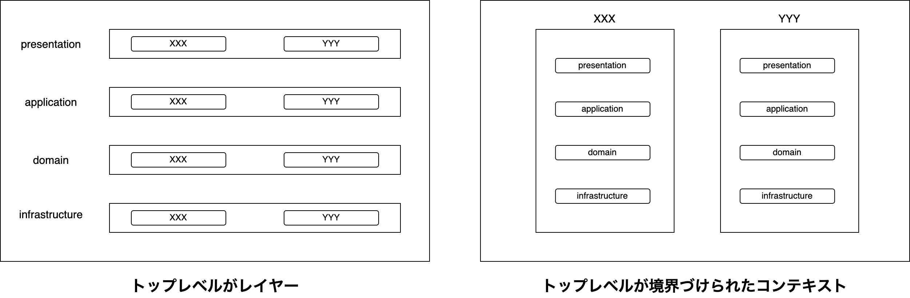

この記事では、「トップレベルのディレクトリ構成をどうするべきか」という問いについて考える。
そして、この問いに対する答えは「レイヤーとドメイン複雑な方をトップレベルのディレクトリ構成にした方が良い」のではないか？と考えてたので、思いを綴ってみる。

## はじまり

### プロジェクト立ち上げ期

「最近のトレンドはレイヤードアーキテクチャだ！」

そう言いながら依存関係を分離したディレクトリ構成を作り、プロジェクトはスタートした。

<!--more-->

```text
.
├── application
│  ├── xxx_usecase.go
│  ├── xxx_repository.go
│  ├── yyy_usecase.go
│  └── yyy_repository.go
├── domain
│  ├── xxx.go
│  └── yyy.go
├── infrastructure
│  └── xxx_repository_impl.go
└── presentation
│  ├── xxx_handler.go
│  └── yyy_handler.go
```



### ドメインの成長期

プロジェクト立ち上げ期に作ったアーキテクチャは、依存関係を把握するのに役に立っていた。
ビジネスが成長するにつれて、ドメインはどんどん複雑になっていくが、どのディレクトリに何のコードを置けば良いのか迷う必要がない。

よく出来たディレクトリ構成だと思っていたが、新しくプロジェクトに参加した人からこんなコメントをもらった。

「機能間の繋がりがいまいち分からない。」

各レイヤーのディレクトリ構成の下にサブディレクトリを切っていなかったため、そのレイヤーの全てのファイルが置かれていた。
相互に呼び出されることない全く異なるドメインのファイルが同じディレクトリに置かれており、結果として、認知負荷が高まっていた。

```text
.
├── application
│  ├── xxx_usecase.go
│  ├── xxx_repository.go
│  ├── yyy_usecase.go
│  ├── yyy_repository.go
│  └── # ここに数十、数百のファイルが置かれていた
├── domain
│  ├── xxx.go
│  ├── xxx_foo.go
│  ├── xxx_bar.go
│  ├── yyy.go
│  ├── yyy_hoge.go
│  ├── yyy_fuga.go
│  └── # ここに数十、数百のファイルが置かれていた
├── infrastructure
│  ├── xxx_repository_impl.go
│  └── # ここに数十、数百のファイルが置かれていた
└── presentation
│  ├── xxx_handler.go
│  └── yyy_handler.go
│  └── # ここに数十、数百のファイルが置かれていた
```

ずっとプロダクトに携わっている人間にとっては、ほぼ全ての機能を把握しているので、特に困らない。
しかし、新しいメンバーにとっては必ずしもそうではない。

このような状況の対処するために、**DDD の文脈での「境界づけられたコンテキスト」ごと**に、サブディレクトリを切ることにした。

```text
.
├── application
│  ├── xxx
│  │  ├── usecase.go
│  │  ├── repository.go
│  │  └── # そこまで多くないファイル数
│  └── yyy
│     ├── usecase.go
│     ├── repository.go
│     └── # そこまで多くないファイル数
├── domain
│  ├── xxx
│  │  ├── foo.go
│  │  ├── bar.go
│  │  └── # そこまで多くないファイル数
│  └── yyy
│     ├── hoge.go
│     ├── fuga.go
│     └── # そこまで多くないファイル数
├── infrastructure # 省略
└── presentation ＃省略
```

これにより、

- 元々の目的だった依存関係の制御
- 複雑なドメインの理解容易性

の両方を達成できるようになった。
めでたしめでたし。

### マイクロサービスにする場合のディレクトリ構成

前の例では、ドメインが成長してもモノリシックなプロジェクトのままであることを仮定していた。
では、マイクロサービスで分割する場合どうなるだろうか？

この場合、ルートのディレクトリ構成は**境界づけられたコンテキスト**ごとに分離した構成となる。

```text
.
├── xxx # ここが1つのマイクロサービスになる
│  ├── application
│  │  └── # そこまで多くないファイル数
│  ├── domain
│  │  └── # そこまで多くないファイル数
│  ├── infrastructure
│  │  └── # そこまで多くないファイル数
│  └── presentation
│     └── # そこまで多くないファイル数
└── yyy # ここが1つのマイクロサービスになる
   ├── application
   │  └── # そこまで多くないファイル数
   ├── domain
   │  └── # そこまで多くないファイル数
   ├── infrastructure
   │  └── # そこまで多くないファイル数
   └── presentation
       └── # そこまで多くないファイル数
```

### あれ、トップレベルのディレクトリ構成が違うぞ？

ドメインが複雑になったときのディレクトリ構成として、 2 つパターンを紹介した。

- トップレベルが**レイヤー**のディレクトリ構成
- トップレベルが**境界づけられたコンテキスト**のディレクトリ構成


_ディレクトリ構成の概念図_

話の流れ的には後者の構成はマイクロサービスを仮定していたが、どちらの構成もモノリシックなプロジェクトに適用可能だ。

また、どちらの場合も

- 今までのディレクトリ構成の目的だった依存関係の制御
- 複雑なドメインの理解容易性

は達成できる。

では、モノリシックな場合において、**この 2 つのディレクトリ構成のどちらが優れているのだろうか？**
これがこの記事での問いとなっている。

## ディレクトリ構成は人間のためのもの

一旦、この問いは置いておいて、そもそもディレクトリ構成について考えてみよう。

手始めに、ディレクトリ構成が「何のため」にあるのかを考えてみる。

前提として、ディレクトリ構成は、必ずしも技術的な制約によって強制されているものではない。
レイヤーで区切ったディレクトリ構成を規約としているフレームワークは例外だが、この記事のような議論をするプロジェクトでは、特に制約のない言語・フレームワークを使っている場合が多いだろう。

では、何のためにディレクトリを切っているか？  
この問いに対する答えは **「人間のため」** に集約されると考えている。

レイヤーで区切ったディレクトリ構成は、人間が依存関係の把握をしやすい状態を目指している。
境界づけられたコンテキストによる分割では、人間がドメインを適切に理解できる状態を目指している。
どちらも人間のためである。

どちらを採用するにせよ、ディレクトリ構成は人間、つまり**そのプロジェクトに携わる(現在・将来に関わらない)開発メンバーにとって** 「良い」 ものでなければならない。

## 「良い」ディレクトリ構成は、ファイルの発見容易性とプロジェクトの理解容易性が高い構成である

「良い」ディレクトリ構成の、「良い」とは何なのか?  
私は **「ファイルの発見容易性と仕様の理解容易性が高い状態」** が「良い」ディレクトリ構成なのではないかと考えている。

具体例として、「ユーザ情報を DB に保存する処理が知りたい(ただし、その処理がどのファイルにかかれているを知らない)」といったユースケースを考えてみよう。

このとき、先程例に挙げたようなディレクトリ構成を採用している場合は、「user ドメインの repository を探してみよう」となることが多いだろう。
この探し方では、ディレクトリ構成は**ファイルに対するインデックス**として機能している。
つまり、このユースケースではディレクトリ構成はファイルの発見容易性を高めるために使われている。
(レイヤーや境界づけられたコンテキストによる分割は、この目的のための手段と捉えている)

別の例として、「あるディレクトリやファイルがどのような処理をしているのか知りたい」といったユースケースを考えてみよう。

この場合は先程の例と逆で、「user ドメインの repository パッケージだから、ユーザに関するデータの読み書きしているのだろう」とディレクトリ構成から実装内容を推測している。
このような推測がしやすいディレクトリ構成になっていると、結果としてプロジェクト全体の理解が高まるだろう。

## トップレベルのディレクトリにより複雑なものを据える

話を戻そう。

我々は、

- トップレベルが**レイヤー**のディレクトリ構成
- トップレベルが**境界づけられたコンテキスト**のディレクトリ構成

のどちらが優れているのか？という問いについて考えていた。

先程の「良い」ディレクトリ構成に関する議論を考慮すると、この 2 つの構成の違いは **「ファイルの発見容易性が違う」** と考えられるのではないだろうか？  
(ディレクトリやファイルが既に特定出来ていたら、トップレベルのディレクトリ構成に関係なく、理解容易性の差はない。)

ファイルを探すときに、先にレイヤーで絞り込むか、ドメインで絞り込むかによって、「ファイルの発見容易性」が変わるのではないか？

「ファイルの発見容易性」が違うことがそのままディレクトリ構成の優劣につながるのではないか？

この仮説について考えてみよう。

### ディレクトリ構成は RDB の複合インデックスとみなせるのではないか？

ファイルをディレクトリ名から探し当てる動作と似た動作をどこかで見た経験があった。
それは、RDB の複合インデックスだった。

- RDB のインデックスもディレクトリ構成も木構造で表現できる
- どちらも検索のためのデータ構造

の 2 点を考えると、この考えは自然な気がする。

このような考え方をすると、元々の問いは「どちらの複合インデックスがより優れているのか？」という問いに変換できる。

- 複合インデックス (`layer_name`, `bounded_context_name`)
- 複合インデックス (`bounded_context_name`, `layer_name`)

### 複合インデックスはカーディナリティの高いものを先に設定する

では、どちらの複合インデックスの方が良いのであろうか？

一般的なプラクティスでは、[カーディナリティ](https://qiita.com/soyanchu/items/034be19a2e3cb87b2efb) が高いものから順に貼っていくことが推奨されている。
最初のインデックスキーでより多く絞り込める方がパフォーマンスが高いからだ。

つまり、

- トップレベルが**レイヤー**のディレクトリ構成
- トップレベルが**ドメイン**のディレクトリ構成

においては、**カーディナリティが高い、すなわちより複雑な方をトップレベルのディレクトリ構成にした方が優れた発見容易性を達成できるのではないだろうか？**

## レイヤーとドメインの複雑性は時間の経過によって変わる

レイヤーとドメインのどちらが複雑なのかはビジネスのフェーズによって変わる点は注意したい。

まず、レイヤーに関しては、ビジネスが成長してもレイヤーの数はさほど増えない。
一方で、ドメインはビジネスが成長するに連れてどんどん複雑になっていく。

つまり、**レイヤーの方が複雑なビジネスの初期は、レイヤーをトップレベルのディレクトリ構成にした方が良い。ビジネスが成長するにつれてドメインの方が複雑になった場合は、境界づけられたコンテキストをトップレベルのディレクトリ構成にした方が良くなるのではないか。**


_時間の経過に伴う複雑性の変化_

これは、昨今のマイクロサービスの流れとも一致する考えだ。

## まとめ

モノリシックな場合において、この 2 つのディレクトリ構成のどちらが優れているのだろうか？という問いを立てて考察をした。

- トップレベルが**レイヤー**のディレクトリ構成
- トップレベルが**境界づけられたコンテキスト**のディレクトリ構成

考察の過程でディレクトリ構成は誰のためのもので、どういう点で優れていないのかいけないかについて考察した。

その考察を元に、問いの判断軸は「ファイルの発見容易性」なのではないかという仮説を立てた。

この仮説とデータベースの複合インデックスの考え方をから、**「レイヤーと境界づけられたコンテキストとで、複雑な方をトップレベルのディレクトリ構成にした方が良い」** という結論に私の中で達した。
ただし、どちらがより複雑なのかは時間の経過によって変わることに注意しなければならない。

## おわりに

実はこの結論に対して私はあまり自信を持てていない。
自分自身、トップレベルが境界づけられたコンテキストのディレクトリ構成を採用したプロジェクトを運用した経験がなく、机上の空論ではないか？と自分を疑っている節がある。
また、このような構成を採用したという話を日本語のテックブログで読む機会も少なく、業界的に流行っていないような気もする。

理由として、以下のようなことは考えられるが正解は分からない。

- どのドメインにも属さない共通機能の置き場所がない
  - いわゆる common や util、shared など
  - トップレベルから生やせば良いじゃんで解決する気もする
- 歴史的経緯により、境界づけられたコンテキストで分割すると循環参照になってしまう
- マイクロサービスに分割していて、それぞれのリポジトリでドメインが複雑にならない

皆さんのプロジェクトではどうしてますか？
コメントお待ちしています。

### 追記

下書きを書き終えた後に知ったが、pospome さんの「pospome のサーバサイドアーキテクチャ（PDF 版）」にて、**横割りと縦割り** という形で整理されていた。


