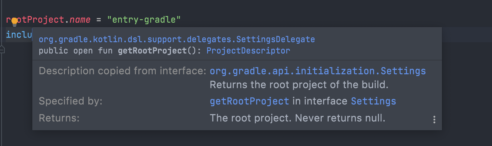

## 1 章はじめに

こんにちは、です。

最近、Gradle を使ったプロジェクトを 1 から構築することがありました。
以前から Gradle を使ったことはあったのですが、ほとんど雰囲気で触っていたため、いざ諸々をセットアップしようとすると戸惑ってしまうことが多々ありました。そのため、改めて Gradle について学んだほうが良かろうということになりました。

この記事では、改めて Gradle を学んだ際に自分のためにまとめたドキュメントを再編集して公開します。

<!--more-->

### お断り

ほとんどが [Gradle User Manual](https://docs.gradle.org/current/userguide/userguide.html)からの引用です。公式ドキュメントを読み込める方には不要かもしれません。

### 使用するバージョン

```bash
$ gradle -v

Welcome to Gradle 7.2!

Here are the highlights of this release:
 - Toolchain support for Scala
 - More cache hits when Java source files have platform-specific line endings
 - More resilient remote HTTP build cache behavior

For more details see https://docs.gradle.org/7.2/release-notes.html

------------------------------------------------------------
Gradle 7.2
------------------------------------------------------------

Build time:   2021-08-17 09:59:03 UTC
Revision:     a773786b58bb28710e3dc96c4d1a7063628952ad

Kotlin:       1.5.21
Groovy:       3.0.8
Ant:          Apache Ant(TM) version 1.10.9 compiled on September 27 2020
JVM:          17 (Amazon.com Inc. 17+35-LTS)
OS:           Mac OS X 11.6 x86_64
```

## 2 章 Gradle の概要

Gradle は、柔軟性とパフォーマンスに重点を置いたオープンソースのビルドオートメーションツールです。Gradle のビルドスクリプトは Groovy または Kotlin DSL を使って記述できます。

[Gradle の特徴](https://docs.gradle.org/current/userguide/userguide.html)は次の通りです。

- **高いカスタマイズ性** - Gradle はカスタマイズと拡張が可能なようにモデル化されています。
- **高速** - Gradle は前回の実行結果からの出力を再利用し、変更のあった入力のみを処理します。また、タスクを並行して実行することで、タスクを高速に完了させます。
- **パワフル** - Gradle は Android の公式ビルドツールであり、多くの一般的な言語と技術をサポートしています。

### なぜ Kotlin を DSL に使うのか

今回は DSL に Kotlin を利用します。理由は次の通りです。

- 始めて学ぶ人にとって、動的型付け言語が分かりにくい
  - 知らないシンタックスやメソッドを推測する手段が少ない
  - Kotlin だと IDE 上から型が推測しやすい

今回は上記の理由により Kotlin を選びましたが、後々 Gradle を理解すれば Groovy で書いても問題になることは少ないと思います。

## 3 章シンプルなプロジェクトで構成を学ぶ

[Building Java Applications Sample](https://docs.gradle.org/current/samples/sample_building_java_applications.html)を参考に、シンプルなプロジェクトを使って Gradle のプロジェクトの構成について学びます。

### プロジェクトを作成する

まず、プロジェクトを作成します。実装言語は Java、DSL は Kotlin を選択します。

```bash
$ pwd
${HOME}/entry-gradle
# entry-gradleという名前のディレクトリをプロジェクトのルートディレクトリにしています

$ gradle init
Starting a Gradle Daemon, 1 stopped Daemon could not be reused, use --status for details

Select type of project to generate:
  1: basic
  2: application
  3: library
  4: Gradle plugin
Enter selection (default: basic) [1..4] 2 # アプリケーションを作るので

Select implementation language:
  1: C++
  2: Groovy
  3: Java
  4: Kotlin
  5: Scala
  6: Swift
Enter selection (default: Java) [1..6] 3

Split functionality across multiple subprojects?:
  1: no - only one application project
  2: yes - application and library projects
Enter selection (default: no - only one application project) [1..2] 1

Select build script DSL:
  1: Groovy
  2: Kotlin
Enter selection (default: Groovy) [1..2] 2

Select test framework:
  1: JUnit 4
  2: TestNG
  3: Spock
  4: JUnit Jupiter
Enter selection (default: JUnit Jupiter) [1..4] 1

Project name (default: entry-gradle):
Source package (default: entry.gradle):

> Task :init
Get more help with your project: https://docs.gradle.org/7.2/samples/sample_building_java_applications.html

BUILD SUCCESSFUL in 1m 31s
2 actionable tasks: 2 executed
```

### 動作確認する

`app/src/main/java/entry/gradle/App.java`を実行してみます。

```java
package entry.gradle;

public class App {
    public String getGreeting() {
        return "Hello World!";
    }

    public static void main(String[] args) {
        System.out.println(new App().getGreeting());
    }
}
```

```bash
$ ./gradlew run

> Task :app:run
Hello World!

BUILD SUCCESSFUL in 582ms
2 actionable tasks: 1 executed, 1 up-to-date
```

無事 `Hello World` と出力されました。`./gradlew` スクリプトについては後述します。

### 具体的なプロジェクト構成を学ぶ

`gradle init` 実行後のプロジェクト構成は次の通りです。

```bash
$ tree
.
├── settings.gradle.kts # 1
├── gradlew # 2
├── gradlew.bat # 2
├── gradle # 3
│   └── wrapper
│       ├── gradle-wrapper.jar
│       └── gradle-wrapper.properties
└── app
    ├── build.gradle.kts # 4
    └── src
        ├── main
        │   ├── java
        │   │   └── entry
        │   │       └── gradle
        │   │           └── App.java
        │   └── resources
        └── test
            ├── java
            │   └── entry
            │       └── gradle
            │           └── AppTest.java
            └── resources
```

このプロジェクトは複数のプロジェクトに分かれた**マルチプロジェクト**構成となっています。

生成されたプロジェクトは次の 2 つのプロジェクトを持っています。

- `/`のルートプロジェクト
- `/app`のサブプロジェクト



次のセクションから生成されたファイルを順に見ていきます。

#### 1. `settings.gradle.kts`

`settings.gradle.kts`は[設定ファイル(Settings file)](https://docs.gradle.org/current/userguide/build_lifecycle.html#sec:settings_file) と呼ばれます。

```kotlin
rootProject.name = "entry-gradle"
include("app")
```

いくつか特徴を見てきます。

まず、拡張子が `kts`です。これは Kotlin を使った DSL であることを表します。`.kts`がついていない場合は Groovy で書かれた DSL となります。

次に、何も import していないのにも関わらず、代入や関数呼び出しが行われています。
`settings.gradle.kts` は[org.gradle.api.initialization.Settings](https://docs.gradle.org/current/dsl/org.gradle.api.initialization.Settings.html)型と 1 対 1 で対応しています。そのため、 `Settings`に定義されているプロパティに暗黙的にアクセスできます。
Kotlin DSL としては、[org.gradle.kotlin.dsl.support.delegates.SettingsDelegate](https://github.com/gradle/gradle/blob/master/subprojects/kotlin-dsl/src/main/kotlin/org/gradle/kotlin/dsl/support/delegates/SettingsDelegate.kt)に対応しており、IDE の定義参照などではこのファイルが参照されています。



ここまで知っていれば、 `Settings`のドキュメントや IDE の定義参照を使うことで、 `settings.gradle.kts` で設定できる値がすぐ分かります。

`gradle init`で生成された `settings.gradle.kts` 設定されている値の意味は次の通りです。

- `rootProject.name` : プロジェクトの名前を指定する。
- `include(”app”)` : `app` というサブプロジェクトをビルドに含めることを定義する。新しいサブプロジェクトを追加したときはここに追記する。

#### 2. `gradlew`、 `gradlew.bat`

これらは [**Gradle Wrapper**](https://docs.gradle.org/current/userguide/gradle_wrapper.html)と呼ばれるスクリプトです。

Gradle Wrapper は、指定したバージョンの Gradle を起動するスクリプトです。指定したバージョンがインストールされていなければダウンロードしてくれます。
この仕組みを使うことで、開発者は手動でインストールを作業することなく、Gradle プロジェクトを素早く実行できます。

基本的に Gradle のバージョンは開発者間で統一することが望ましいので、各開発者は `gradle` コマンドを直接使わず、Gradle Wrapper を通じて実行することが推奨されています。

```bash
$ gradle run
$ ./gradlew run # こちらの方が好ましい
```

なお、このスクリプトは基本的に開発者が編集する必要はありません。多くの開発者が設定したい値は後述する `gradle/wrapper/gradle-wrapper.properties`に定義することが多いです。
何らかの理由で Gradle Wrapper をカスタマイズしたい場合は、ドキュメントを参照してください。



#### 3. `gradle/wrapper/gradle-wrapper.properties`

Gradle Wrapper で使う Gradle のバージョンなどを定義するファイルです。

```bash
distributionBase=GRADLE_USER_HOME
distributionPath=wrapper/dists
distributionUrl=https://services.gradle.org/distributions/gradle-7.2-bin.zip
zipStoreBase=GRADLE_USER_HOME
zipStorePath=wrapper/dists
```

この例では、Gradle v7.2 を使うように設定されています。

#### 4. `app/build.gradle.kts`

[ビルドスクリプト (Build Script)](https://docs.gradle.org/current/userguide/tutorial_using_tasks.html)と呼ばれる、各プロジェクトの設定の定義をしたり、**タスク (Task)** を定義したりといった様々なことができるスクリプトです。

ビルドスクリプトは Gradle の中で最も重要なファイルの 1 つです。ビルドスクリプトでできることは非常に多く、説明したい概念も多いです。
そのため、このセクションでは `gradle init` で生成された部分を軽く眺め、残りは後述することにします。

```kotlin
plugins {
    // Apply the application plugin to add support for building a CLI application in Java.
    application
}

repositories {
    // Use Maven Central for resolving dependencies.
    mavenCentral()
}

dependencies {
    // Use JUnit test framework.
    testImplementation("junit:junit:4.13.2")

    // This dependency is used by the application.
    implementation("com.google.guava:guava:30.1.1-jre")
}

application {
    // Define the main class for the application.
    mainClass.set("entry.gradle.App")
}
```

ビルドスクリプトは [org.gradle.api.Project](https://docs.gradle.org/current/dsl/org.gradle.api.Project.html) 型と 1 対 1 で対応しています。
そのため、 `Project` に定義されている `plugin` や `dependencies` を import なしで呼び出せます。

また、[default Gradle API imports](https://docs.gradle.org/current/userguide/writing_build_scripts.html#script-default-imports) に定義されているものも暗黙的に import されています。
唐突に呼び出されているメソッドやプロパティを見かけた場合は、これらに定義されていないか確かめると良いです。 (後述する Gradle Plugin により追加されたものの場合もあります。)



</aside>

定義されている各設定は次の通りです。

- `plugins`
  - **Gradle Plugin**と呼ばれる Gradle プロジェクトを拡張するプラグインを使うための設定
  - ここでは、 `application`という Gradle 標準のプラグインを読み込んでいる
  - プラグインの詳細は後述
- `repositories`
  - `dependencies` で指定する依存ライブラリがホスティングされているリポジトリを設定する
  - [Maven Central](https://search.maven.org/) は事実上デファクトとなっているリポジトリ
- `dependencies`
  - プロジェクトで使用する依存ライブラリを定義する
  - [依存関係の設定は様々な方法がある](https://docs.gradle.org/current/userguide/dependency_management_for_java_projects.html#sec:configurations_java_tutorial)
- `application`
  - `application` プラグインに関する設定
  - プラグインを読み込むことで元々存在しないブロックを定義できるようになる

### ここまでのまとめ

`gradle init` で作成される初期プロジェクトから学べる Gradle の知識は次の通りです。

- マルチプロジェクトと呼ばれる複数のサブプロジェクトに分かれたプロジェクトを作成できる
- Gradle Wrapper は Gradle のバージョンなどを固定するためのスクリプト
- `settings.gradle.kts`は `org.gradle.api.initialization.Settings`と 1 対 1 対応している
  - 困ったら https://docs.gradle.org/current/dsl/org.gradle.api.initialization.Settings.html を見れば良い
- `build.gradle.kts`は `org.gradle.api.Project`と 1 対 1 対応している
  - 困ったら https://docs.gradle.org/current/dsl/org.gradle.api.Project.htmlを見れば良い
- `build.gradle.kts` の `dependencies` ブロックで依存関係を記述する (この章では概要のみ)
- Gradle Plugin はプロジェクトを拡張するためのプラグイン (この章では概要のみ)

## 4 章 `dependencies`を使った依存関係の追加

3 章で簡単に依存関係の追加の方法を説明しました。
ここでは、実際にサードパーティのライブラリを依存関係に追加し、Java から呼び出してみます。

### 依存関係を追加する

今回は、[Lombok](https://projectlombok.org/) を依存関係に追加してみます。

公式ドキュメントによると、Lombok は Maven Central にホスティングされているので、 `repositories` の追加は不要です。 `/app/build.gradle.kts` に `dependencies` を追加します。

```diff
dependencies {
+   compileOnly("org.projectlombok:lombok:1.18.22")
+   annotationProcessor("org.projectlombok:lombok:1.18.22")
+   testCompileOnly("org.projectlombok:lombok:1.18.22")
+   testAnnotationProcessor("org.projectlombok:lombok:1.18.22")

    // Use JUnit test framework.
    testImplementation("junit:junit:4.13.2")

    // This dependency is used by the application.
    implementation("com.google.guava:guava:30.1.1-jre")
}
```

なお、ビルドスクリプトは普通の Kotlin のコードが書けるので、次のようにバージョンを変数として管理もできます。

```kotlin
val lombokVersion = "1.18.22"
dependencies {
    compileOnly("org.projectlombok:lombok:${lombokVersion}")
    annotationProcessor("org.projectlombok:lombok:${lombokVersion}")

    testCompileOnly("org.projectlombok:lombok:${lombokVersion}")
    testAnnotationProcessor("org.projectlombok:lombok:${lombokVersion}")
}
```

さて、設定を眺めると `compileOnly`や `annotationProcessor`など、見慣れないメソッドがでてきました。

これらは **依存関係コンフィグレーション(Dependency Configuration)** と呼ばれ、依存関係を宣言するために使われるメソッドです。

Lombok はコンパイル時にアノテーションを解釈するので、コンパイル後には不要です。そのため、コンパイル時のみに使用する `compileOnly` とアノテーションを処理するのに必要な `annotationProcessor` が使われています。

その他のメソッドを含め詳しい動作は、Android および Gradle の公式ドキュメントが詳しいので参照してください。





### Java から追加した依存関係を呼び出す

`app/src/main/java/entry/gradle/App.java`で Lombok を使ってみます。

IDE で補完が出ない場合は、IDE 内で Gradle をリロードして、IDE 内で依存関係をダウンロードさせると動く場合が多いです。

```java
package entry.gradle;

+ import lombok.Value;

public class App {
    public String getGreeting() {
        return "Hello World!";
    }

    public static void main(String[] args) {
        System.out.println(new App().getGreeting());
+       var user = new User("p1ass", 23);
+       System.out.println(user);
    }

+   @Value
+   public static class User {
+       String name;
+       int age;
+   }
}
```

```bash
$ ./gradlew run

> Task :app:run
Hello World!
App.User(name=p1ass, age=23)

BUILD SUCCESSFUL in 975ms
2 actionable tasks: 2 executed
```

Lombok を import して使うことができました。

### ここまでのまとめ

- `dependencies`ブロックに依存関係コンフィグレーションを追加することで依存関係を追加できる
- ビルドスクリプトでは Kotlin のコードを書ける
- IDE で補完が出なかったら IDE 内の Gradle をリロードすると良い

## 5 章 Gradle のタスク(Task)を理解する

今までの説明で時折タスクという単語が出てきましたが、これは一般名詞としてのタスクではなく [Gradle の用語としてタスク](https://docs.gradle.org/current/userguide/tutorial_using_tasks.html)です。ここでは、Gradle のタスクについて説明します。

Gradle プロジェクトで実行できる作業はタスクという形で定義されます。タスクは Gradle が実行するアトミックな作業を表し、Gradle プロジェクトに紐づきます。

タスクの具体例としては次のようなものが挙げられます。

- クラスのコンパイル
- JAR の作成
- Javadoc の作成
- リポジトリへの公開

タスクは後述する Gradle Plugin を適用することで、事前定義されたタスクを使えるようにできます。
そのため、誰かが作ってくれたタスクと同様の作業をしたい場合は自分でタスクを定義する必要はありません。
しかし、何らかのカスタムした作業を Gradle 内で実行したい場合は自分でタスクを定義する必要があります。

### 簡単なタスクを定義する

タスクはビルドスクリプトに定義します。
試しに、 `app/build.gradle.kts` に `JAVA_HOME` を標準出力に表示するタスクを定義します。

```kotlin
tasks.register("showJavaHome") {
    doFirst {
        println(System.getenv("JAVA_HOME"))
    }

    println("this: $this")
}
```

タスクは `./gradlew [タスク名]`で実行できます。

```bash
$ ./gradlew app:showJavaHome
this: task ':app:showJavaHome' # registerのブロックはTaskであることが分かる

> Task :app:showJavaHome
/Users/p1ass/.jenv/versions/corretto64-17

BUILD SUCCESSFUL in 1s
1 actionable task: 1 executed

$ ./gradlew showJavaHome # タスク名が被らない場合はプロジェクト名を省略できる
this: task ':app:showJavaHome'

> Task :app:showJavaHome
/Users/p1ass/.jenv/versions/corretto64-17
```

タスクが実行できました。

`tasks` は [TaskContainer](https://docs.gradle.org/current/dsl/org.gradle.api.tasks.TaskContainer.html) で、タスクの追加や検索といったタスクの管理を責務にしています。
TaskContainer には `register` メソッドが定義されており、タスクを定義して TaskContainer に登録できます。

### タスクの構成

タスクの具体的な処理は[アクション (Action)](https://docs.gradle.org/current/javadoc/org/gradle/api/Action.html)という形で抽象化されています。
タスクが実行されるとタスクに紐付けられているのアクションが順に実行されます。
アクションは [org.gradle.api.Task](https://docs.gradle.org/current/dsl/org.gradle.api.Task.html)に定義されている`doFirst` や `doLast` を通じて、順序を指定しながらタスクに紐付けます。

この例では、`showJavaHome` というタスクに `JAVA_HOME` を表示するというアクションを紐付けていることになります。

### Gradle ビルドのライフサイクル

先程のタスクの実行例を見て不思議に思ったことはないでしょうか？
`this` を表示する `println`の結果が `doFirst`の結果よりも先に表示されているのです。
`doFirst`がタスクの実行の最初に呼ばれることは直感的に分かると思うのですが、 `println`はいつ呼ばれるのでしょうか？

これを理解するには、[ビルドのライフサイクル](https://docs.gradle.org/current/userguide/build_lifecycle.html)を理解する必要があります。

#### ビルドフェーズ

Gradle ビルドには 3 つのフェーズが存在します。

1. **Initialization** : どのプロジェクトが今回のビルドに必要か判定し、必要なプロジェクトの `Project`インスタンスを生成します。
1. **Configuration** : ビルドに含まれる全てのプロジェクトのビルドスクリプトを実行します。
1. **Execution** : まず、Configuration フェーズで作成・設定されたタスク群から実行するタスクを特定します。実行するタスクは、gradle コマンドに渡されたタスク名と、カレントディレクトリによって決定されます。その後、特定されたタスクを実行します。

### ビルドフェーズと処理の実行順序

ポイントは、ビルドフェーズにより、実行される設定ファイルやビルドスクリプトが異なる点です。

1. 設定ファイルは Initialization フェーズで実行されます。
1. ビルドスクリプトは Configuration フェーズで実行されます。
1. ビルドスクリプトのうち、タスクの `doFirst`や `doLast`で登録されたアクションは Execution フェーズで実行されます。

先程の例では、 `println`が Configuration フェーズで実行され、`doFirst`はその後の Execution フェーズで実行されたため、先に `this`が出力されたのです。

#### より複雑な例

[公式ドキュメント](https://docs.gradle.org/current/userguide/build_lifecycle.html#sec:settings_file)より、複雑な例を引用します。

```kotlin
// settings.gradle.kts
rootProject.name = "basic"
println("This is executed during the initialization phase.")

```

```kotlin
// build.gradle.kts
println("This is executed during the configuration phase.")

tasks.register("configured") {
    println("This is also executed during the configuration phase, because :configured is used in the build.")
}

tasks.register("test") {
    doLast {
        println("This is executed during the execution phase.")
    }
}

tasks.register("testBoth") {
    doFirst {
        println("This is executed first during the execution phase.")
    }
    doLast {
        println("This is executed last during the execution phase.")
    }
    println("This is executed during the configuration phase as well, because :testBoth is used in the build.")
}
```

```bash
$ ./gradlew test testBoth

This is executed during the initialization phase.

> Configure project :
This is executed during the configuration phase.
This is executed during the configuration phase as well, because :testBoth is used in the build.

> Task :test
This is executed during the execution phase.

> Task :testBoth
This is executed first during the execution phase.
This is executed last during the execution phase.

BUILD SUCCESSFUL in 0s
2 actionable tasks: 2 executed
```

ビルドフェーズの概念が分かると、なぜこの順序で `println` が実行されているのか理解できるようになると思います。

### タスクの処理を Convention フェーズに書くか Execution フェーズに書くか

タスクの処理は Convention フェーズと Execution フェーズの両方に書くことができます。
では、どちらにタスクの処理を書くべきでしょうか？

[公式ドキュメントのベストプラクティス](https://docs.gradle.org/current/userguide/authoring_maintainable_build_scripts.html#sec:minimize_logic_executed_configuration_phase)によると、**Convention フェーズに実行されるロジックを最小限に抑えることが推奨されています。**
Convention フェーズでは、実行するタスク以外のタスクも構成されます。そのため、アクションではないタスクのコードは、ビルドの実行のたびに、たとえ実行されないタスクだとしても毎回実行されてしまいます。
したがって、タスクの処理はできるだけアクションに書き、Execution フェーズで実行されるようにしてください。

### タスク間の依存関係と実行順序

Gradle のタスクは[他のタスクとの依存関係を定義したり、あるタスクの後に別のタスクを実行したりといったスケジューリングを定義できます。](https://docs.gradle.org/current/userguide/more_about_tasks.html#sec:adding_dependencies_to_tasks)

`/app/build.gradle.kts` に次のようなタスクを定義して実行してみます。

```kotlin
tasks.register("foo") {
    doLast {
        println("foo")
    }
}

tasks.register("bar") {
    dependsOn("foo")
    doLast {
        println("bar")
    }
}
```

```bash
$ ./gradlew bar

> Task :app:foo
foo

> Task :app:bar
bar

BUILD SUCCESSFUL in 683ms
2 actionable tasks: 2 executed
```

`dependsOn` を使って、 `bar`タスクは `foo` タスクに依存していることを宣言しています。そのため、 `bar` タスクを実行すると、先に `foo`タスクが実行されます。

なお、今回はタスク名を文字列で指定しましたが、 `TaskProvider`を使うことでタスクの参照を使って依存関係を定義できます。

```kotlin
val fooTask = tasks.register("foo") {
    doLast {
        println("foo")
    }
}

val barTask = tasks.register("bar") {
    dependsOn(fooTask)
    doLast {
        println("bar")
    }
}

// 以下はKotlinの移譲(delegation)を使った例
// https://docs.gradle.org/current/userguide/kotlin_dsl.html#using_kotlin_delegated_properties

val fooTask by tasks.registering {
    doLast {
        println("foo")
    }
}

val barTask by tasks.registering {
    dependsOn(fooTask)
    doLast {
        println("bar")
    }
}
```

他にも `mustRunAfter`を使った実行順序の指定もできます。

```kotlin

val fooTask by tasks.registering {
    doLast {
        println("foo")
    }
}

val barTask by tasks.registering {
    dependsOn(fooTask)
    doLast {
        println("bar")
    }
}

barTask {
    mustRunAfter(fooTask)
}
```

```bash
$ ./gradlew bar foo

> Task :app:foo
foo

> Task :app:bar
bar

BUILD SUCCESSFUL in 512ms
2 actionable tasks: 2 executed
```

コマンドライン引数として `bar` 、 `foo`の順にタスクを指定しましたが、実行順序の指定により先に `foo`が実行されます。

なお、 `mustRunAfter`は実行順序の指定のみで、依存関係を指定しているわけではないです。
そのため、 `bar` を実行しても `foo`は実行されません。

```bash
$ ./gradlew bar

> Task :app:bar
bar

BUILD SUCCESSFUL in 503ms
1 actionable task: 1 executed
```

他にも、 `onlyIf` を使ったタスクを実行する条件の指定など色々できるので、より詳しく知りたい方は[ドキュメント](https://docs.gradle.org/current/userguide/more_about_tasks.html)を参照してください。

### タスクの Up-to-date チェック (インクリメンタルビルド)

Gradle は、入力が変わらない限り、一度実行したタスクをもう一度実行しないようにしてくれます。再実行が不要なタスクをスキップすることで、ビルド時間を節約できます。この機能は[インクリメンタルビルドと呼ばれています。](https://docs.gradle.org/current/userguide/more_about_tasks.html#sec:up_to_date_checks)

#### 仕組み

Gradle では、タスクに指定された入力と出力のいずれかが前回のビルド以降に変更されていないかチェックします。もし変更されていなければ、そのタスクは最新 (Up-to-date) とみなし、そのタスクをスキップします。


_公式ドキュメントより引用 (コンパイルの例)_

#### 簡単な例

```kotlin
tasks.register("incrementalTest"){
    inputs.file("input.txt")
    outputs.file("output.txt")

    doLast {
        println("incrementalTest")
    }
}
```

`inputs` は [TaskInputs](https://docs.gradle.org/current/javadoc/org/gradle/api/tasks/TaskInputs.html) 、 `output`は[TaskOutputs](https://docs.gradle.org/current/javadoc/org/gradle/api/tasks/TaskOutputs.html)インターフェースで、それぞれタスクの入出力を定義できます。

```bash

$ ./gradlew incrementalTest

> Task :app:incrementalTest
incrementalTest

BUILD SUCCESSFUL in 1s
1 actionable task: 1 executed # 最初は実行される

$ ./gradlew incrementalTest

BUILD SUCCESSFUL in 539ms
1 actionable task: 1 up-to-date # 入出力が変わってないので、実行されない

# ここでinput.txtを書き換える
$ vim PATH_TO_input.txt

$ ./gradlew incrementalTest

> Task :app:incrementalTest
incrementalTest

BUILD SUCCESSFUL in 458ms
1 actionable task: 1 executed # もう一度実行された
```

### ここまでのまとめ

- タスクの管理は `TaskContainer` が行う
- タスクの処理は一連のアクションとして定義される
- タスクの実行には 3 つのフェーズが存在する
- タスクの処理はできるだけ Execution フェーズに実行されるアクションとして書く
- タスクの依存関係や実行順序を指定できる
- 入出力の変更をチェックすることで、タスクの実行をスキップしビルド時間を短縮できる

## 6 章 Gradle Plugin を使った機能拡張

[Gradle Plugin](https://docs.gradle.org/current/userguide/plugins.html) は Gradle に機能を追加するためのインターフェースです。
Gradle Plugin はプラグイン固有の新しいタスクやオブジェクト、規約(convention)を追加できます。

### Gradle Plugin のメリット

ある程度まとまった処理をプラグインとして抽象化することで、命令的な処理を Plugin の具体的な実装の中に閉じ込めることができます。
結果として、ビルドスクリプト内では、プラグインを読み込むための宣言のみを含めることになり、[ビルドスクリプトのコードの理解と保守が容易になります。](https://docs.gradle.org/current/userguide/authoring_maintainable_build_scripts.html#sec:avoid_imperative_logic_in_scripts)

また、他のプロジェクトで Plugin を再利用できるようになるメリットもあります。

### Gradle Plugin を適用する

実際にサードパーティで提供されているプラグインを適用してみます。

今回は、4 章でも使った Lombok をプラグインを通して適用してみます。
Lombok のインストールは直接 `dependencies` に追加する方法とプラグインを適用する方法の [2 種類が提供されています。](https://projectlombok.org/setup/gradle)
プラグインを使うことでより簡単に Lombok を使うことができます。

`app/build.gradle.kts` を編集します。

```diff
plugins {
    // Apply the application plugin to add support for building a CLI application in Java.
    application
+   id("io.freefair.lombok") version "6.3.0"
}

repositories {
    // Use Maven Central for resolving dependencies.
    mavenCentral()
}

- val lombokVersion = "1.18.22"
dependencies {
-    compileOnly("org.projectlombok:lombok:${lombokVersion}")
-    annotationProcessor("org.projectlombok:lombok:${lombokVersion}")

-    testCompileOnly("org.projectlombok:lombok:${lombokVersion}")
-    testAnnotationProcessor("org.projectlombok:lombok:${lombokVersion}")
}
```

```bash
$ ./gradlew run
Starting a Gradle Daemon (subsequent builds will be faster)

> Task :app:run
Hello World!
App.User(name=p1ass, age=23)

BUILD SUCCESSFUL in 23s
3 actionable tasks: 3 executed
```

Lombok のプラグインは、依存関係の追加や Lombok 用のタスクを追加してくれるため、正しく依存関係の解決が行われコンパイルできました。

Lombok のプラグインによって追加されたタスクは `gradlew` で実行できます。

```bash
$ ./gradlew delombok

BUILD SUCCESSFUL in 793ms
1 actionable task: 1 up-to-date34546
```

また、プラグインで追加ぢｓたタスクに対して、追加の処理を定義できます。

```kotlin
// TaskContainerからタスクを取得している
tasks["delombok"].doLast {
    // サードパーティのタスクの実行にフックして何かをしたいときに便利
    println("delombok doLast")
}
```

```bash
$ ./gradlew delombok

> Task :app:delombok
delombok doLast

BUILD SUCCESSFUL in 4s
1 actionable task: 1 executed
```

### プラグインを自作する

サードパーティのプラグインをインターネット経由で適用するだけでなく、ローカルのプロジェクト内でプラグインを作ることも可能です。

では、どういったときにプラグインを自作するのでしょうか？
公式ドキュメントでは、次の用途が紹介されています。

- 命令的な処理をカプセル化したいとき
- 複数のサブプロジェクト間で共通の規約(Convention)をまとめるとき

### 命令的な処理をプラグインでカプセル化する

プラグインのメリットの１つであるカプセル化を用いて、命令的な処理をビルドスクリプトからプラグインに追いやれることです。
次に示すコードは[公式ドキュメント](https://docs.gradle.org/current/userguide/authoring_maintainable_build_scripts.html#sec:avoid_imperative_logic_in_scripts)から引用したものです。

例えば、次のような `guild.gradle.kts`があるとします。

```kotlin
if (project.findProperty("releaseEngineer") != null) {
    tasks.register("release") {
        doLast {
            logger.quiet("Releasing to production...")

            // release the artifact to production
        }
    }
}
```

`release`タスクはプロパティの値によって `TaskContainer` に登録されるかどうか分岐していて、命令的なロジックが含まれています。
この例のコードは小さいですが、より大きなビルドスクリプトで多くの手続き的な処理が含まれていたら、可読性と保守性が下がってしまうことは容易に想像できます。

このような場合は、命令的なロジックを `buildSrc` 内にプラグインとして書き、ビルドスクリプトではそのプラグインを適用する宣言だけを書くことにします。
これにより、ビルドスクリプトをシンプルに保てます。

```java
// buildSrc/src/main/java/com/enterprise/ReleasePlugin.java

package com.enterprise;

import org.gradle.api.Action;
import org.gradle.api.Plugin;
import org.gradle.api.Project;
import org.gradle.api.Task;
import org.gradle.api.tasks.TaskProvider;

public class ReleasePlugin implements Plugin<Project> {
    private static final String RELEASE_ENG_ROLE_PROP = "releaseEngineer";
    private static final String RELEASE_TASK_NAME = "release";

    @Override
    public void apply(Project project) {
        if (project.findProperty(RELEASE_ENG_ROLE_PROP) != null) {
            Task task = project.getTasks().create(RELEASE_TASK_NAME);

            task.doLast(new Action<Task>() {
                @Override
                public void execute(Task task) {
                    task.getLogger().quiet("Releasing to production...");

                    // release the artifact to production
                }
            });
        }
    }
}
```

```kotlin
// build.gradle.kts

plugins {
    id("com.enterprise.release")
}
```

なお、ここで登場した `buildSrc` ディレクトリはプラグインの実装など、[ビルドスクリプトに含めるべきでないコードを置く場所として使われます。](https://docs.gradle.org/current/userguide/organizing_gradle_projects.html#sec:build_sources)
`buildSrc` は、Gradle がコンパイルしビルドスクリプトのクラスパスに配置してくれます。
そのため、 `buildSrc`に書かれたプラグインをビルドスクリプトから呼び出せます。

### Convention Plugin を作成する

マルチプロジェクト構成の複数のサブプロジェクトは、いくつか共通の性質を持っている場合があります。
例えば、`Foo` プロジェクトと `Bar` プロジェクトは両方同じライブラリを使用しているといった性質です。
しかし、このライブラリは `Baz` プロジェクトでは利用しておらず、マルチプロジェクト全体でこのライブラリを有効化したくないということが考えられます。

こういった場合には、`Foo` プロジェクトと `Bar` プロジェクトに[共通する規約(Convention)をプラグインという形で定義します。](https://docs.gradle.org/current/userguide/sharing_build_logic_between_subprojects.html#sec:convention_plugins)
それぞれのプロジェクトで定義したプラグインを適用することで、規約を共通化できます。

#### 設定例

今回は [Precomiled Script Plugin](https://docs.gradle.org/current/userguide/custom_plugins.html#sec:precompiled_plugins) と呼ばれる方法でプラグインを作成します。

```gradle
// buildSrc/build.gradle
plugins {
    `kotlin-dsl` // Kotlin DSLでPrecomiled script pluginを有効にするために必要
}

repositories {
    mavenCentral()
}
```

```kotlin
// buildSrc/src/main/kotlin/library-convention.gradle.kts

plugins {
    java
}

val lombokVersion = "1.18.22"
dependencies {
    // 共通で使うライブラリをつらつら書く
    compileOnly("org.projectlombok:lombok:${lombokVersion}")
    annotationProcessor("org.projectlombok:lombok:${lombokVersion}")

    testCompileOnly("org.projectlombok:lombok:${lombokVersion}")
    testAnnotationProcessor("org.projectlombok:lombok:${lombokVersion}")
}
```

```diff
// app/build.gradle.kts
plugins {
    // Apply the application plugin to add support for building a CLI application in Java.
    application
+   `library-convention` // 作った自作Convention Pluginを読み込む
}

dependencies {
-		 val lombokVersion = "1.18.22"
-    compileOnly("org.projectlombok:lombok:${lombokVersion}")
-    annotationProcessor("org.projectlombok:lombok:${lombokVersion}")

-    testCompileOnly("org.projectlombok:lombok:${lombokVersion}")
-    testAnnotationProcessor("org.projectlombok:lombok:${lombokVersion}")
}
```

```bash
$ ./gradlew clean # 一回cleanしないと正しくコンパイルできないときがあった

BUILD SUCCESSFUL in 612ms
14 actionable tasks: 1 executed, 13 up-to-date

$ ./gradlew run

> Task :app:run
Hello World!
App.User(name=p1ass, age=23)

BUILD SUCCESSFUL in 929ms
15 actionable tasks: 3 executed, 12 up-to-date
```

作った `library-convention` プラグインを読み込むことで、 `app` プロジェクトのビルドスクリプトに依存関係を書くことなく、コンパイルできました。

### ここまでのまとめ

- Gradle Plugin を使うことで命令的なロジックをビルドスクリプトから取り除ける
- 複数のサブプロジェクトで使いたい規約を Convention Plugin という形で共通化できる

## 7 章 FAQ

### Gradle のベストプラクティスはありますか？

公式ドキュメントにあります。





### 大規模なプロジェクトを作るときのコツはありますか？

公式ドキュメントにあります。



## 8 章 終わりに

この記事では、Gradle について基本的な概念から少し踏み込んだ概念まで紹介しました。
かなり長い文章になってしまいましたが、一度理解することで、Gradle のプロジェクトに対する理解がかなり深まると思います。(そうなることを願っています。)

もし、誤りなどを見つけたら、[ブログをホスティングしている GitHub](https://github.com/p1ass/blog)の issue、もしくは PR という形でお知らせしたいただけると嬉しいです。
