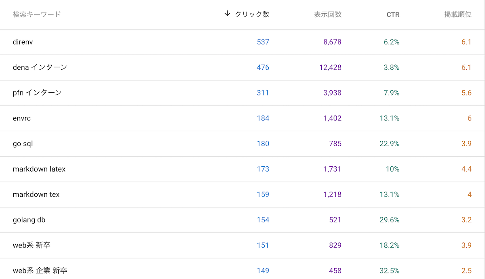

こんにちは、[@p1ass](https://twitter.com/p1ass)です。

ブログをはてなブログから移行して一年経ったので、色々感想や分かったことを書いていこうと思います。

<blockquote class="twitter-tweet">
ブログ移行してから1年経ったらしい <a href="https://t.co/kRLp82lVuO">https://t.co/kRLp82lVuO</a>
&mdash; ぷらす (@p1ass) <a href="https://twitter.com/p1ass/status/1280907489551151104?ref_src=twsrc%5Etfw">July 8, 2020</a></blockquote> 

<!--more-->

## 移行のモチベーション

そもそもはてなブログを辞めたいを思ったきっかけは、レスポンスの遅さでした。トップページや記事を読み込むのに結構時間がかかり、う〜んと思ってました。また、デザインを好き勝手いじるのが少々難しく、もっとカスタマイズしたいなぁと思っていました。

そんな中、静的サイトジェネレータを使えば簡単にブログを生成出来ると知り、はてなブログから Hugo に移行することにしました。なぜ Hugo にしたのかはこの記事を趣旨から逸れるので省略します。

## ブログのカスタマイズとか記事の書きやすさとか

まず、デザインに関しては[Tale](https://github.com/EmielH/tale-hugo/)というテーマにパッチを当てて使っています。パッチは HTML ファイルや CSS ファイルを`layouts/` や `/assets`ディレクトリにコピってきてコードを書き換えています。今思えば、テーマを Fork して書き換えた方が見通しよく管理できる気がして、やらかしたなと思ってます。まあ一度書き換えたら頻繁にいじらないし、、、ということで放置してます。

記事の書きやすさに関しては、「普通にストレスなく書ける」という感じです。Hugo には[ショートコード](https://gohugo.io/content-management/shortcodes/)という機能があり、スペニットを自由に作成出来るのが便利です。

また、ブログは Netlify にホスティングしてあるので、公開前に Deploy Preview で記事の確認が出来るのも便利です。

## 移行後 1 年間のメトリクスとか

### 速度

見て分かる通り、Lighthouse はかなり改善されました。体感でも感じれるレベルで速くなったので非常に満足しています。画像は移行当初のものですが、今もさほど変わっていません。

<blockquote class="twitter-tweet">
ブログ移行で幸せになれた <a href="https://t.co/ZjVfV9LH6C">pic.twitter.com/ZjVfV9LH6C</a>
&mdash; ぷらす (@p1ass) <a href="https://twitter.com/p1ass/status/1147207034019860481?ref_src=twsrc%5Etfw">July 5, 2019</a></blockquote> 

### ページビュー

何回かスパイクがあって分かりにくいのですが、少しずつ増えていってます。

### PV ランキング

1. [21 卒 Web 系ソフトウェアエンジニア職で新卒就活したので結果をまとめる](/posts/job-hunting-2021/)
1. [Twitter トレンド 1 位になった個人開発 Web サービスの負荷対応記録](/posts/midare)
1. [Markdown で書いた実験レポートを TeX 組版の美しい PDF に変換する Docker イメージを作った](/posts/mdtopdf)

という感じで、狙って書いた記事が上位に来てます。これらの記事は Twitter 流入だけでなく、はてブのホットエントリーからの流入もかなりありました。

### はてブ

https://b.hatena.ne.jp/entrylist?url=https%3A%2F%2Fblog.p1ass.com%2F&sort=count

トップ 3 が PV ランキングと一緒です。

### 流入元

Google 検索が一番多いです。次に Twitter、直接、はてなブックマークと続きます。

特徴的なのは、**Twitter とはてブの流入数を足すと Google 検索の流入数を上回ること** です。多くの人に読んでもらいたいなら、SNS で拡散されるような記事を書くことが大事そうです。

とはいえ、Google 検索からの流入も 4 割程度あるので、検索クエリに引っかかりやすいような Tips やバグ対処などの記事の需要も無視できません。

要はバランスってやつですね。

### OS・ブラウザ

OS は iOS と MacOS で過半数を占めるのに対し、ブラウザは Chrome が半数です。

皆 Safari 使ってないんですね、、、(僕もですが)

### 検索パフォーマンス

こっかはら Google Search Console のデータです。

たまに跳ね上がってる部分がありますが、数ヶ月前までは順調に右肩上がりになってました。最近は停滞気味です。

よく見ると周期性があるのが分かると思いますが、土日になると PV が下がっています。みんな土日は仕事してないんですね。(それはそう)

### 検索クエリ

[direnv](/posts/direnv-dotenv)が多くて、次がインターン系、[go sql](/posts/go-database-sql-wrapper)と続きます。

PV ランキングと違う顔ぶれなのがはっきりと分かります。

## おわりに

Hugo に移行して 1 年経ちましたが、満足度はかなり高いです。

僕の場合、自作ブログを作ることよりも記事を書くところにモチベーションがあるので、自由度がありつつも簡単にセットアップ出来るのはとても自分に合っていました。

「記事を沢山書きたいが、はてなブログには不満がある」という人は移行してみると幸せになれるかもしれません。

おわり
