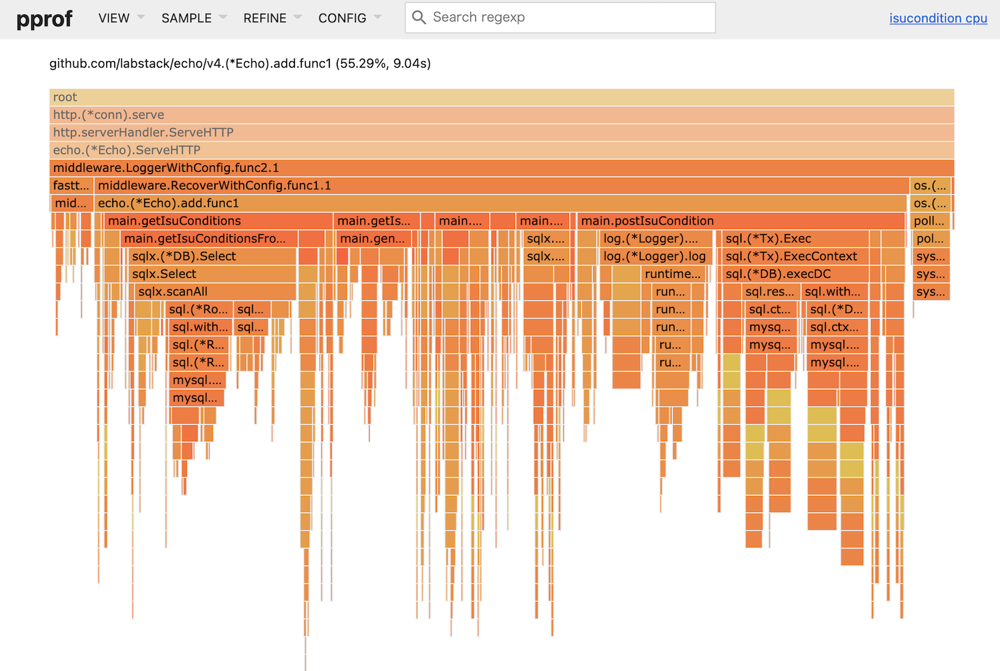

こんにちは [@p1ass](https://twitter.com/p1ass) です。

今年も[去年に引き続き](https://blog.p1ass.com/posts/isucon10/)ISUCON の予選に参加しました。
去年は FAIL で学生枠の本戦出場を逃したので「今年こそは！」と思っていたのですが、タイトルの通り予選敗退しました。
結果は Best が 71,673 点、追試スコアが 67,097 点で 48 位でした。

この記事では、競技中にやったことをまとめておきます。
実装言語は Go で、メンバーは [@Lorse](https://twitter.com/LorseKudos)と [@usagiga](https://twitter.com/usagiga_dev)です。


<!--more-->

## 事前準備

今回は去年とメンバーが一人入れ替わったので、事前に顔合わせの MTG と練習を 2 度オンラインで行いました。

usagiga が全サーバに alp などの初期設置を撒くスクリプトと Nginx のコンフィグをいい感じに git 管理してくれる君を作ってくれました。

## やったこと

### pprof・alp ・pt-query-digest・netdata を追加

計測できないことには始まらないので、app、Nginx、DB の負荷を計測できるようにしました。

### `isu_condition` にインデックスを貼る

`jia_isu_uuid, timestamp` のインデックスを貼ってくれました。
MariaDB では降順インデックスが効かないのですが、とりあえず放置で ASC のインデックスを貼ってくれました。


### `getTrend` の N+1 の改善を試みる

pprof を取ったところ `getTrend` が重たそうだったので改善を試みました。(`postIsuCondition` は後回しにしたけど、理由は忘れました。)


_初期のpprof_

`getTrend` は 
- `character` と `isuList` の2重ループ
- 各 `isu` ごとに最新の `condition` しかいらないのにすべて取得している

 という2つの問題があったので、これらをどうにか 1 回で取ってこようとしました。

ただ、`character` は25 個固定で増える様子がなかったので先に `condition` のほうを改善しようと思い、次のようなクエリを書きました。

```sql
SELECT SUB.id, MAIN.timestamp, MAIN.`condition`
FROM isu_condition as MAIN
INNER JOIN ( 
  SELECT isu.id as id, MAX(ic.timestamp) as max_timestamp,
         `condition`, ic.jia_isu_uuid 
  FROM `isu` as isu
  LEFT JOIN isu_condition as ic 
    ON isu.jia_isu_uuid = ic.jia_isu_uuid
  WHERE `character` = ? 
  GROUP BY id
) as SUB 
ON MAIN.jia_isu_uuid = SUB.jia_isu_uuid AND MAIN.timestamp = SUB.max_timestamp
ORDER BY MAIN.timestamp DESC
```

このクエリを書くことで `isuList` のループがなくなりクエリの発行回数は減りましたが、インデックスがちゃんと効いておらず、スコアはあまり改善しませんでした。
とはいえ取り込まない理由もないよね、ってことで master にマージしました。

### 不要なトランザクションを消す

よくコードを見ると、トランザクションを貼る必要がないのにトランザクションを貼っている部分があったので、剥がしました。

### APP : DBを 1 : 1 構成にする

事前に DB を別サーバに移すことは決まっていたので、裏でやってくれました。
「`bind-address` の設定がうまくいかない」と少し詰まってたみたいですが、見ていたファイルが違っていて `/etc/mysql/mariadb.conf.d/50-server.cnf` の設定を書き換えたらできたらしいです。

### Nginx の秘伝のタレを撒く

これも同様に裏でやってくれていました。
いまいちどの設定が反映されたのかはわかってないです。

### `postIsuCondition` の改善

pprof を見ると、 `postIsuCondition` が大きくなってきたので対策を試みました。



最初は複数のリクエストをキューイングして、バルクで保存する方式を考えて実装したのですが、なぜかスコアが 1000 点から上がらないバグにを生み出してしまい、仕方なく諦めて各リクエストごとのバルクインサートのみ実装しました。

こういった処理は以前にも書いたことがあったので、すんなり書けるからと思っていたのですが、まさかのハマりで Go 力の衰えを感じました。

### ADMIN PREPARE 対策

`interpolateParams=true` を DSN につけてくれました。

### `db.SetMaxOpenConns` を調整

そのまんまです。

このあたりで時刻は 13:30、点数は 1 万点くらいでした。

### 暗黒時代 (13 ~ 14 時台)

お昼を挟んだこのあたりから手詰まりになりはじめ、各自色々な実装を試したのですが、点数を上げる改善を打てず悶々としていました。

このときの状況は、netdata を見るところ App も DB も両方 CPU を食っており、まずは負荷を下げたいよね〜という感じでした。
また、この時点での alp の結果は次の通りでした。

```text
+--------+--------+--------+---------+--------+--------+--------+--------+--------+-----------+------------+---------------+-----------+--------+--------------------------------------------+
| COUNT  |  MIN   |  MAX   |   SUM   |  AVG   |   P1   |  P50   |  P99   | STDDEV | MIN(BODY) | MAX(BODY)  |   SUM(BODY)   | AVG(BODY) | METHOD |                    URI                     |
+--------+--------+--------+---------+--------+--------+--------+--------+--------+-----------+------------+---------------+-----------+--------+--------------------------------------------+
|      2 | 20.028 | 20.144 |  40.172 | 20.086 | 20.028 | 20.028 | 20.028 |  0.058 | 24102.000 |  60074.000 |     84176.000 | 42088.000 | GET    | /debug/pprof/profile?seconds=xxx           |
|   1343 |  0.008 |  1.048 | 733.776 |  0.546 |  0.048 |  0.564 |  1.000 |  0.275 |     0.000 |   1666.000 |   1652030.000 |  1230.104 | GET    | /api/trend?                                |
|      1 |  0.188 |  0.188 |   0.188 |  0.188 |  0.188 |  0.188 |  0.188 |  0.000 |    43.000 |     43.000 |        43.000 |    43.000 | POST   | /initialize?                               |
|     92 |  0.052 |  0.284 |   7.340 |  0.080 |  0.000 |  0.064 |  0.272 |  0.046 |    15.000 |    157.000 |     12269.000 |   133.359 | POST   | /api/isu?                                  |
|   5684 |  0.004 |  0.436 | 372.184 |  0.065 |  0.004 |  0.056 |  0.216 |  0.043 |     0.000 |    676.000 |   2063850.000 |   363.098 | GET    | /api/condition/.+                          |
|   1346 |  0.004 |  0.432 |  77.548 |  0.058 |  0.000 |  0.048 |  0.188 |  0.040 |     0.000 |   1279.000 |    975105.000 |   724.447 | GET    | /api/isu?                                  |
|   1731 |  0.016 |  0.388 |  90.700 |  0.052 |  0.000 |  0.044 |  0.176 |  0.037 |     0.000 |   1215.000 |   1062532.000 |   613.826 | GET    | /api/isu/.+/graph                          |
|   7790 |  0.008 |  0.428 | 338.128 |  0.043 |  0.004 |  0.036 |  0.180 |  0.036 |     0.000 |  99032.000 | 151299601.000 | 19422.285 | GET    | /api/isu/.+/icon                           |
|   1456 |  0.004 |  0.360 |  60.536 |  0.042 |  0.000 |  0.032 |  0.188 |  0.038 |     0.000 |    159.000 |    188181.000 |   129.245 | GET    | /api/isu/.+\?                              |
|    300 |  0.004 |  0.108 |   5.960 |  0.020 |  0.000 |  0.016 |  0.084 |  0.020 |     0.000 |     21.000 |      1155.000 |     3.850 | POST   | /api/signout?                              |
|    845 |  0.004 |  0.284 |  13.068 |  0.015 |  0.000 |  0.008 |  0.092 |  0.021 |     0.000 |     19.000 |      4876.000 |     5.770 | POST   | /api/auth?                                 |
|    557 |  0.004 |  0.168 |   7.592 |  0.014 |  0.000 |  0.004 |  0.108 |  0.022 |     0.000 |     64.000 |     21583.000 |    38.749 | GET    | /api/user/me?                              |
|    262 |  0.004 |  0.108 |   2.596 |  0.010 |  0.000 |  0.008 |  0.056 |  0.012 |   343.000 |    343.000 |     89866.000 |   343.000 | GET    | /?jwt=xxx                                  |
| 116351 |  0.084 |  0.192 | 886.836 |  0.008 |  0.000 |  0.004 |  0.092 |  0.016 |     0.000 |     14.000 |        98.000 |     0.001 | POST   | /api/condition/.+                          |
|   1400 |  0.000 |  0.112 |   5.988 |  0.004 |  0.000 |  0.000 |  0.056 |  0.011 |   343.000 |    343.000 |    105301.000 |    75.215 | GET    | /?                                         |
|     18 |  0.000 |  0.004 |   0.004 |  0.000 |  0.000 |  0.000 |  0.000 |  0.001 |     0.000 |    343.000 |      2058.000 |   114.333 | GET    | /isu/.+/condition                          |
|   8510 |  0.000 |  0.040 |   0.636 |  0.000 |  0.000 |  0.000 |  0.000 |  0.001 |   592.000 | 249440.000 |  83330732.000 |  9792.095 | GET    | /assets/.+                                 |
|      1 |  0.000 |  0.000 |   0.000 |  0.000 |  0.000 |  0.000 |  0.000 |  0.000 |   343.000 |    343.000 |       343.000 |   343.000 | GET    | /isu/8469e6f6-0d29-4052-87cf-dd9bfde45014? |
|      1 |  0.000 |  0.000 |   0.000 |  0.000 |  0.000 |  0.000 |  0.000 |  0.000 |   343.000 |    343.000 |       343.000 |   343.000 | GET    | /isu/b82dcff4-8fae-4773-9956-22ab354adb7e? |
|      1 |  0.000 |  0.000 |   0.000 |  0.000 |  0.000 |  0.000 |  0.000 |  0.000 |   343.000 |    343.000 |       343.000 |   343.000 | GET    | /isu/8fb74e6e-4f8d-4a33-9862-dbcdc0712c7e? |
|      1 |  0.000 |  0.000 |   0.000 |  0.000 |  0.000 |  0.000 |  0.000 |  0.000 |   343.000 |    343.000 |       343.000 |   343.000 | GET    | /isu/cab99f63-bb3a-4648-b6df-376396f2c7ab? |
|      1 |  0.000 |  0.000 |   0.000 |  0.000 |  0.000 |  0.000 |  0.000 |  0.000 |   343.000 |    343.000 |       343.000 |   343.000 | GET    | /isu/15063e10-26fc-4dac-ae3a-1f195e0c6c4a? |
|      3 |  0.000 |  0.000 |   0.000 |  0.000 |  0.000 |  0.000 |  0.000 |  0.000 |     0.000 |    343.000 |       343.000 |   114.333 | GET    | /register?                                 |
|      6 |  0.000 |  0.000 |   0.000 |  0.000 |  0.000 |  0.000 |  0.000 |  0.000 |   343.000 |    343.000 |      2058.000 |   343.000 | GET    | /isu/.+/graph\?                            |
|      1 |  0.000 |  0.000 |   0.000 |  0.000 |  0.000 |  0.000 |  0.000 |  0.000 |   343.000 |    343.000 |       343.000 |   343.000 | GET    | /isu/eb104b95-3532-4828-8550-89da717b9667? |
+--------+--------+--------+---------+--------+--------+--------+--------+--------+-----------+------------+---------------+-----------+--------+--------------------------------------------+
```

ログを見た結果、方針としては、
- 相変わらず `api/trend` が重いので改善したい
- `/api/condition/.+ ` を改善したい
- `/api/isu/.+/icon` を改善したい

の3つで戦っていくことにしました。

### `getTrend` のレスポンスを go-cache でキャッシュする

上の方針を経ててから2時間後くらいに、「整合性保たなくていいならキャッシュすればよくね？クエリパラメータもないし」と思い立ち、 [go-cache](https://github.com/patrickmn/go-cache) で 500ms で有効期限が切れるキャッシュにぶち込むことにしました。

結果としてはスコアは上がらなかったものの、DB の負荷が 100% 張り付きから 30% くらいまで下がりました。
また、レスポンスタイムの平均は 546ms から 74ms まで下がりました。

### App : DB を 2 : 1 の構成にする

DB のサチりが解消されたので、App を分割すればもっとスコアが上がるのでは？と思い、3 台構成にしてもらいました。

Nginx のロードバランスは `/api/condition.+` だけ 2 台目に回し、残りは 1 台目で裁くようにしました。

この辺りで 5 万点ぐらいまで上がりました。

### assets を Nginx から配信する

Go で配信していたのを Nginx で配信するようにしました。

### 暗黒時代その2 (16 時台)

16 時台も改善ができず苦しんでいました。

icon の改善はチームメンバーがやって沼っていたのですが、僕も一緒にコードを読んでもいまいちバグの原因がわからず、改善できませんでした。
alp や pprof を見たところ、 `postIsuCondition` 、`getIsuCondition` 、`getIsuGraph` がボトルネックになっていることはわかったのですが、時間内に改善できたボトルネックはありませんでした。

### 再起動試験対策

17 時になって競技終了まで残り 1 時間になったので、再起動試験対策で DB の立ち上げを待つようにしました。

### `COUNT(*)` で存在チェックをしていたところを `LIMIT 1` でやるようにする

色々な箇所で、`COUNT(*)` を使って `isu` や `user` の存在確認を行っているところがあったので、`LIMIT 1` で取ってきて比較するようにしました。

この改善により、6万点台になりました。

### 不要なミドルウェアやログを消す

終了時間も迫ってきたので、再起動試験をしながらログや使ってない DB などを消して負荷を下げました。

この再起動試験のチェック中に上振れしたベストスコアの 7 万点がでました。

### 祈る 🙏

再起動試験が通ることを祈って終了しました。

## 結果

結果は先にも書いたとおり、48位でした。
凍結前のリーダーボードでは14位まで上がれたので「ワンチャンあるか！？」と思っていましたが、普通に追い上げられて駄目でした。


_終了時のリーダーボード(他のチームは1時間前のスコア)_

## 感想

去年も全体順位が 50 位くらいだったので、上位 10% くらいには入れるけど本戦は行けないというレベル感が自分の今の限界なのかなと思わされました。
本戦に行くには、もう 1~2 個改善を入れないといけないと思うので、より早く改善案を考えて素早く実装する能力が必要そうです。来年までの課題ですね。

来年こそは本戦行きたいです！！！
