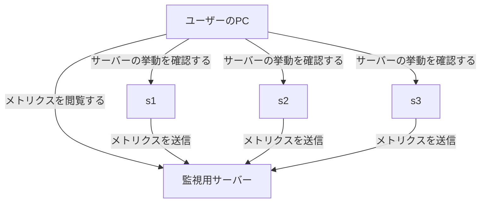

こんにちは、[@p1ass](https://twitter.com/p1ass) です。

去年に引き続き、 [@km_conner](https://twitter.com/km_conner) と [@atrn0](https://twitter.com/atrn0) でチーム「釜中の鯖」としてISUCON13に参加しました。
結果は**187,577点で総合4位**になりました。わいわい 🙌


_4位 187,577　釜中の鯖_

<!--more-->

## 今年新たに導入した文明の利器

毎年ISUCONに参加している我々ですが、ISUCONで使うツール群はあまりアップデートされていませんでした。
しかし、時代は移り変わり、世の中には便利なツールもたくさん増えていたようです。
そこで、今年から新たに3つのツールを導入してISUCONに望むことにしました。

### Tailscale

[Tailscale](https://tailscale.com/)はWireguardプロトコルを使ったVPN SaaSです。
Tailscaleを使うとほんの少しの設定だけでMacやLinux、Dockerコンテナといった様々なデバイスやリソースをVPNに追加することができます。

我々のチームでは、
- メンバーのローカルPC
- 競技用インスタンス
- 自前で用意した監視用サーバー

をVPNに接続し、相互に通信できるようにしました。



このような構成にすることにより、手元のPCから競技用インスタンスのNginxを開いたり、MySQLサーバーに接続したりできるようになります。
(事前に `bind-address`を変更しています)

今年初めて使いましたが、SSHでポートフォワーディングする手間もなく全てののポートにアクセスして色々挙動を確かめられて便利でした。
提案してくれた@atrn0、ありがとう。

### GitHub Copilot・JetBrains AI Assistant

トレンドには乗っかろうの精神で、LLM系のツールを導入しました。
GitHub Copilotは言わずもながですが、加えて[JetBrains AI Assistant](https://blog.jetbrains.com/ja/idea/2023/06/ai-assistant-in-jetbrains-ides/)も使ってみました。



JetBrains AI Assistantはちょうどよいタイミングで早期プレビューの案内が来たこと、JetBrain IDEでGitHub Copilot Chatを使えなかったことを加味して利用を決めました。
(プレビュー段階であるためチームメンバー全員が使えたわけではなかったです)

コードの概要説明やリファクタリングの示唆を貰うための手段として有用でしたが、使いこなせたかというと正直微妙...。
頭で考えていることをそのままダンプしてくれるGitHub Copilotの方が便利だと感じました。


_JetBrains AI Assistantに「NGワードを含むコメント削除の実装のリファクタリング」を任せてみた様子_

### OpenTelemetry

ISUCONでは「推測するな、計測せよ。」という格言が広く知られています。
我々もその格言にのっとり、HTTPログやスローログをもとにパフォーマンスの改善点を発見してします。

しかし、今までのフローでは「推測」してしまっている部分がありました。
HTTPログを集計し、改善対象となるEPを特定したとしても、**アプリケーションコードのどの部分を改善すべきか？** という点は推測するしかありませんでした。

そこで今年からOpenTelemetryを用いたトレーシングを導入し、あるEPにおいてどの部分にどれだけ時間がかかっているか可視化できるようにしました。
集計したデータはTailscaleのVPNを通じ監視用サーバーに送られ、そこに立っている[Jaeger](https://github.com/jaegertracing/jaeger)のUIを用いて分析しています。
Tailscaleのおかげで競技用インスタンスに色々準備する必要がなくて楽ちんでした。


_fillLivestreamResponseがN回呼ばれている様子_


_発行されているSQLも確認できる_

トレースはチームメンバーにも好評でした。
HTTPログやスローログは良くも悪くも統計データとして丸められてしまいます。
一方で、トレースデータはリクエストごとに細かく記録されているため、あるリクエストでどのような処理が走っているのかを詳細に確認できます。
統計データを用いて改善対象を見定め、トレースデータを用いて改善対象の箇所を特定するという使い分けをするのが良さそうです。

## 競技中に行った改善

さて、ここからは競技中に行った改善について紹介します。
当日のコードはGitHubで公開しています。



### 10:51 App用のMySQLを2台目に移行 (5,333点)

我々のチームでは、アプリケーションサーバーとMySQLは初動で必ず分離するという方針をとっています。
その方針にのっとり、今年も初手からMySQLを分離しました。

### 11:02 fillLivestreamResponseのN+1を解消 (7,188点)

`livestream_tags` と `tags` をJOINして取ってくるようにしました。

### 11:08 searchのN+1を一部解消 (7,447点)

`livestreams` を `WHERE IN` で取ってくるようにしました。
ついでにいくつかのインデックスを貼ってます。

### 11:12 MySQLとNginxの設定に秘伝のタレを追加 (7,212点)

いつも入れている設定を流し込みました。

### 11:35 `fillLivestreamResponse` と `fillUserResponse` のバルクバージョンを用意 (7,993点)

search EPを見ていく中で、これらの関数はループ内で何度も呼ばれていることがトレースから分かっていました。
そこで、複数のIDを渡すと一度に全てのデータを取ってくる関数を用意し、そちらに乗り換えることにしました。

### 11:39 コメント取得APIのN+1を解消 (10,034点)

コメントの取得のN+1を改善しました。

### 12:22 iconのハッシュ計算をicon投稿時に行うようにする (19,325点)

pprofを見ると、iconのハッシュ計算でCPUを食っていることが分かりました。
iconのハッシュ値は一度計算したあとは変わらないので、icon投稿時に計算してDBに保存しておくことにしました。

### 12:54 N+1を修正したときに埋め込んだバグを修正

ユーザーとテーマとアイコンを一気に取ってくるために次のような構造体を用意していました。

```go
type UserAndIconAndTheme struct {
  UserModel
  // Theme
  ID        int64          `db:"theme_id"`
  DarkMode  bool           `db:"dark_mode"`
  // Icon
  ImageHash sql.NullString `db:"image_hash"`
}
```

ベンチは通っていたので最初気づかなかったのですが、後々おかしい挙動をしていると報告を受けました。
原因を調べてみると、`UserModel` にも `ID` が含まれていたため、 `ID` フィールドが重複してしまっていたのです。
そのため、 `&UserAndIconAndTheme{}.ID` としたときにユーザーIDではなくテーマIDが返ってきてしまっていました。

ここでかなりの時間を使った...。
埋め込みはバグらせがちだから注意しような！

### 13:29 リアクション取得APIのN+1を解消 (24,412点)

最初はそこまで重くなかったリアクション系のAPIがHTTPログの上位に上がってきたので対応しました。

### 14:28 PowerDNSをやめてアプリケーション・サーバーでDNSを解決するようにする (26,685点)

PowerDNSが使うMySQLの負荷がずっと高いと話題になっていました。
そこで、お昼を食べながら@KMConnerに「いい感じにしといて」くらいの雑フリをしといたら、MySQLを全く使わない形で書き直してくれました。

途中途中で実装方針説明を受けていたのですが、DNSの仕組みをあまり知らないので「良い感じになるならそれでいいや」くらいの返事をしていました。
後々実装を読んだのですが、miekg/dnsというOSSを使って自前でDNSサーバーを実装していました。すごい。



### 15:35 NGワードのチェックをGoでやる (25,261点)

NGワードのチェックをLIKEを使ってやっていましたが、アプリケーションで実装できそうだなと思い、Goで実装し直しました。
あまり点数が伸びていませんが、N+1が残っていて、後半で改善したときに点数が伸びています。

### 15:52 貼られていないインデックスがあったので貼る (31,553点)

今年の問題はインデックスがほとんどありませんでした。
気づいたタイミングで随時貼っていたのですが、まだまだあったようです。

### 15:59 統計情報のN+1を一部改善 (35,046点)

スローログの大半を統計EPで使わているクエリが締めていました。
N+1でクエリが発行されていたので、一部改善しました。

### 16:04 GOGCやファイルディスクリプタの調整 (40,800点)

このあたりからpprofにGCに関するフレームグラフが出てくるようになりました。
忘れないうちに設定値を変更しています。

### 16:35 iconをNginxから配信する (54,047点)

この時点でpprofのフレームグラフを見ていると、iconの配信がボトルネックになっていることが分かりました。
そこで、iconの配信をアプリケーションからNginxに移しました。

この実装は元々僕がやっていたのですが途中で投げ出してしまい、@KMConnerが引き継いでくれました。ありがとう。

### 16:53 DNS関係のEPとそれ以外のEPを別インスタンスでホスティングする (65,663点)

DNSサーバーをアプリケーションで実装したことで、DNS水責め攻撃の負荷が上がり、かなりのCPUを食っていました。
現時点で3台目の用途がなかったので、そこにDNSに関係のない普通のEPを移しました。


### 17:09 統計情報の残りのN+1を解消 (143,119点)

統計情報の残りのN+1がスロークエリの上位を占めていたので解消しました。
ここで一気にスコアが爆上がりしました。めちゃめちゃ熱い展開。

### 17:?? 再起動試験

この辺で再起動試験をしておきます。
去年の二の舞いにならないように、UI上での動作確認も行いました。

だた、UIではなぜか動かない機能が多く「初期実装が悪いのか、俺らが悪いのか...?」と頭を悩ませていました。
感想を見ているとどうやら初期実装の不具合のようでした。良かった...。

### 17:43 ログや計測系のツールを消す (186,373点)

諸々のログを削除しました。4万点もあがってラッキー。

### 17:53 MySQLのパラメータを調整 (187,577点)

最後のあがきでMySQLのパラメータを少し調整しました。

ここで競技終了です！


## 感想

我々のチームは去年のISUCON12本選でFAILという無念の結果で終わってしまったため、今年は最低でもスコアを残そうと思っていましたが、その目標は無事達成できました。

また、4位という上位のスコアを取れたのも素直に嬉しいです。
競技前にチームメンバーから言われていた「目指すは優勝」を達成できなかった悔しさもありますが、それでも十分すぎる好順位でした。

## 来年にむけて

ここまで来たので、**目指すべきは優勝**しかありません！
ただ、NaruseJunが強すぎるので優勝の糸口は全く見えていません。来年に向けてゆっくり策を考えようと思います。


## 終わりに

毎年になりますが、ISUCONの作問や運営に携われた方々のお陰により、ISUCONというお祭りを楽しむことができました。
本当にありがとうございました！！