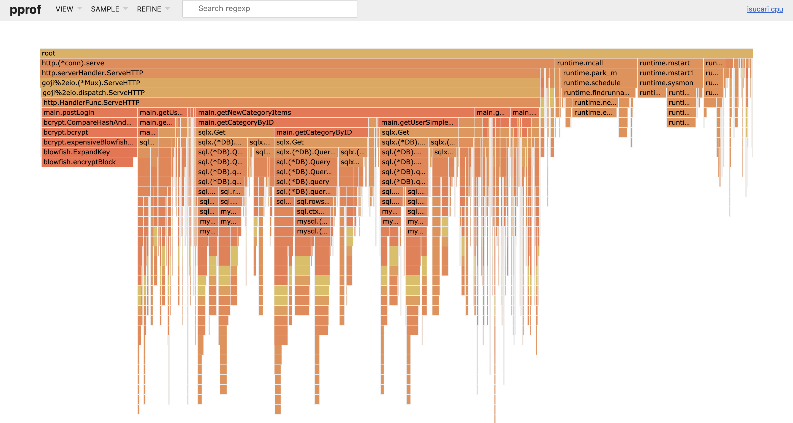

こんにちはです。  
9月8日に同じくの運営であるtomoyat1さんとISUCON9の予選に出場してきました。

結果は惨敗でしたが、来年に向けて今年やったことを備忘録として残しておきます。

<!--more-->

## 事前準備

ガッツリしたことは何もしていないです。先日に1時間ほど、初動をどうするかの話し合いをしました。また、軽くpprofやスロークエリログ、nginxのアクセス解析の方法を調べました。

過去問で予行練習をしたかったのですが、時間がなくそのまま本番に突入しました。

## 当日

### 10:00 ルールを読む

tomoyat1さんがサーバのインスタンス立ち上げを行っている間に予選マニュアルを読んでました。

「ユーザにあわせた商品の一覧を返すことで、購入の機会を増やすことができます。」という文章に疑問を持ちつつも、ひとまず全部を読みました。

### 10:17 webappをgit管理する

インスタンスが立ったので、ソースコードをgit管理するようにしました。

この時点でローカルで開発ができるようになりました。去年はGo Moduleに対応していなくて大変だったらしいのですが、今年は幸いなことに`go.mod`があったので、特に戸惑うことなく環境を整えることができました。

### 10:?? Nginxのaccess logを吐くようにする & alp で解析できるようにする


初回ベンチマークを回す前にNginxのアクセスログとMySQLのスロークエリログの設定(こっちはtomoyat1さんが担当)をしました。

他にもappサーバとDBサーバの分割とnetdataの準備をtomoyat1さんがやってくれました。

### 11:00 初回ベンチ

2,310: ｲｽｺｲﾝ

netdataを見るとDBの負荷が100%に張り付いていたので、SQLクエリを軽くしていこうという話になりました。

```
+-------+-------+-------+---------+-------+-------+-------+-------+--------+------------+------------+-------------+------------+--------+----------------------------------------------+
| COUNT |  MIN  |  MAX  |   SUM   |  AVG  |  P1   |  P50  |  P99  | STDDEV | MIN(BODY)  | MAX(BODY)  |  SUM(BODY)  | AVG(BODY)  | METHOD |                     URI                      |
+-------+-------+-------+---------+-------+-------+-------+-------+--------+------------+------------+-------------+------------+--------+----------------------------------------------+
|   347 | 0.040 | 7.332 | 999.288 | 2.880 | 0.044 | 3.268 | 6.532 |  1.722 |      0.000 |  30371.000 | 6794812.000 |  19581.591 | GET    | /users/transactions.json                     |
|   266 | 0.072 | 1.100 |  48.820 | 0.184 | 0.076 | 0.128 | 0.408 |  0.125 |  23431.000 |  23937.000 | 6292215.000 |  23654.944 | GET    | /new_items/30.json                           |
|   264 | 0.088 | 1.388 |  69.552 | 0.263 | 0.088 | 0.196 | 0.676 |  0.182 |  23034.000 |  23957.000 | 6187888.000 |  23438.970 | GET    | /new_items.json                              |
|   249 | 0.023 | 0.704 |  42.923 | 0.172 | 0.052 | 0.112 | 0.376 |  0.107 |      0.000 |  23985.000 | 5847281.000 |  23483.056 | GET    | /new_items/10.json                           |
|   240 | 0.084 | 0.816 |  44.072 | 0.184 | 0.084 | 0.128 | 0.592 |  0.138 |  22666.000 |  23518.000 | 5538988.000 |  23079.117 | GET    | /new_items/60.json                           |
|   233 | 0.072 | 1.380 |  43.728 | 0.188 | 0.072 | 0.124 | 0.556 |  0.148 |  23399.000 |  23884.000 | 5506922.000 |  23634.858 | GET    | /new_items/20.json                           |
|   223 | 0.026 | 0.324 |  24.154 | 0.108 | 0.052 | 0.080 | 0.276 |  0.065 |      0.000 |  23436.000 | 5144102.000 |  23067.722 | GET    | /new_items/1.json                            |
|   214 | 0.068 | 0.820 |  28.460 | 0.133 | 0.072 | 0.100 | 0.404 |  0.091 |  23502.000 |  23994.000 | 5079126.000 |  23734.234 | GET    | /new_items/40.json                           |
|   187 | 0.064 | 0.300 |  16.350 | 0.087 | 0.064 | 0.080 | 0.188 |  0.029 |  23091.000 |  23614.000 | 4366904.000 |  23352.428 | GET    | /new_items/50.json                           |
|   123 | 0.076 | 0.552 |  24.898 | 0.202 | 0.076 | 0.196 | 0.388 |  0.112 |     73.000 |    105.000 |   11646.000 |     94.683 | POST   | /login                                       |
|   116 | 0.004 | 0.452 |   5.260 | 0.045 | 0.000 | 0.008 | 0.344 |  0.094 |     13.000 |    106.000 |    4336.000 |     37.379 | POST   | /sell                                        |
|   114 | 0.734 | 2.068 | 106.894 | 0.938 | 0.000 | 1.608 | 1.632 |  0.792 |      0.000 |     49.000 |    4094.000 |     35.912 | POST   | /buy                                         |
|   112 | 0.016 | 0.320 |   7.212 | 0.064 | 0.000 | 0.020 | 0.288 |  0.084 |   2799.000 |   2969.000 |  330921.000 |   2954.652 | GET    | /settings                                    |
|    87 | 0.804 | 1.868 |  48.342 | 0.556 | 0.000 | 0.804 | 1.532 |  0.452 |     29.000 |     83.000 |    3488.000 |     40.092 | POST   | /ship_done                                   |
|    80 | 0.012 | 1.100 |  40.244 | 0.503 | 0.000 | 0.808 | 0.832 |  0.391 |      0.000 |     61.000 |    4086.000 |     51.075 | POST   | /ship                                        |
|    47 | 0.008 | 1.388 |  33.812 | 0.719 | 0.008 | 0.808 | 0.816 |  0.284 |     34.000 |     34.000 |    1598.000 |     34.000 | POST   | /complete
```

### 11:41 LIMIT 1 をつける

1件しか取得しないSELECT文にLIMIT 1をつけました。

2,410 ｲｽｺｲﾝ: ちょっと増えた

### 12:37 `getNewItems`のN+1を潰す

alpで見ると頻繁に `/new_items` や `/new_items/*.json` が叩かれていたので、このハンドラーを読んでみるとN+1だったので、JOINを駆使して修正しました。

2,310 ｲｽｺｲﾝ: ちょっと減った

### 12:53 pprofを導入

細かいプロファイルを取りたくなったので導入しました。

`getNewCategoryItems`に一番時間が使われていたので修正することにしました。



### 13:20 `getNewCategoryItems` と `getTransaction` のN+1を直す

自分が`getNewCategoryItems` をtomoyat1さんが`getTransaction`を直しました。

2,710 ｲｽｺｲﾝ: 300増えた

### 13:32 `BcryptCost`を1にする

`postLogin` のbcryptoの処理が重たかったのでBcryptCostを1にしました。

後から気づいたのですがbcryptのコストの最小値は4なので1にしても無意味です(ライブラリ側でデフォルトの10にされるため)。

### 14:26 getCategoryByIDのSQLを1回で住むようにする

pprofで割合が大きかった`getCategoryByID` がSQLクエリを2回発行していたので一回で済むようにしました。

2,710 ｲｽｺｲﾝ: まさかのあまり変化せず

### 昼休憩

昼休憩です。近くのコンビニに買い出しに行きました。

itemsのGETを高速化しても商品の購入がスムーズにいかないと点数上がらないよねという話をしつつ午後の方針を決めました。

### 15:10 `postBuy` で叩く外部APIをgoroutineで叩くようにする

`POST /buy`が地味に遅かったので外部APIをgoroutineで同時に叩くようにしました。本当はトランザクション周りも良くしたかったのですが、あまり良いアイデアが思いつかずそのままにしました。

3,010 ｲｽｺｲﾝ: 3000点台に載った

### 15:52 `postComplete` のトランザクションを一部外す

本当にトランザクションを外していいのか分からなかったのですが、「駄目だったらベンチ落ちるやろ！w」ということで外しました。ついでに外部APIをgoroutineで叩くようにしました。

3,310 ｲｽｺｲﾝ: 少し伸びた


### 16:04 `BcryptCost`を4にする

`BcryptCost`の最小値が4と気づいたので変更しました。

あまりスコアに変化はありませんでした。


### 17:20 新着一覧ページをパーソナライズする

「ユーザにあわせた商品の一覧を返すことで、購入の機会を増やすことができます。」という文章があったので、各ユーザが最後に購入したカテゴリと同じカテゴリを表示するようにしました。

3,420 ｲｽｺｲﾝ: 少し伸びた

### 17:22 `campaign`を1にする & Nginxの設定を変更 by tomoyat1

これまでに`campaign`を1にするのを試していたのですが、500系が多く返ってきて変更を躊躇っていました。

このタイミングでtomoyat1さんがNginxのtoo many connectionsが原因なことを突き止めて設定を変更しました。

4,310 ｲｽｺｲﾝ: めっちゃ伸びた！


### 17:47 インデックスをinit.shから貼るようにする

今までDBのインデックスを直接貼っていたのですが、initializeでDROPしているので意味がないことに気づき、ベンチのスタート時にセットするようにしました。

5,610 ｲｽｺｲﾝ: 結構伸びた

### 18:00 ~ ポータルが落ちて延長戦 & ベンチを回す

色々とログを吐く設定をやめたりしてベンチを回したが点数が半分になりました。ワロタ

2,810 ｲｽｺｲﾝ: 😇

## スコアの遷移

failは沢山ありますが、基本は右肩上がりにすることが出来ました。
最後だけが悲しいです。


## 感想

初のISUCONでしたがものすごく楽しかったです。他のチームがスコア伸ばしてるのを見ると負けられないぞという気持ちになりますし、色々と勉強になりました。

来年は本戦行きたいです！💪💪
