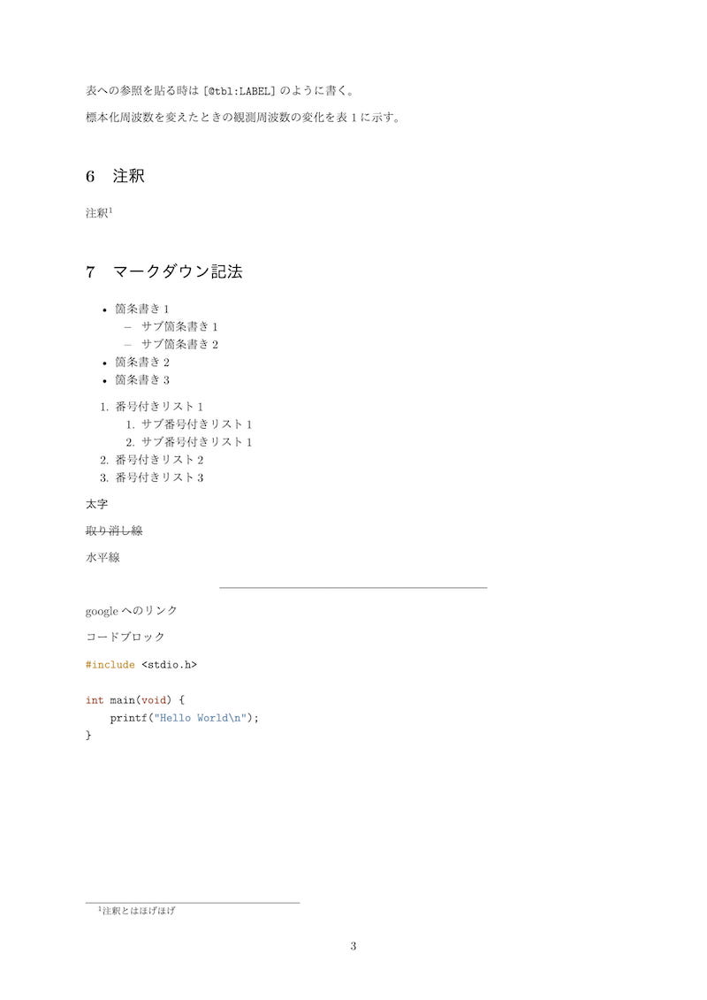

こんにちは、[@p1ass](https://twitter.com/p1ass)です。

皆さんは、実験レポートを何で書いていますか？
Word ですか？それとも LaTeX ですか？

私はそのどちらでもなく、**Markdown**で書いています。
Markdown はシンプルなシンタックスで様々な表現ができ、多くのエンジニアに愛されています。
しかし、Markdown は実験レポート用途にあまり使われていないため、そのままでは美しい PDF を作成することができません。

この記事では、pandoc という様々なフォーマットのドキュメントを相互変換するツールを使って、Markdown で書いた実験レポートを TeX 組版の美しい PDF にする方法をご紹介します。

<!--more-->

これは、マークダウンから変換した PDF です。

依存は全て Docker イメージにまとめてあるので、**Docker さえあれば、ローカルに何もインストールすることなく、誰でも簡単に美しい実験レポートを作成できる**ので、皆さん是非試してみてください。

## 特徴

まずはじめに、今回私が作成した Docker イメージの特徴を一覧で紹介します。

- Markdown を PDF に変換
- Markdown を保存するたびに PDF に変換
- TeX 組版を使用した美しい見た目
- セクション番号の自動付与
- LaTeX 形式の数式入力
- 数式・図表番号とその参照
- LaTeX コマンド
- マークダウンの様々な記法がそのまま使用可能
- etc...

このように様々な特徴があります。

**「Word で書くと番号付けや数式入力が面倒くさいから LaTeX で書いているけど、LaTeX の文法も冗長で面倒くさい、、、😔」**
という人にはとてもおすすめできます。

実際の変換前の Markdown ファイルと PDF ファイルは次のリンク先から見ることができます。

[変換前の Markdown ファイル](https://github.com/p1ass/mdtopdf/blob/master/examples/example.md)

[変換後の PDF ファイル](https://github.com/p1ass/mdtopdf/blob/master/examples/example.pdf)

## Markdown を PDF に変換する方法

Docker を使って PDF に変換を行います。
Docker のインストール方法は各自調べてください。

今回使用する Docker イメージはこのリポジトリで管理しています。スターしてくれると泣いて喜びます 😂



PDF に変換する方法は**簡単 3STEP**です。

### STEP1 : Docker イメージを pull する


\$ docker pull plass/mdtopdf


※ この Docker イメージのサイズは**1.68GB**です。速いネット回線を使って pull することをおすすめします。

### STEP2 : 変換したい Markdown ファイルがあるディレクトリに移動する


\$ cd path/to/directory


### STEP3 : PDF に変換する

`INPUT.md`は各自自分のファイルに書き換えてください。処理が完了すると`INPUT.pdf`が生成されます。


\$ docker run -it --rm -v `pwd`:/workdir plass/mdtopdf mdtopdf INPUT.md


以上です。とても簡単ですね！

## 発展的な使い方

### 保存するたびに PDF に変換する

いちいち保存するたびに変換コマンドを打っていては面倒くさいですよね。

そこで、Markdown ファイルを保存するたびに変換するようにできるようにしましょう。


\$ docker run -it --rm -v `pwd`:/workdir plass/mdtopdf w-mdtopdf INPUT.md


1 秒間隔でファイルを監視し、変更があれば PDF に変換します。

このスクリプトは以下のブログを参考にさせていただきました。



### alias を使って簡単に変換を実行できるようにする

上で書いたコマンドは長くて覚えづらいですよね。

`alias` コマンドを使って簡単に呼び出せるようにしましょう。


\$ echo "alias mdtopdf='docker run -it --rm -v `pwd`:/workdir plass/mdtopdf mdtopdf'" >> ~/.bash_profile
$ echo "alias w-mdtopdf='docker run -it --rm -v `pwd`:/workdir plass/mdtopdf w-mdtopdf'" >> ~/.bash_profile
$ source ~/.bash_profile

$ mdtopdf INPUT.md
$ w-mdtopdf INPUT.md


zsh: `.bash_profile` を `.zshrc` にしてください。  
Ubuntu: `.bash_profile` を `.bashrc` にしてください。

### Markdown ファイルを tex ファイルに変換する

TeX 組版を使っていることからも分かる通り、今回の PDF 生成は内部的には一度 tex ファイルにしてから行われています。
そのため、その中間ファイルを生成することもできます。


\$ docker run -it --rm -v `pwd`:/workdir plass/mdtopdf mdtotex INPUT.md


## pandoc を使った変換

さて、ここでは pandoc を使った変換の方法を(おまけ程度に)見ていきます。

上で紹介した変換は全てシェルスクリプトでラップしていましたが、内部的には pandoc を使っています。



pandoc は Markdown や HTML、EPUB、Word、LaTeX、PDF など多種多様なドキュメントフォーマットを相互に変換してくれる Haskell 製のツールです。
Windows、macOS、Linux などに対応していて大体の環境では動くと思われます。

Markdown から PDF への変換には次のスクリプトを実行しています。


#!/bin/bash

# mdtopdf

input=$1
pandoc -s -N ${input%._}.md -o \${input%._}.pdf \
-V documentclass=ltjarticle --pdf-engine=lualatex \
-V geometry:margin=1in \
-F pandoc-crossref \
-M "crossrefYaml=/config/crossref_config.yaml"



`-N`オプションで自動でセクション番号を付与してくれます。

`-F pandoc-crossref`ではという相互参照のためのフィルタを使っています。
次の行の`-M "crossrefYaml=..."`と合わせて、図表番号を正しく表示できるようにしています。


figureTitle: '図'
tableTitle: '表'
listingTitle: 'コード'
figPrefix: '図'
eqnPrefix: '式'
tblPrefix: '表'
lstPrefix: 'コード'




`--pdf-engine=lualatex`で PDF 生成のエンジンには LuaLaTeX を使用するように指定しています。これは他のエンジンでは正しく日本語を認識してくれないためです。
また、`-V`で LuaLaTeX 用のオプションを指定しています。

保存するたびに PDF に変換するのは簡単で、次のスクリプトを使っています。


#!/bin/bash

# w-mdtopdf

watcher $1  mdtopdf $1


２回同じファイル名を引数に指定しなくても良いようにしているだけですね。

`mdtotex`は`mdtopdf`とほとんど同じなので省略します。

## 終わりに

pandoc を使うことで、Markdown ファイルから美しい TeX 組版の PDF を生成することができました。
また、Docker とシェルスクリプトを使うことで、使用者側は pandoc などを意識せず、簡単に扱うことができます。

皆さんも是非使ってみてください！

Issue、Conrtibute、Star どれもお待ちしています！



## 参考


