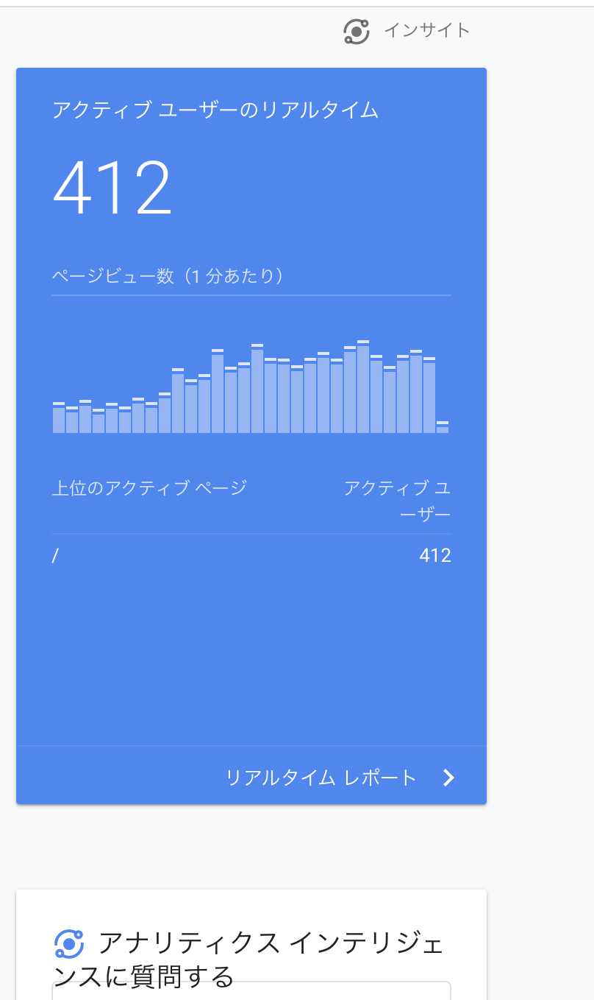
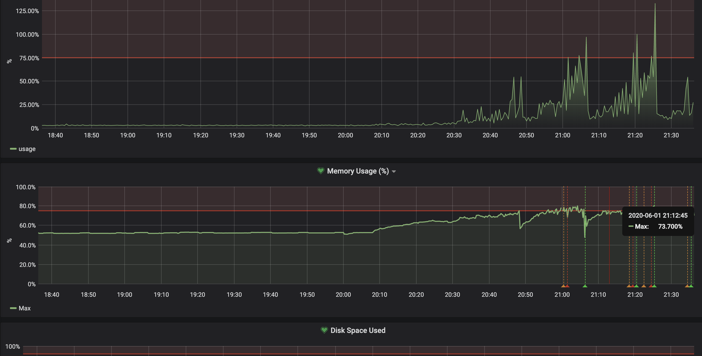

こんにちは、です。

この記事はひょんなことから、LT 会のために作った Web アプリがバズって、Twitter トレンド 1 位になってしまい、ひぃひぃ言いながら行ったインフラ改善をまとめたものになります。
スケーラビリティは全く考慮していない LT 会用の Web アプリをどのように改善していたのかについてまとめることで、個人開発者の参考になれば良いなと思っています。

なお、ここで書かれている内容はプロダクションレディなサービスを作る上では当たり前なことが多数です。本当に高負荷トラフィックを裁くための知見はないので、予めご了承ください。

<!--more-->

## 作った Web アプリ: 「生活習慣の乱れを可視化するやつ」

「生活習慣の乱れを可視化するやつ」という Web アプリを作りました。



<blockquote class="twitter-tweet">
ツイートを分析して生活習慣の乱れを可視化するツイ廃向けのWebアプリを作りました！ Twitter連携で簡単に起床・就寝時間が分かり、どんどん生活習慣が乱れていく様子を見ることができます。  左の画像は規則正しい人、右の画像は生活習慣が乱れている人のグラフです ⏰<a href="https://t.co/5f7xlh7X6J">https://t.co/5f7xlh7X6J</a> <a href="https://t.co/6YNo02VATv">pic.twitter.com/6YNo02VATv</a>
&mdash; ぷらす (@p1ass) <a href="https://twitter.com/p1ass/status/1267413338016804864?ref_src=twsrc%5Etfw">June 1, 2020</a></blockquote> 

このアプリは Twitter OAuth を使ってツイートを解析し、カレンダー UI で直感的に起きている時間を把握することが出来るアプリです。本来は生活習慣の乱れを可視化するために作ったのですが、実態としては **「ツイ廃可視化アプリ」** なので、多くの人が Twitter のしすぎに気づくことが出来たようです。

また、いくつかのネットメディアにも掲載していただきました。





ソースコードは GitHub で全て公開してあるので、興味のある方は是非ご覧ください。Go x React で書いてます。



## インフラ改善記録

さて、ここからが本題になります。ここでは。サービス公開から Twitter トレンド 1 位になるまでに行った改善を時系列で紹介していきます。

### LT 会に登壇する

冒頭で書いたとおり、このアプリは LT 会のために作ったものです。友人の誕生日会 LT でこのアプリに関する登壇をしました。

### 酒飲みながら LT 会を聞きつつ、アナリティクスを見たらアクティブユーザが結構いてビビる

無事登壇も終了し、のんきに酒を飲みながら LT 会を聞いていたのですが、ふと気になり Google Analytics を開いたら、アクティブユーザが 100 人を超えていてビビります。

<blockquote class="twitter-tweet">
ワロタ <a href="https://t.co/YRj4pXIqqN">pic.twitter.com/YRj4pXIqqN</a>
&mdash; ぷらす (@p1ass) <a href="https://twitter.com/p1ass/status/1267418549745664003?ref_src=twsrc%5Etfw">June 1, 2020</a></blockquote> 

また、このあたりで RT 数が 100 を超え始め、ちょっと焦り始めます。

この 30 分後にはアクティブユーザが 400 人を超えました。

### VPS の Grafana のアラートがなる

走行しているうちに API サーバを立てている VPS のアラートがなり始めました。

_プロセスがリスポーンを繰り返している様子 (上)CPU 使用率 (下)メモリ使用率_

ここで、この時点におけるインフラアーキテクチャについて軽く説明しておきます。フロントエンドは Netlify でホスティング、API サーバは ConoHa の VPS(CPU1 コア、メモリ 512MB)

### Cloud Run に移行する

### キャッシュの Expire を短くする

### セッションを Redis に移す

### バグらせてしまった

### Twitter トレンド１位になる

### Twitter API の Rate Limit にあたる

### アラートをたくさん設定して寝る
