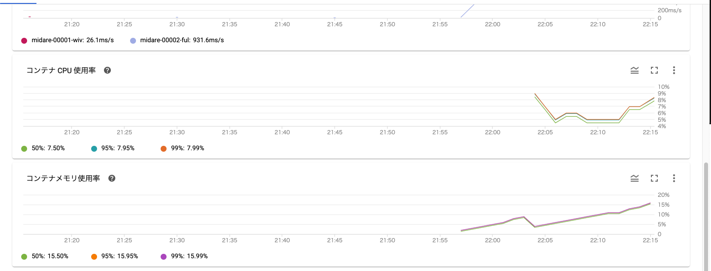
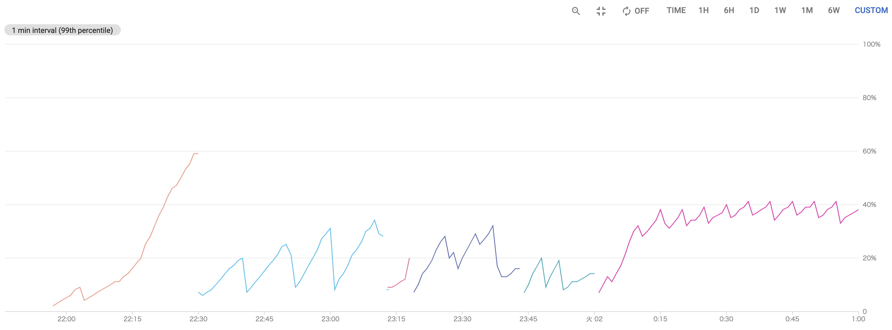

こんにちは、です。

この記事はひょんなことから、LT 会のために作った Web アプリがバズって、Twitter トレンド 1 位になってしまい、ひぃひぃ言いながら行ったインフラ改善をまとめたものになります。
スケーラビリティは全く考慮していない LT 会用の Web アプリをどのように改善していたのかについてまとめることで、個人開発者の参考になれば良いなと思っています。

なお、ここで書かれている内容はプロダクションレディなサービスを作る上では当たり前なことが多数です。本当に高負荷トラフィックを裁くための知見はないので、予めご了承ください。

<!--more-->

## 作った Web アプリ: 「生活習慣の乱れを可視化するやつ」

「生活習慣の乱れを可視化するやつ」という Web アプリを作りました。



<blockquote class="twitter-tweet">
ツイートを分析して生活習慣の乱れを可視化するツイ廃向けのWebアプリを作りました！ Twitter連携で簡単に起床・就寝時間が分かり、どんどん生活習慣が乱れていく様子を見ることができます。  左の画像は規則正しい人、右の画像は生活習慣が乱れている人のグラフです ⏰<a href="https://t.co/5f7xlh7X6J">https://t.co/5f7xlh7X6J</a> <a href="https://t.co/6YNo02VATv">pic.twitter.com/6YNo02VATv</a>
&mdash; ぷらす (@p1ass) <a href="https://twitter.com/p1ass/status/1267413338016804864?ref_src=twsrc%5Etfw">June 1, 2020</a></blockquote> 

このアプリは Twitter OAuth を使ってツイートを解析し、カレンダー UI で直感的に起きている時間を把握することが出来るアプリです。本来は生活習慣の乱れを可視化するために作ったのですが、実態としては **「ツイ廃可視化アプリ」** なので、多くの人が Twitter のしすぎに気づくことが出来たようです。

また、いくつかのネットメディアにも掲載していただきました。





ソースコードは GitHub で全て公開してあるので、興味のある方は是非ご覧ください。Go x React で書いてます。



## インフラ改善記録

さて、ここからが本題になります。ここでは。サービス公開から Twitter トレンド 1 位になるまでに行った改善を時系列で紹介していきます。

### 20:00 LT 会に登壇する

冒頭で書いたとおり、このアプリは LT 会のために作ったものです。友人の誕生日会 LT でこのアプリに関する登壇をしました。

### 20:30 酒飲みながら LT 会を聞きつつ、アナリティクスを見たらアクティブユーザが結構いてビビる

無事登壇も終了し、のんきに酒を飲みながら LT 会を聞いていたのですが、ふと気になり Google Analytics を開いたら、アクティブユーザが 100 人を超えていてビビります。

<blockquote class="twitter-tweet">
ワロタ <a href="https://t.co/YRj4pXIqqN">pic.twitter.com/YRj4pXIqqN</a>
&mdash; ぷらす (@p1ass) <a href="https://twitter.com/p1ass/status/1267418549745664003?ref_src=twsrc%5Etfw">June 1, 2020</a></blockquote> 

また、このあたりで RT 数が 100 を超え始め、ちょっと焦り始めます。

この 30 分後にはアクティブユーザが 400 人を超えました。

### 21:00 VPS の Grafana のアラートがなる

走行しているうちに API サーバを立てている VPS のアラートがなり始めました。

_プロセスがリスポーンを繰り返している様子 (上)CPU 使用率 (下)メモリ使用率_

ここで、この時点におけるインフラアーキテクチャについて軽く説明しておきます。フロントエンドは Netlify でホスティング、API サーバは ConoHa の VPS(CPU1 コア、メモリ 512MB)を利用して Docker で立ち上げていました。そのため、フロントエンドが落ちる心配はないのですが、API はすぐ落ちてしまう可能性がありました。

また、LT 会用に作った雑実装なため、**ログインセッションをオンメモリで持っていたため、スケールアウトすることも出来ませんでした。**

この時点でインフラをクラウドに移行し、スケールアウトに対応したアプリケーションに書き換えることを決意しました。

### 21:10 Cloud Run に移行を始める

クラウドに移行すると決めたので、どのサービスを使うか検討を始めます。

まず、クラウドベンダは日常的に使い慣れている GCP にすることにしました。
次に度のサービスを利用するか考えるのですが、VPS で動かしていることを考えると GCE が 1 番簡単です。
しかし、スケーラブルなアーキテクチャを作るには時間がかかると判断し断念しました。
その他のいくつかのマネージドサービスを検討したのですが、

- 簡単にスケールアウトができる
- Docker イメージをそのまま使える
- 業務で使っている

**Cloud Run** を使うことにしました。

GCP にはフルマネージド型のコンピューティング プラットフォームとして GAE もありますが、GAE 用のコンフィグを準備する手間やローカル開発サーバの準備に時間がかかります。1 分でも早く移行したいと考え、今回は選択しませんでした。

なお、先程書いたとおりオンメモリで情報を持っているためスケールアウトはできないので、現時点では最大インスタンス数を 1 に設定してバグらないようにします。一旦スペックの高いインスタンスを使ってリクエスト捌き、その間にスケールアウトできる構成にアプリケーションを書き換える戦略です。

### 補足: Cloud Run の最小インスタンス数について

知っている方は知っているかと思いますが、**Cloud Run の最小インスタンス数は 0 です。つまり、コンテナが全て止まる可能性があります。** 全てのコンテナが止まるとオンメモリで持っているログインセッション情報が全て飛ぶので、ログインセッションを維持できなくなる可能性があります。

しかし、現状のリクエスト数を見る限り、インスタンス数が 0 になることはないだろうと考え、リクエストが落ち着く前に、ログインセッションを API サーバから切り離すことにしました。

### 22:00 Cloud Run への移行が完了する

一時間逆で Cloud Run への移行が完了しました。

<blockquote class="twitter-tweet">
爆速でVPSからCloud Runに移行した <a href="https://t.co/KeMb9OWTIH">https://t.co/KeMb9OWTIH</a>
&mdash; ぷらす (@p1ass) <a href="https://twitter.com/p1ass/status/1267441450754568192?ref_src=twsrc%5Etfw">June 1, 2020</a></blockquote> 

_移行直後のメトリクス_

### 22:20 ツイート情報のキャッシュの Expire を短くする

移行直後のメトリクスを見ればわかるように、メモリ使用率がどんどん上昇しています。これはツイート情報をオンメモリでキャッシュしているのが原因です。

起きている時間を返す API は、レスポンスが遅い(1 リクエストで数百 ms かかる)Twitter API を直列で複数回叩く必要があるため、**カレンダー情報を取得する API は全体で 1~2 秒ほどかかります。**

そのため、ブラウザをリロードするたびに Twitter API をコールするのは辛いです。そこで、オンメモリでツイート情報をキャッシュに 30 分間は何回 API をコールしても同じ情報を返すようにしていました。[^1]

[^1]: 30 分はカレンダーの時間分解能

しかし、サービスのユーザ数が多くなるたびにこのキャッシュはメモリを圧迫し、メモリを食い尽くす可能性がありました。

Google Analytics を見ると、平均セッション維持時間は数分であり、30 分もキャッシュしておく必要がなさそうだったので、キャッシュの Expire を 10 分まで短くし、なるべくメモリを開放するようにしました。

_後に Expire を 5 分ごとに行うようにした_

## 22:20 アクティブユーザが 2000 人を超える (未だに信じていない)

キャッシュの実装がし終わったころには、アクティブユーザが 2000 人を超えていました。

<blockquote class="twitter-tweet">
いやそれは無いやろwwww <a href="https://t.co/sitWe3r5vE">pic.twitter.com/sitWe3r5vE</a>
&mdash; ぷらす (@p1ass) <a href="https://twitter.com/p1ass/status/1267446250904772609?ref_src=twsrc%5Etfw">June 1, 2020</a></blockquote> 

しかし、後に計算してみたのですが、この値は Cloud Run のメトリクスや Google Analytics の PV 数とあまり辻褄が合いません。多くとも 1000 人程度だったのでは？と考えています。(真相は不明)

### 22:30 Twitter API の Rate Limit にあたる

サーバが死にました。

<blockquote class="twitter-tweet">
あ、サーバ死んだ
&mdash; ぷらす (@p1ass) <a href="https://twitter.com/p1ass/status/1267449807678795776?ref_src=twsrc%5Etfw">June 1, 2020</a></blockquote> 

原因は Twitter API の Rate Limit でした。Twitter API の User Timeline を取得する API はアプリ 1 つにつき 100,000 リクエスト/日という制限があり、これに引っかかってしまいました。

> Important notice: On June 19, 2019, we began enforcing a limit of 100,000 requests per day to the /statuses/user_timeline endpoint, in addition to existing user-level and app-level rate limits. This limit is applied on a per-application basis, meaning that a single developer app can make up to 100,000 calls during any single 24-hour period.



応急処置として新たに Twitter アプリを作成し、トークンを差し替えることにしました。

**注意及び免責**

**当時は知りませんでしたが、同一のソフトウェアで複数の Twitter アプリを作成することは禁止されています。この制限に気づいてから複数の Twitter アプリを利用するのはやめ、現在は 1 つの Twitter アプリのみを利用しています。この記事を読んだ読者が複数の Twitter アプリを使用したとしても、一切の責任を負いません。**

> You may not register multiple applications for a single use case or substantially similar or overlapping use cases. In this context, a “use case” is a consistent set of analyses, displays, or actions performed via an application. Please note that providing the same service or application to different people (including “white label” versions of a tool or service) counts as a single use case.



### 23:05 セッションを Redis に移す

API サーバのスケールアウトを可能にするために、ログインセッションを保存するための Redis 用のインスタンスを一台立ち上げました。これにより、API サーバのスケールアウトが可能になりました。

### 23:20 ログイン処理がバグってることに気づく

<blockquote class="twitter-tweet">
夜ご飯食べてないので買いに行く  TLのみんな一回試してみてだめだったらリプちょーだい
&mdash; ぷらす (@p1ass) <a href="https://twitter.com/p1ass/status/1267460825255563266?ref_src=twsrc%5Etfw">June 1, 2020</a></blockquote> 

コンビニから返ってきたら、ログイン処理がおかしいという報告が来ていました。調査してみると、Redis に移すべきオンメモリの情報を移し忘れていました。そのため、ログインが 1/n の確率で成功する状態になっていました 😇

急いでバグを修正し、すぐデプロイしました。このデプロイが終わったところには日付が回っていました。

### 24 時代 Cloud Monitoring のアラート設定を沢山する

寝ても大丈夫なように色々なアラートをガンガン設定しました。

### 25:00 Twitter トレンド１位になる

プリコネ[^2]や CheerUpHanabi を抑えて Twitter トレンド 1 位になりました 🎉

<blockquote class="twitter-tweet">
トレンド1位らしいです！ ありがとうございます🙏 <a href="https://t.co/PtZjehBABA">pic.twitter.com/PtZjehBABA</a>
&mdash; ぷらす (@p1ass) <a href="https://twitter.com/p1ass/status/1267488254334398470?ref_src=twsrc%5Etfw">June 1, 2020</a></blockquote> 

[^2]: コッコロたん〜〜〜

### 深夜 色々微調整を行う

キャッシュの間隔や細かいバグつぶしなどを沢山しました。

### 29:00 (朝の 5 時) 寝る

これにて当日の対応は終了です。寝ました。

## 最終的なリクエスト数

リリース日の PV は 11 万、次の日は 30 万でした。その後は指数関数的に減っていき、今では 1%もありません。

## サーバ対応をしてみて思ったこと

当たり前ですが、**「最初からスケーラブルな設計にしておく」** ことはとても大事です。少なくともログインセッションを Redis や MySQL に持っていたら、もっと対応は楽だったでしょう。個人開発だからと手を抜くと痛い目に会います。

また、**「テストを書いていなかったこと」** を非常に後悔しています。普段はテストを書くことが当たり前だったのですが、今回は書いていませんでした。サーバ対応で焦ってコードを直しているとバグを埋め込みがちでデバッグにとても苦労しました。デバッグしながら、「あぁ、なんで俺はテストを書かなかったんだ...」とぼやいていました。

## まとめ

今回の対応で「当たり前のことを当たり前にやる」ことの重要性を痛感しました。当たり前のことをやっていての障害は仕方ないですが、当たり前のことをしていないマイナスからの対応は結構苦痛でした。今回は趣味だったので良かったですが、これが仕事だと思うとゾッとします。これからは趣味でも当たり前のことを当たり前にやっていきたいです。

この記事が皆さんに役に立てば幸いです。

## ひとりごと

この対応で僕の生活習慣が乱れました。どうしてくれるんですか？？

## おまけ

<blockquote class="twitter-tweet">
はい <a href="https://t.co/Zwkzcch7fs">https://t.co/Zwkzcch7fs</a>
&mdash; ぷらす (@p1ass) <a href="https://twitter.com/p1ass/status/1267430794739412998?ref_src=twsrc%5Etfw">June 1, 2020</a></blockquote> 

<blockquote class="twitter-tweet">
落としたサーバの数だけ強くなれる
&mdash; ぷらす (@p1ass) <a href="https://twitter.com/p1ass/status/1267498932776517634?ref_src=twsrc%5Etfw">June 1, 2020</a></blockquote> 
