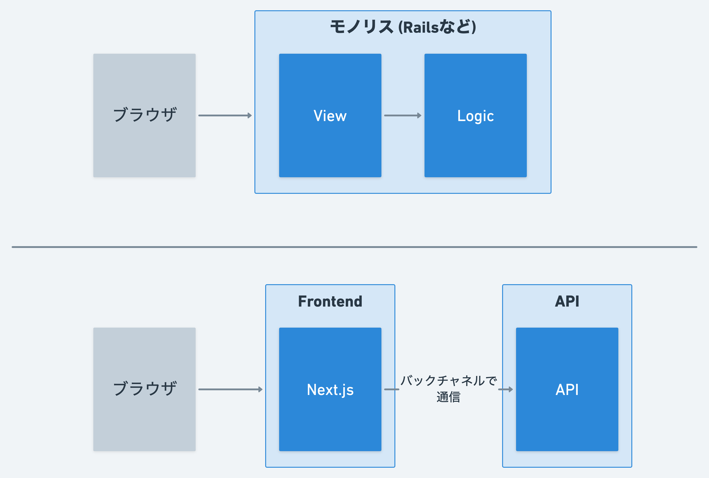
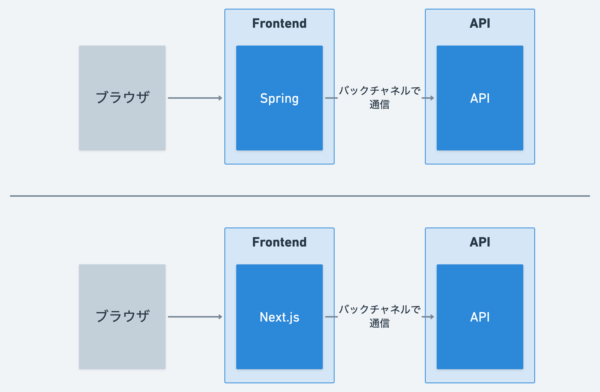
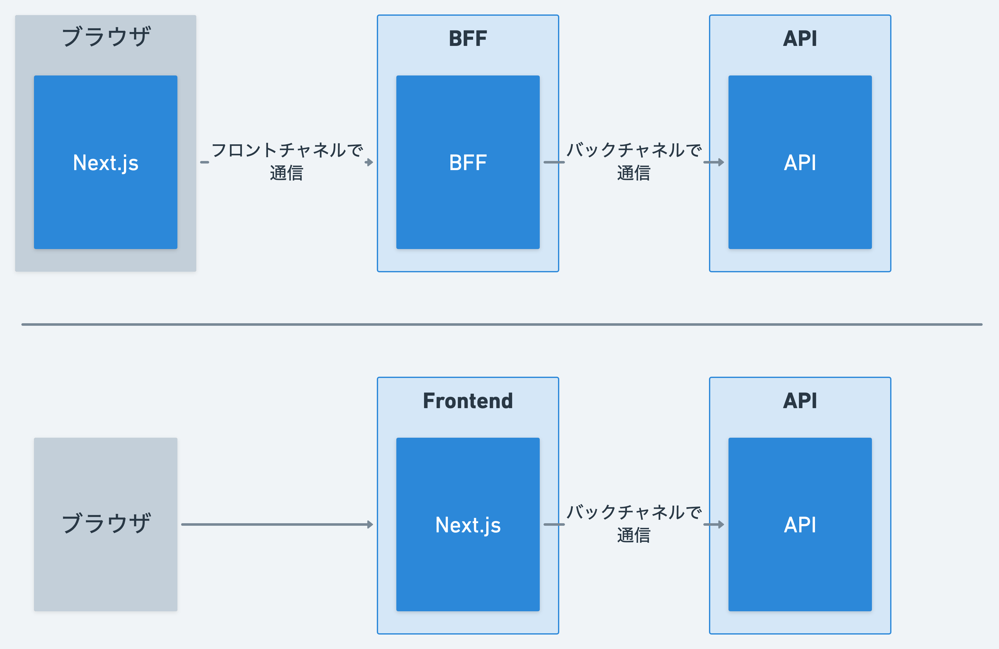

こんにちは、[@p1ass](https://twitter.com/p1ass)です。

最近、Next.js 13 から beta で導入されている [App Directory](https://beta.nextjs.org/docs/app-directory-roadmap) を趣味で触っているのですが、今まで SPA を採用しづらかった事業領域でも React のエコシステムを使えるようになりそうな予感がして、ワクワクしています。

このブログでは、今までどういった課題があり、Next.js の App Directory がそれをどのように解決するのかを紹介します。
なお、内容はあくまで考察であり、実際に運用をしているわけでない点に注意してください。
これは「夢」なのです。

<!--more-->

## SPA に移行しづらいシステムたち

### レンダリングの移り変わり

Angular や React、Vue.js が登場する前、HTML のレンダリングの多くはテンプレートエンジンを介して行われていました。
Rails や Spring、Django といったフルスタックフレームワークはこれらの機能を有していますし、使っている/いた方も多いでしょう。
サーバーサイドレンダリング (SSR) をメインにしつつ、一部で JavaScript を用いた DOM の書き換えでクライアントサイドレンダリング (CSR) を実現していました。

その後、SPA ライブラリが登場し、HTML の構築はブラウザ上で行う CSR が主流になりました。
CSR ができない/何らかの理由でしたくない場合のみ SSR をする構成が流行っています。

このトレンドによって、**メインとなるレンダリング処理はサーバーサイドからクライアントサイドへ移り変わりました**。
この移り変わりは様々なメリットを生み出した一方、様々な考慮事項を生み出したと考えています。

### CSR を有効活用しづらい事業領域

CSR が主流になるということは、様々なロジックがブラウザ上で実行されることを意味します。
ユーザのインタラクションに対する反応時間を短縮できる一方で、ブラウザの制約が技術的な足かせになるシステムも存在しました。

銀行や証券、決済、認証認可は、セキュリティの観点から CSR を活用しづらい事業領域の例だと考えています。

もちろん、CSR + Web API という構成でこれらのシステムが実現可能です。
しかし、セッション管理や CSRF 攻撃に対する対策など、様々な箇所で今までとは異なる仕組みや工夫が必要です。
他にも、ユーザからアクセスできない安全なストレージ存在しないブラウザだからこそのリスクアセスメントも必要でしょう。

また、私のような悪いエンジニアは Dev Console を開いて勝手に非公開 API を使おうと試みたりします。
銀行の残高取得 API や振り込み実行 API を勝手に使える(かもしれない)のはちょっとワクワクします。
サービス提供者側からたまったもんじゃないでしょうが。
私がサービス提供者側なら、こういった処理サーバサイドでやりたいし、外部との通信はできるだけブラウザを介しないバックチャネルで通信したいです。

これらを考慮すると、CSR による UX の改善とセキュリティ対策のしやすさを天秤にかけたときに、セキュリティ対策を優先する選択の方がベターに感じられるのではないでしょうか？
(UX を蔑ろにするのではなく、トレードオフの話です。)

別の観点として、人材面での課題もあります。
こういったシステムは技術スタックから(マークアップやデザインの担当の人はいれど)フロントエンド専任の人がいることは少ないことがあります。
私のようなバックエンドメインのエンジニアが片手間でやっている場合も見られます。
そうなると、今までと全くパラダイムが異なる CSR を推進する旗振り役がおらず、「旧来の方法のままで良いのでは？」となっていまいます。

色々書いてしまいましたが、言いたいのは**セキュリティ面での技術的制約や人材の観点から、CSR のメリットを享受しづらい場合がある**ということです。
そのため、技術選定において、テンプレートエンジンによる旧来のアーキテクチャと対等なレベルで戦えてなかったように感じています。
(Rails x Vue.js / React といった構成もできますが、同様の理由であえて選択するほどではないと思います。)

## App Directory によって Next.js は他と対等な選択肢になりうる

### Server Component がデフォルトの世界

しかし、Next.js 13 から beta で導入されている [App Directory](https://beta.nextjs.org/docs/app-directory-roadmap) は上記で挙げたデメリットを覆すだけの可能性を持っています。
それは App Directory 内のページのレンダリング方法の変更です。

App Directory では、デフォルトで Server Component です。つまり、明示的な指定が無い限り全てのコンポーネントはサーバーサイドでレンダリングされます。
今までは、`getServerSideProps` で選択的に SSR していましたが、意識せずとも SSR になります。

_Server Component がデフォルトで選択的に Client Component が使われる。また、その併用も可能 (Next.js のドキュメントより引用)_

この変更は今までの Client Component メインのメンタルモデルから真逆の Server Component メインのメンタルモデルに変わったことを意味します。
つまり、旧来のテンプレートエンジンを含んだフレームワークと同じ心持ちで実装できるのです。
また、今まではセキュリティ等の技術的制約がありましたが、旧来の仕組みをそのままサーバーサイド Node で実装すればよいだけなので、これらの制約からは解放されます。

これは言ってしまえば、JSX を単なるテンプレートエンジンの発展型として捉えているに過ぎません。
これまでの SPA はテンプレートエンジンとは異なるパラダイムだったからこそ発展したと思っていますが、**今回のような課題を抱えている我々が本当に必要としているものはサーバーサイドでレンダリングされるベターなテンプレートエンジンだったのかもしれません。**

### React のエコシステムの恩恵を受けられるようになる

制約が外れるだけではデメリットがなくなるだけです。しかし、デメリットがなくなったおかげで React やその周辺のエコシステム恩恵を最大限享受できるようになります。

現在の Web フロントエンドは Node と React のエコシステムがベースになって発展してきています。
Next.js を使うことで、テンプレートエンジンでは享受しずらかったエコシステムの恩恵を最大限受けられます。

特に開発者体験の向上につながる恩恵は多いです。
Linter や Formatter も多いし、便利なライブラリも多いです。
マークアップまで JavaScript/TypesScript でできる JSX は賛否ありますが、HTML の途中に Python や Ruby を書くよりは好きです。

Next.js を選ぶデメリットがなくなったことで、これらのメリットを享受するために Next.js を選択するのは"十分あり"な選択になってきていると感じています。
後は人材面で推進する人がいれば..。

## どういうアーキテクチャになるか

では、実際に Next.js を採用するとしてどんなアーキテクチャになるのでしょうか？
構成を 3 つほど考えてみます。

### 1. モノリスから Frontend サーバを分離する

1 つ目は Rails や Django などフルスタックフレームワーク上に構築されたモノリスから Frontend サーバーを分離する構成です。
サーバーサイドでの処理が必要で、SPA に切り出したかったが切り出せずにいた場合は特にフィットするでしょう。

MVC の View にあたる部分だけ新たに Next.js で実装し、モノリスとはバックチャネルで通信します。
セッション管理などブラウザが関連する機能は Next.js 側に実装することになりそうです。

### 2. 元々あった Frontend サーバーをリプレイスする

以前、「Frontend サーバーを Spring で実装して、後ろにいるマイクロサービスと通信している」という話を聞いたことがあります。
もちろん Spring のままでも良いですが、Node・React のエコシステムの恩恵を受けたい場合はリプレイスをする意思決定をしても良いかもしれません。

### 3. SPA + BFF を１つの Next.js サーバーにする

マイクロサービスを推進しているプロダクトだと、ブラウザが叩く API が増えて逆にパフォーマンスが下がることがあります。
こういったときに、1 つの解決手段として BFF を作ってブラウザは 1 回だけ API を呼び出す構成が考えられます。

もちろんこの構成でも良いですが、クライアントが Web のみであれば、BFF を消してバックチャンネルで API を呼び出す構成にしてしまうのは１つの手だと思います。
今まで SPA で運用してきたということは Client Component が既に多いかと思いますが、App Directory は選択的に Client Component を使えるので、問題になることも少ないでしょう。

どれも目新しい構成ではないですが、活用場所は色々とありそうです。

## まとめ

このブログのタイトルは **「バックエンドエンジニアが Next.js の App Directory に夢を見る」** でした。

バックエンドエンジニアである私から見ると、React や Vue.js がオーソドックスな選択になってきている世の中であるにも関わらず、テンプレートエンジンを使ったシステムはまだまだたくさん存在します。
それらの理由は様々ですが、ブラウザの制約によるセキュリティ上の懸念や人材面での課題がありました。

そんな中登場した Next.js の App Directory は旧来の SSR のテンプレートエンジンを使ったシステムと同じメンタルモデル・アーキテクチャでシステムを実装できます。
JSX をベターなテンプレートエンジンとみなしているに過ぎませんが、それをするだけでも Node・React とともに発展したエコシステムのメリットを享受できます。

たったこれだけでも開発生産性があがる環境はまだまだあると思います。そんな環境に Next.js を導入できないかなと夢見ています。
