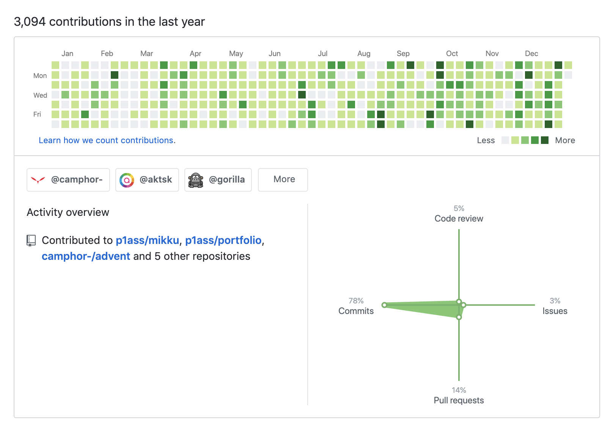
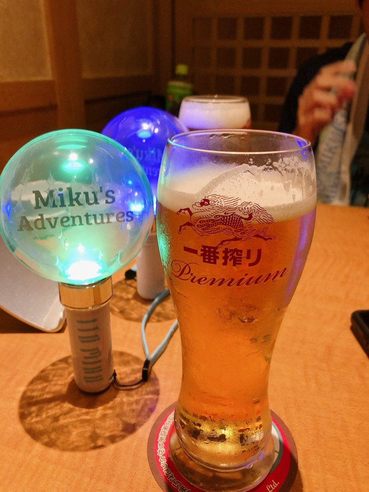

こんにちは、です。

1 年ぶり 2 度目の振り返り記事です。(前回の記事は諸事情により削除されました)

今年も改めて振り返ってみると、様々なことがあった一年でした。技術の面は勿論のこと、大学や交友関係、趣味など去年とはまた違う一年を過ごしました。

誰かの役に立つとは思えないですが、自分がいつか振り返れるようにダラダラ書いていきます。

<!--more-->

## プログラミングが生活の一部に

_GitHub の草_

一年を通してコードをたくさん書きました。息を吸うようにコードを書いていたので、草を生やす意識はしていなかったのですが、改めて見ると「こんなにコードを書いたのかぁ」という気持ちです。

ただ、去年とはプログラミングへの取り組み方が変わりました。

去年までは、「楽しい！」って言いながら深夜遅くまでぶっ続けで書いていることが多かったのですが、今年はある程度やったら「今日はもうやめて別のことをしよう」と無我夢中でやることがなくなりました。

これは良くも悪くも、 **プログラミングが生活の一部になった** だと思います。どんなことでも習慣になると、意識しなくても毎日続けるようになりますが、それと同じです。

コードを書くことに無我夢中に慣れないのは少し悲しいですが、健康的な生活を送れるようになったのはとても良いことなので、この感じを来年も保っていきたいです。

付け加えておきますが、 **決してプログラミングが楽しくなくなったとかそういうことは一切なくて、普通に楽しいです** 楽しくなかったらとっくに辞めてるので。

## 個人開発

### Memoito

夏休み明けに Web アプリを一本リリースしました。





開発期間が 10 日弱しかない突貫工事だったので、クオリティはそんなに高くないですが、SNS を通して「いつも使ってます！」といったメッセージや改善点のフィードバックをもらえて、**「良いサービスを作るにはどうしたらよいか？」** を考えることができました。

また技術的には、Kubernetes や Terraform を新たに挑戦しました。SRE 寄りの経験はほとんどなく、Kubernetes に関しては「なんかコンテナがスケールするらしい」程度の知識しかなかったので、一度クラスタを組んでみることで基本的な機能を理解することができました。

現在は無料クレジットを有効活用して GKE 上で運用しているのですが、クレジットが切れる前に安い代替手段を考えないといけないなぁという気持ちです。

お金をかけられない学生にとって、**クラスタとは別にステートフルなデータを管理するためのマネージドサービスを用意する必要があるクラウドネイティブな開発はかなり厳しいです。**

来年は素直に VPS を効率的に運用する方法を模索します。

### OSS

 というライブラリと  という CLI ツールを公開しました。



初めて OSS を作ったのですが、普段の Web 開発とは違った視点で設計やコーディングをする必要があってとても悩まされました。

作ったからにはちゃんとメンテしていきたいです。

## インターン

今年は 5 つのインターンに行きました。

- 
- 
- 
- 
- 

自分でも「多すぎやろ！」とツッコミたくなるのですが、色んな会社の開発現場をこんな短期間で見て回れるのはこの先ないと思うので、参
加して良かったです。

また、他の学生や社員との相対的な立ち位置を知ることができました。自分が得意なこと、不得意なことを知ることができる良い経験でした。

## CAMPHOR-

という京都のエンジニアやデザイナーを目指す学生向けコミュニティの運営になりました。



きっかけは、2019 年の代表であった @shiba6v さんからの熱いプッシュでした。最初はあまり乗り気ではなかったのですが、気づいたら承諾して運営になっていました。

運営になってから様々なイベントの企画や開発に携わりました。学校では表立って活動するタイプではなかったので、運営のような仕事をした経験はなかったのですが、周りに助けられながら様々なことにチャレンジできました。

また、CAMPHOR-には普段から様々なバックグラウンドを持つ学生が訪れるので、その人達と交流することができ、多くの刺激を得ることができました。自分と違う技術スタックを持った人の話はとても面白いですし、違った視点で物事を見ているので様々な気づきを得ることができました。

来年からは自分が CAMPHOR-の代表になるので、もっと良いコミュニティ作りをしていきたいと思います！

ついでなので宣伝ですが、**CAMPHOR-は学生なら誰でも、自由に、アポ無しで来てもらって大丈夫なので、気軽に遊びに来てください！**

サークルではないので、入会という概念もなく、無料で遊びに来ることができます。技術的なスキルが必要という訳でもないので、ハードル高いと心配する必要もないです。個人の作業をするためにモニターや Wi-Fi を使いにくるという形でも全然 OK です。モクモク作業しつつ、たまにワイワイ技術の相談や議論をする、というスタイルでも OK です。

## 大学

3 回生なので、講義室で普通に講義を受けてます。正直あまりモチベーションが高くないので、基本は PC を開いて作業をしています。

実験は大変なのですが、自分なりに効率化できる手段を探して、なるべく速く終わらすことができるように努力をしています。





来年は研究室配属があって今後が不透明なのですが、ブラックな研究室に放り込まれないようにリサーチをしつつ、ワークライフバランスを保って生活したいです。

## 就活

21 卒なので就活をしてます。内定は複数ありますがどこに行くかは決めてません。選考も全部終わってません。

行くところを決めたらブログを書くので、ここではこの程度に留めておきます。

## 趣味

ここから先は本当に興味がある人だけで大丈夫です。

### フェス・クラブ

**酒を飲みながら爆音で音楽を聞けるのは最高だ** いうことに気づいてしまってから、時間を見つけては足を運んでます。

ダンスミュージックが好きな人は一度足を運んでみましょう！





--以下オタク箱--

kz(livetune)本人による SEVENTH HAVEN



KMNZ の VR



Yunomi はやっぱり最 The 高



### 推し

今年のメイントピックは **伊藤美来の推し** なったことです。

<blockquote class="instagram-media" data-instgrm-captioned data-instgrm-permalink="https://www.instagram.com/p/B6IH-DOFfQ4/?utm_source=ig_embed&amp;utm_campaign=loading" data-instgrm-version="12" style=" background:#FFF; border:0; border-radius:3px; box-shadow:0 0 1px 0 rgba(0,0,0,0.5),0 1px 10px 0 rgba(0,0,0,0.15); max-width:540px; min-width:326px; padding:0; width:99.375%; width:-webkit-calc(100% - 2px); width:calc(100% - 2px);">
 <a href="https://www.instagram.com/p/B6IH-DOFfQ4/?utm_source=ig_embed&amp;utm_campaign=loading" style=" background:#FFFFFF; line-height:0; padding:0 0; text-align:center; text-decoration:none; width:100%;" target="_blank"> 
 

 
 

 

 
<svg width="50px" height="50px" viewBox="0 0 60 60" version="1.1" xmlns="https://www.w3.org/2000/svg" xmlns:xlink="https://www.w3.org/1999/xlink"><g stroke="none" stroke-width="1" fill="none" fill-rule="evenodd"><g transform="translate(-511.000000, -20.000000)" fill="#000000"><g><path d="M556.869,30.41 C554.814,30.41 553.148,32.076 553.148,34.131 C553.148,36.186 554.814,37.852 556.869,37.852 C558.924,37.852 560.59,36.186 560.59,34.131 C560.59,32.076 558.924,30.41 556.869,30.41 M541,60.657 C535.114,60.657 530.342,55.887 530.342,50 C530.342,44.114 535.114,39.342 541,39.342 C546.887,39.342 551.658,44.114 551.658,50 C551.658,55.887 546.887,60.657 541,60.657 M541,33.886 C532.1,33.886 524.886,41.1 524.886,50 C524.886,58.899 532.1,66.113 541,66.113 C549.9,66.113 557.115,58.899 557.115,50 C557.115,41.1 549.9,33.886 541,33.886 M565.378,62.101 C565.244,65.022 564.756,66.606 564.346,67.663 C563.803,69.06 563.154,70.057 562.106,71.106 C561.058,72.155 560.06,72.803 558.662,73.347 C557.607,73.757 556.021,74.244 553.102,74.378 C549.944,74.521 548.997,74.552 541,74.552 C533.003,74.552 532.056,74.521 528.898,74.378 C525.979,74.244 524.393,73.757 523.338,73.347 C521.94,72.803 520.942,72.155 519.894,71.106 C518.846,70.057 518.197,69.06 517.654,67.663 C517.244,66.606 516.755,65.022 516.623,62.101 C516.479,58.943 516.448,57.996 516.448,50 C516.448,42.003 516.479,41.056 516.623,37.899 C516.755,34.978 517.244,33.391 517.654,32.338 C518.197,30.938 518.846,29.942 519.894,28.894 C520.942,27.846 521.94,27.196 523.338,26.654 C524.393,26.244 525.979,25.756 528.898,25.623 C532.057,25.479 533.004,25.448 541,25.448 C548.997,25.448 549.943,25.479 553.102,25.623 C556.021,25.756 557.607,26.244 558.662,26.654 C560.06,27.196 561.058,27.846 562.106,28.894 C563.154,29.942 563.803,30.938 564.346,32.338 C564.756,33.391 565.244,34.978 565.378,37.899 C565.522,41.056 565.552,42.003 565.552,50 C565.552,57.996 565.522,58.943 565.378,62.101 M570.82,37.631 C570.674,34.438 570.167,32.258 569.425,30.349 C568.659,28.377 567.633,26.702 565.965,25.035 C564.297,23.368 562.623,22.342 560.652,21.575 C558.743,20.834 556.562,20.326 553.369,20.18 C550.169,20.033 549.148,20 541,20 C532.853,20 531.831,20.033 528.631,20.18 C525.438,20.326 523.257,20.834 521.349,21.575 C519.376,22.342 517.703,23.368 516.035,25.035 C514.368,26.702 513.342,28.377 512.574,30.349 C511.834,32.258 511.326,34.438 511.181,37.631 C511.035,40.831 511,41.851 511,50 C511,58.147 511.035,59.17 511.181,62.369 C511.326,65.562 511.834,67.743 512.574,69.651 C513.342,71.625 514.368,73.296 516.035,74.965 C517.703,76.634 519.376,77.658 521.349,78.425 C523.257,79.167 525.438,79.673 528.631,79.82 C531.831,79.965 532.853,80.001 541,80.001 C549.148,80.001 550.169,79.965 553.369,79.82 C556.562,79.673 558.743,79.167 560.652,78.425 C562.623,77.658 564.297,76.634 565.965,74.965 C567.633,73.296 568.659,71.625 569.425,69.651 C570.167,67.743 570.674,65.562 570.82,62.369 C570.966,59.17 571,58.147 571,50 C571,41.851 570.966,40.831 570.82,37.631"></path></g></g></g></svg>

 
 この投稿をInstagramで見る

 

 

 

 

 

 

 

 

 

</a> 
 <a href="https://www.instagram.com/p/B6IH-DOFfQ4/?utm_source=ig_embed&amp;utm_campaign=loading" style=" color:#000; font-family:Arial,sans-serif; font-size:14px; font-style:normal; font-weight:normal; line-height:17px; text-decoration:none; word-wrap:break-word;" target="_blank">週刊プレイボーイの公式グラビアサイト「週プレグラジャパ！」が主催する『グラジャパアワード2019』の「声優部門賞」に、週刊プレイボーイにて掲載された伊藤美来ちゃんの『追憶とモノローグ』が選ばれました！ 素敵！嬉しい！ 応援しくれているファンの皆さん、そしてこの掲載をきっかけに知ってくれた皆さんに感謝です！ 本当にありがとうございました。 記念に未公開のオフショットを追加で公開しちゃいます！ #伊藤美来 #グラジャパ #アワード2019 #週プレグラジャパ #声優部門賞 #NC龍神</a>
 
<a href="https://www.instagram.com/itomiku_official/?utm_source=ig_embed&amp;utm_campaign=loading" style=" color:#c9c8cd; font-family:Arial,sans-serif; font-size:14px; font-style:normal; font-weight:normal; line-height:17px;" target="_blank"> 伊藤美来オフィシャル</a>(@itomiku_official)がシェアした投稿 - <time style=" font-family:Arial,sans-serif; font-size:14px; line-height:17px;" datetime="2019-12-16T08:40:40+00:00">2019年12月月16日午前12時40分PST</time>

</blockquote> 

ライブにも行きました。最高以外の言葉がないですね。

_ライブ後の飲みでペンライトの写真を撮る人の図_

また、LINE LIVE のプレミアムチャンネル(有料チャンネル)にも加入してしまいました。



LINE LIVE でインターンしていた時は **「誰か課金するんだ、、、」** とか思っていたのですが、人間はチョロいですね。

ちなみには推しの名前にちなんでます。

### SHIROBAKO 熱

来年 SHIROBAKO の映画が公開されるということもあり、SHIROBAKO が自分の中でアツいです。Advent Calendar も書きました。



**何回見ても良い作品なので、最初の方で脱落せずにとりあえず全部見てください！！！話はそれからです！！！**

### 今年見たアニメ

今年新規で見たアニメの中で印象に残ってる作品は、

- ヴァイオレット・エヴァーガーデン
- まちカドまぞく
- かぐや様は告らせたい
- 鬼滅の刃
- 天気の子
- SAO3 期
- 彼方のアストラ

です。基本的にストーリーがある作品が好きなので、「まちカドまぞく」にハマってしまったのは自分でも驚きです。

これも全部 **「シャミ子が悪いんだよ」**

## まとめ

2019 年は気づいたら終わってました。毎年同じようなことを言っている気がするのですが、毎年そう感じてしまうので仕方ないです。

来年は「就活を終わらす」と「卒業する」という期限付きの大事な目標があるので、これだけはクリアしつつ、CAMPHOR-の代表として色々やっていきたいと思います。

最後になりますが、今年一年本当にお世話になりました。来年もよろしくお願いします。
