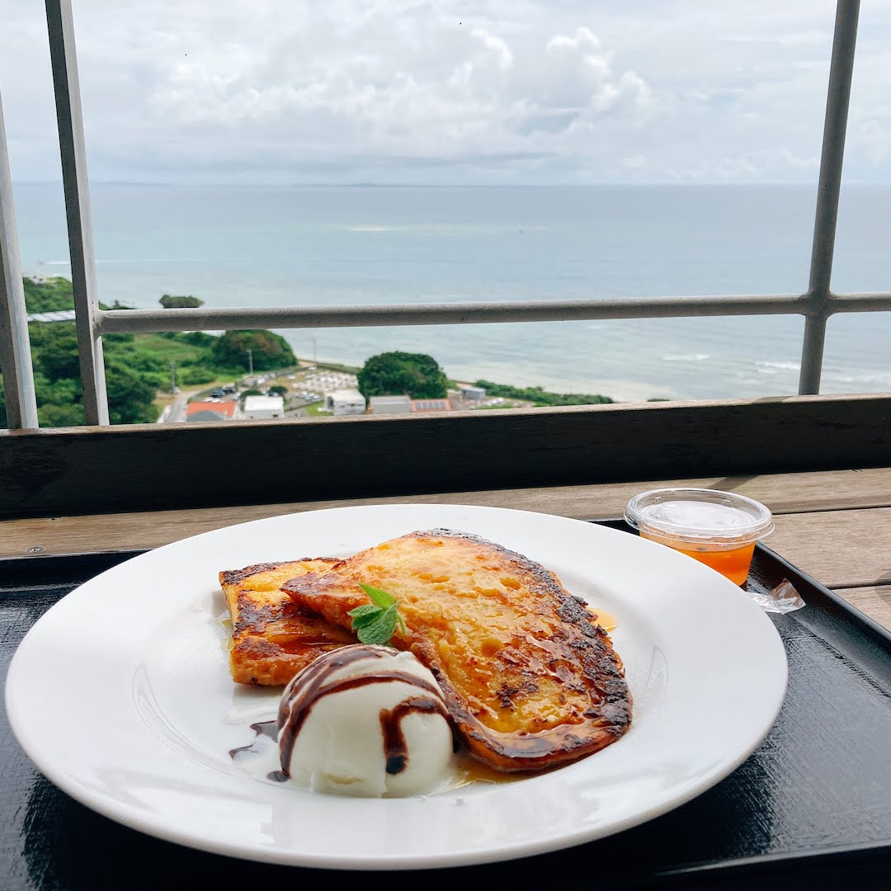

こんにちは、[@p1ass](https://twitter.com/p1ass)です。

1 年ぶり 3 度目の振り返り記事。  
前回の記事はこちら。



<!--more-->

## 個人 OKR の達成状況

今年は年始に個人 OKR を策定していた。まずはそれに沿って振り返る。



### O1: 特定の言語やフレームワーク、ベンダーに囚われない汎用的な知識を手に入れる

１つ目の目標はインプットに関するもの。大学生活のうちに業務では学びづらい知識を手に入れることで、技術力の幅が広がるのではという思いから生まれた。

| Key Result                                                                                                                                      | 達成度合い |
| ----------------------------------------------------------------------------------------------------------------------------------------------- | ---------- |
| KR1-1: [僕がコンピュータサイエンスに関して知らないこと](https://blog.p1ass.com/posts/i-do-not-understand-cs/)に挙げた知らないことを全部理解する | 10%        |
| KR1-2: 設計やミドルウェア、コンピュータサイエンスの基礎に関係する技術書を 10 冊読む                                                             | 4 冊       |
| KR1-3: TOEIC800 点取れる程度のリーディング力・リスニング力を身につける                                                                          | 0%         |

結果は散々だった。

#### KR1-1: [僕がコンピュータサイエンスに関して知らないこと](https://blog.p1ass.com/posts/i-do-not-understand-cs/)に挙げた知らないことを全部理解する

そもそもコンピュータサイエンスを単体で学ぶことにあまり興味が持てなかった。
僕は何かを解決するために技術を使うのが好きな人間で、より良い解決策を見つけるために様々な技術を学んでいるので、座学っぽい学び方は性に合わなかった。

一応春に応用情報技術者試験という餌を用意していたのだが、コロナで試験が中止になって餌に食いつくことは無かった。秋の試験は研究があって申し込まなかったので、モチベが上がることは無かった。

#### KR1-2: 設計やミドルウェア、コンピュータサイエンスの基礎に関係する技術書を 10 冊読む

次の 4 冊の本を読んだ。

<iframe style="width:120px;height:240px;" marginwidth="0" marginheight="0" scrolling="no" frameborder="0" src="//rcm-fe.amazon-adsystem.com/e/cm?lt1=_blank&bc1=000000&IS2=1&bg1=FFFFFF&fc1=000000&lc1=0000FF&t=p1ass02-22&language=ja_JP&o=9&p=8&l=as4&m=amazon&f=ifr&ref=as_ss_li_til&asins=4873118867&linkId=7f642186e9493920eaeda79a48b2db25"></iframe>
<iframe style="width:120px;height:240px;" marginwidth="0" marginheight="0" scrolling="no" frameborder="0" src="//rcm-fe.amazon-adsystem.com/e/cm?lt1=_blank&bc1=000000&IS2=1&bg1=FFFFFF&fc1=000000&lc1=0000FF&t=p1ass02-22&language=ja_JP&o=9&p=8&l=as4&m=amazon&f=ifr&ref=as_ss_li_til&asins=B07KXP79Y9&linkId=1916cdb83d98f451a4287d39f689b85f"></iframe>
<iframe style="width:120px;height:240px;" marginwidth="0" marginheight="0" scrolling="no" frameborder="0" src="//rcm-fe.amazon-adsystem.com/e/cm?lt1=_blank&bc1=000000&IS2=1&bg1=FFFFFF&fc1=000000&lc1=0000FF&t=p1ass02-22&language=ja_JP&o=9&p=8&l=as4&m=amazon&f=ifr&ref=as_ss_li_til&asins=4908686033&linkId=5006420240262db78acfdfe0e408db50"></iframe>
<iframe style="width:120px;height:240px;" marginwidth="0" marginheight="0" scrolling="no" frameborder="0" src="//rcm-fe.amazon-adsystem.com/e/cm?lt1=_blank&bc1=000000&IS2=1&bg1=FFFFFF&fc1=000000&lc1=0000FF&t=p1ass02-22&language=ja_JP&o=9&p=8&l=as4&m=amazon&f=ifr&ref=as_ss_li_til&asins=4873118468&linkId=bcb2f7de3b725078ade0d02eff679017"></iframe>

**『レガシーコードからの脱却』** は今年読んだ本の中で**一番学びが多い本**だった。
レガシーコード関連の書籍は多く出版されているが、この本では「9 つのプラクティス」が紹介されており、具体的にどうレガシーコードに立ち向かっていくのかが書かれていて良かった。また、プラクティスの背景にある原則を重要視している点も好感が持てる。  
**「明日のベロシティのために今日品質を上げる」** という文章は壁に飾りたい。

**『みんなのコンピュータサイエンス』** はアルゴリズムやデータベースなどの基礎を学べる本だった。基本情報よりも簡単なのでガッツリ学ぶには物足りなかったが、分かりやすく完結にまとまっていて、人におすすめできる良書だった。

**『Go ならわかるシステムプログラミング』** は前々から気になってた本で、この OKR を策定したときに気合を入れて読んだ。システムコールやソケット、ブロッキング IO といった OS 周りの知らない知識を吸収できた。これが C で書かれていたら挫折してたと思う。Go で書かれていて助かった。

**『Go 言語による並行処理』** は後述する Go Conference に向けて読んだ本で、登壇資料を作る上でだいぶ参考にさせていただいた。並行処理をプロダクションに入れる前に一度読んでおきたい本。

#### KR1-3: TOEIC800 点取れる程度のリーディング力・リスニング力を身につける

英語は本当に何もしていない。申し込んでた TOEIC がコロナで中止になりモチベーションが 0 になった。また、英語を学ばなくても開発できる(GitHub 程度なら読める)のも相まって残念な結果になった。

### O2: エンジニアとしてのプレゼンスを向上させる

2 つ目の目標はアウトプットに関するもの。**「数年キャリアの上の人がやっていることを先取りする」** という戦略の元、決定した。

| Key Result                                  | 達成度合い     |
| ------------------------------------------- | -------------- |
| KR2-1: 20 分以上のセッションに 3 回登壇する | 2 回           |
| KR2-2: ブログを 30 本書く                   | 17+2+2+1=21 本 |

#### KR2-1: 20 分以上のセッションに 3 回登壇する

[CAMPHOR- DAY 2020](https://blog.camph.net/event/camphor-day-2020/) と [Go Conference '20 in Autumn SENDAI](https://sendaigo.connpass.com/event/185474/) で登壇した。

CAMPHOR- DAY は自分が代表をしていたコミュニティでの登壇だった。自分の VPS 運用について語ったものだが、役に立った人がいたみたいで良かった。

Go Conference '20 in Autumn SENDAI は**初の**外部での 20 分登壇だった。正直かなり緊張して、スライド作りも発表ギリギリまでやっていた。「なぜこの発表をしたいのか？」を突き詰めば自ずと良い発表ができると思っていたが、話したいことが多すぎて逆に瞑想してしまった。
なんとか発表を終えることができたが、今度からはもう少し余裕を持ってスライドを作りたい。

#### KR2-2: ブログを 30 本書く

[ぷらすのブログ](https://blog.p1ass.com)が 17 本、[CAMPHOR- Blog](https://blog.camph.net)が 2 本、[DeNA Engineers' Blog](https://engineer.dena.com/authors/p1ass/)が 2 本、[Qiita](https://qiita.com/p1ass)が 1 本で、合計 21 本だった。

目標には及ばなかったが、頑張った方だと思う。同じ CAMPHOR-の運営メンバーである [@sanposhiho](https://twitter.com/p1ass)を密かにライバル視して頑張ってブログを書いていたが、研究をしながらの生活ではこれが限界だった。
この調子だと「社会人になったらほとんど書く時間を確保できないのではないか」という不安が少しある。

ブログの内容は、去年よりも Tips 的なものが多かった。ブログを書く時間が取れないというのもあるが、そもそも技術的に難しいことをほとんどしなかったから書くネタがなかったというのが正しい。来年はもう少し濃い記事を書きたい。

なお、はてブのホットエントリーに載ったのは次の２つだった。




どちらも完全に狙ったタイトル・記事内容だったので、ちゃんと多くの人に見てもらえてよかった。

### O3: 学生としての最後の時間を最大限有効に使う

| Key Result                            | 達成度合い |
| ------------------------------------- | ---------- |
| KR3-1: 積んでいるゲームを全て消化する | 0%         |
| KR3-2: ライブに 3 回行く              | 3 回 💯    |
| KR3-3: xxx                            | 💯         |

#### KR3-1: 積んでいるゲームを全て消化する

積みゲーは一切消化できなかった。やったゲームはスプラ 2、マリカ、雀魂など無限にやれるものばっかで、積んでる RPG 系は手を付けなかった。

#### KR3-2: ライブに 3 回行く

ライブは次の 3 つに行った。

- [Perfume 8th Tour 2020 “P Cubed” in Dome](https://www.perfume-web.jp/cam/dometour2020/)
- [暴力的にカワイイ](https://ageha.zaiko.io/_item/332420)
- [都 Premium Live 2020](https://miyako-premiumlive.jp/)

Perfume だけがコロナ前で、残りはコロナ中の開催だった。
この目標は達成できないものと思っていたので、秋〜冬にかけて参加できてよかった。**やはりライブは現地に限る。**

### 総評

結果として達成できた Key Result は 2 つだけだった。そもそも OKR が 100%達成できることを想定していないので、達成率が悪いのは仕方ないが、それにしても散々な結果だった。

来年はもう少し項目を絞った目標作りをしようと思う。来年の目標はまた別の記事で。

## 趣味開発

ここからは OKR とは関係のない振り返りをしていく。

趣味開発では「Relaym」と「生活習慣の乱れを可視化するやつ」の 2 つをリリースした。

<blockquote class="twitter-tweet">
<a href="https://twitter.com/hashtag/%E6%8A%80%E8%82%B2%E5%B1%95?src=hash&amp;ref_src=twsrc%5Etfw">#技育展</a> でさんぽし君が発表してたRelaymのサーバサイド開発のリードやってました〜！  ソースコードやPRDなどもOSSで全部公開してあるので是非見てね〜<a href="https://t.co/9wf993LMa3">https://t.co/9wf993LMa3</a>
&mdash; ぷらす (@p1ass) <a href="https://twitter.com/p1ass/status/1309703226325757953?ref_src=twsrc%5Etfw">September 26, 2020</a></blockquote> 

<blockquote class="twitter-tweet">
ツイートを分析して生活習慣の乱れを可視化するツイ廃向けのWebアプリを作りました！ Twitter連携で簡単に起床・就寝時間が分かり、どんどん生活習慣が乱れていく様子を見ることができます。  左の画像は規則正しい人、右の画像は生活習慣が乱れている人のグラフです ⏰<a href="https://t.co/5f7xlh7X6J">https://t.co/5f7xlh7X6J</a> <a href="https://t.co/6YNo02VATv">pic.twitter.com/6YNo02VATv</a>
&mdash; ぷらす (@p1ass) <a href="https://twitter.com/p1ass/status/1267413338016804864?ref_src=twsrc%5Etfw">June 1, 2020</a></blockquote> 

「Relaym」はリリースするまでかなり時間をかけてしまったが、無事リリースできた。何が何でもリリースしたい気持ちがあったので、PdM っぽい立ち回りをして、最初のリリースに本当に必要な機能の検討をファシリテートすることで、どうにかリリースまで落とし込んだ。他にも開発工数のすり合わせとか色んなことをしていたので、いつかブログにまとめたい。

「生活習慣の乱れを可視化するやつ」はバズって[ねとらぼに掲載されたりして笑った](https://nlab.itmedia.co.jp/nl/articles/2006/03/news042.html)。毎日 [Twitter でシェアされるツイ廃 OGP を見る](https://twitter.com/search?q=%23%E7%94%9F%E6%B4%BB%E7%BF%92%E6%85%A3%E3%81%AE%E4%B9%B1%E3%82%8C%E3%82%92%E5%8F%AF%E8%A6%96%E5%8C%96%E3%81%99%E3%82%8B%E3%82%84%E3%81%A4&src=typed_query&f=live)のが日課になってる。楽しい。  
機能追加は全然出来ていないが、コンセプトに沿った良い機能が思いつかないので放置してる。

_GitHub の草_

## 開発アルバイト

DeNA でアルバイトしている。日比谷音楽祭という音楽フェス向けのアプリのサーバサイド開発と情シス部署で Slack App の開発をした。数千人規模の情シス部署って大変なんだなって気持ちになれて、一周回って為になった。

後、バイトではないが[メルカリの静的解析インターンにも参加した](https://blog.p1ass.com/posts/itervar/)。お金を貰いながら静的解析を学べるのは良い経験だった。当時はずっとアルバイト漬けの生活だったので、仕事とは無関係のコードを書けるのも幸せだった。

## マネジメントの勉強

CAMPHOR-の代表になってから「マネジメントっぽいことも知らないといけないよなぁ」と思い、書籍やブログを山程読み漁った。おそらく**今年は技術よりもマネジメント関係の方に時間を費やした。**

<iframe style="width:120px;height:240px;" marginwidth="0" marginheight="0" scrolling="no" frameborder="0" src="//rcm-fe.amazon-adsystem.com/e/cm?lt1=_blank&bc1=000000&IS2=1&bg1=FFFFFF&fc1=000000&lc1=0000FF&t=p1ass02-22&language=ja_JP&o=9&p=8&l=as4&m=amazon&f=ifr&ref=as_ss_li_til&asins=4873118484&linkId=aa84be3626e912e1c509e89edfa8c25a"></iframe>
<iframe style="width:120px;height:240px;" marginwidth="0" marginheight="0" scrolling="no" frameborder="0" src="//rcm-fe.amazon-adsystem.com/e/cm?lt1=_blank&bc1=000000&IS2=1&bg1=FFFFFF&fc1=000000&lc1=0000FF&t=p1ass02-22&language=ja_JP&o=9&p=8&l=as4&m=amazon&f=ifr&ref=as_ss_li_til&asins=4873116309&linkId=5f8ff43bfd01c473884964f209b171f4"></iframe>
<iframe style="width:120px;height:240px;" marginwidth="0" marginheight="0" scrolling="no" frameborder="0" src="//rcm-fe.amazon-adsystem.com/e/cm?lt1=_blank&bc1=000000&IS2=1&bg1=FFFFFF&fc1=000000&lc1=0000FF&t=p1ass02-22&language=ja_JP&o=9&p=8&l=as4&m=amazon&f=ifr&ref=as_ss_li_til&asins=B079TLW41L&linkId=42a704fd444f59ccf739033fab789a3b"></iframe>

1 年勉強した感想だけど、マネジメント全く分からん。なるべく人とのコミュニケーションを丁寧に取るようにしたり、1on1 を実施したりと様々な取り組みをしたけど、これが正解なのか分かってない。

唯一自信を持って言えるのは「仕組み作り」で、メンバーが自由に行動できるようにするためのルールづくりや、そのドキュメント作りを頑張った。マネージャーの仕事は「メンバーが自由に動けるために障害を取り除く」ことだと思っているので、その指名の一部は果たせたかなと思ってる。

また、CAMPHOR-ではマネージャー側、会社では 1 チームメンバーとして働いているので、どちらの立場の気持ちも少しずつ分かるようになってきた。これは結構良いことだと思っていて、両方の立場が分かることでより深い議論や思考ができるようになると思ってる。

## 旅行

こっから趣味の話。技術の話だけが気になってた人はここでブラウザバックして OK。

今年は人生で 1 番旅行した年だった。
沖縄、箱根、富士急、仙台、福島、新潟、東京、千葉と様々な場所に行った。GoTo トラベル様々である。空いてるディズニーは最高。

去年は就活のため新幹線に乗りまくってたが、今年は飛行機を乗りまくった。そろそろ飛行機のワクワクがなくなってきている自分が悲しい。

_沖縄で食べたモーニング_

## 映画

今年はベストを決めるのは難しいレベルで良作が多かったが **『TENET』や『劇場版ヴァイオレット・エヴァーガーデン』** は素晴らしかった。  
脳みそを使う作品、伏線バリバリの作品が好きなので、TENET はドンピシャだった。3 時間が一瞬に感じられる没入感で楽しめた。
ヴァイオレットは開始 5 分で泣かされた。思い出すだけで泣けてくる。

他にも **『Fukushima 50』や『劇場版 SHIROBAKO』** も好きだった。

挙げた作品のうちのいくつかは MOVIX の新しいシアターである[ドルビーシネマ](https://www.smt-cinema.com/dolby/index.html)で鑑賞した。他のシアターよりも色彩豊かな映像を楽しめるので、一度ドルビーシネマを使ってから普通のシアターに戻れなくなってしまった。

## アニメ

今年見た作品の一覧は[Annict のプロフィール](https://annict.jp/@p1ass/watched)を参照。

**ソマリと森の神様、かくしごと、かぐや様、デカダンス、魔女の旅々** あたりが良かった。

かぐや様は原作を追っていてストーリーが知ってる分、余計に 3 期を見たくてソワソワしてる。

魔女の旅々は最初ウォッチしてなかったんだけど、1 話を見て「あっこれ好き」ってなった。ちょっとダークな部分もあるストーリーが面白くて、短編集にも関わらず次がどんどん見たくなってしまう。ラノベ上がりだからって少し避けてたのが本当にもったいなかった。イレイナさんかわいい。

## おわりに

OKR はあまり達成できなかったが、総じて楽しい 1 年だった。コロナのせいでイベントに参加できなかったのは悲しいが、その分旅行ができたのでまあいいかという気持ちになってる。

来年は社会人になるので今年のような生活はできないと思うが、できるだけ趣味も楽しみたい。

おわり。
