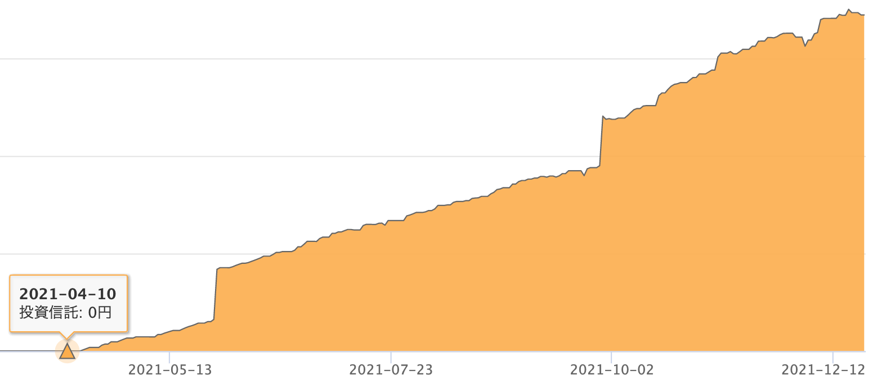
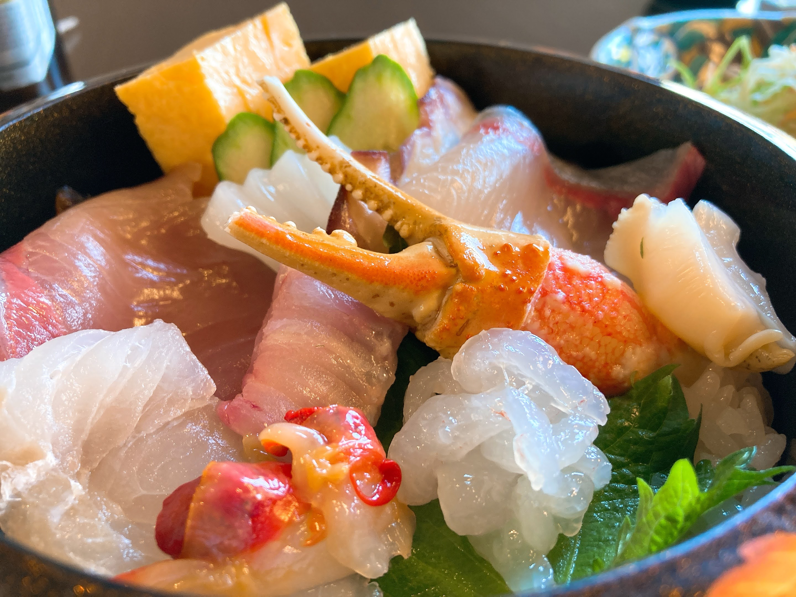
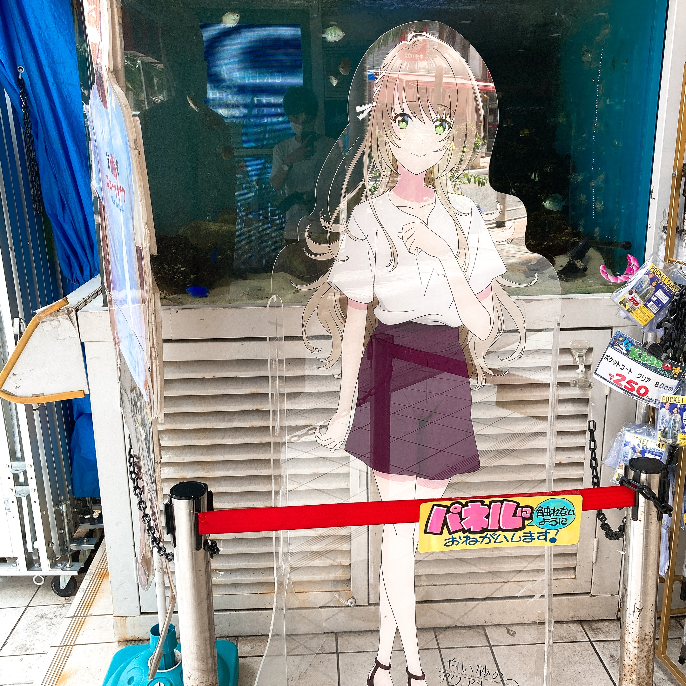

こんにちは、[@p1ass](https://twitter.com/p1ass)です。

年末恒例、人生の振り返り記事です。
今年は

- 時間
- 仕事
- 投資
- 趣味

の 4 トピックでお届けします。

<!--more-->

## 時間

今年は社会人になったことにより、時間の使い方が大きく変わりました。

学生時代は、

- 大学
- コミュニティ活動 ([CAMPHOR-](https://camph.net))
- 趣味プログラミング

が大きな割合を占めていて、エンジニアリング関係以外のことをする時間がほとんどありませんでした。 (当時はそれに対して特に不満は思っていません。)

社会人になってからはこの時間配分が大きく変わりました。
趣味プログラミングをやっていた時間は仕事の時間に置き換えられ、大学やコミュニティ活動に使っていた時間が全部空きました。
そのため、仕事終わりの夜や休日は基本的に好きな時間ができるようになりました。
言い方を変えれば**可処分時間が増えた**というところでしょうか。

この可処分時間で何をしていたかを振り返ってみると、この辺が増えたと感じています。

- 本の読む時間が増えた
- ゲームをする時間が増えた
- 友人とプログラミング以外のことで遊ぶことが増えた

今までも技術書は読むことには読んでいたのですが、少し空いた時間にねじ込んで読んでいました。
しかし、今年は「暇だから読む」という流れが多く、「読みたいから時間を作る」とは逆の流れになりました。

これは結構大きな変化で、今まで手を出しにくかった **「興味はあるけど、さほど急ぎではない」** という本にも手を出せるようになりました。
読んだ本それぞれの詳細を書くことは省略しますが、いくつかの Amazon のリンクとブログ記事をおいておくので、興味があったらクリックしてみてください。

<iframe style="width:120px;height:240px;" marginwidth="0" marginheight="0" scrolling="no" frameborder="0" src="//rcm-fe.amazon-adsystem.com/e/cm?lt1=_blank&bc1=000000&IS2=1&bg1=FFFFFF&fc1=000000&lc1=0000FF&t=p1ass02-22&language=ja_JP&o=9&p=8&l=as4&m=amazon&f=ifr&ref=as_ss_li_til&asins=B084QBQDZ3&linkId=7d32b2090e3d052e26bffe49ad7eb860"></iframe>
<iframe style="width:120px;height:240px;" marginwidth="0" marginheight="0" scrolling="no" frameborder="0" src="//rcm-fe.amazon-adsystem.com/e/cm?lt1=_blank&bc1=000000&IS2=1&bg1=FFFFFF&fc1=000000&lc1=0000FF&t=p1ass02-22&language=ja_JP&o=9&p=8&l=as4&m=amazon&f=ifr&ref=as_ss_li_til&asins=4297103265&linkId=b7ea802eae712bc6b635f4d0285ddb2c"></iframe>
<iframe style="width:120px;height:240px;" marginwidth="0" marginheight="0" scrolling="no" frameborder="0" src="//rcm-fe.amazon-adsystem.com/e/cm?lt1=_blank&bc1=000000&IS2=1&bg1=FFFFFF&fc1=000000&lc1=0000FF&t=p1ass02-22&language=ja_JP&o=9&p=8&l=as4&m=amazon&f=ifr&ref=as_ss_li_til&asins=B01LYMTJ0M&linkId=19af137b9f58475cba8e0967dc1d2371"></iframe>
<iframe style="width:120px;height:240px;" marginwidth="0" marginheight="0" scrolling="no" frameborder="0" src="//rcm-fe.amazon-adsystem.com/e/cm?lt1=_blank&bc1=000000&IS2=1&bg1=FFFFFF&fc1=000000&lc1=0000FF&t=p1ass02-22&language=ja_JP&o=9&p=8&l=as4&m=amazon&f=ifr&ref=as_ss_li_til&asins=4873119464&linkId=25e3622e356089efe51052a90dc1047c"></iframe>
<iframe style="width:120px;height:240px;" marginwidth="0" marginheight="0" scrolling="no" frameborder="0" src="//rcm-fe.amazon-adsystem.com/e/cm?lt1=_blank&bc1=000000&IS2=1&bg1=FFFFFF&fc1=000000&lc1=0000FF&t=p1ass02-22&language=ja_JP&o=9&p=8&l=as4&m=amazon&f=ifr&ref=as_ss_li_til&asins=B082WXZVPC&linkId=efb1176240ba50a17e929a369bb22c4c"></iframe>
<iframe style="width:120px;height:240px;" marginwidth="0" marginheight="0" scrolling="no" frameborder="0" src="//rcm-fe.amazon-adsystem.com/e/cm?lt1=_blank&bc1=000000&IS2=1&bg1=FFFFFF&fc1=000000&lc1=0000FF&t=p1ass02-22&language=ja_JP&o=9&p=8&l=as4&m=amazon&f=ifr&ref=as_ss_li_til&asins=4873118700&linkId=0095fd1cf93d843befb0f0e06690c873"></iframe>
<iframe style="width:120px;height:240px;" marginwidth="0" marginheight="0" scrolling="no" frameborder="0" src="//rcm-fe.amazon-adsystem.com/e/cm?lt1=_blank&bc1=000000&IS2=1&bg1=FFFFFF&fc1=000000&lc1=0000FF&t=p1ass02-22&language=ja_JP&o=9&p=8&l=as4&m=amazon&f=ifr&ref=as_ss_li_til&asins=B07L5M7DXS&linkId=bc627ffbc425ee145ce7350cf13005b6"></iframe>



また、**明らかに趣味でコードを書く時間が減りました。**
ありがたいことに仕事でのエンジニアリングが面白いので、わざわざ趣味でたくさん書かなくても良いかなと感じるようになってきました。
とはいえ、新しい記事を追うのは今も続けていて、RSS フィードやはてブは相変わらず毎日チェックしています。
仕事で書くコードの目新しさが減ってきたら、そのうちまた趣味でコードを書く時間が増えるかもしれません。

## 仕事

次のトピックは仕事です。
4 月からアルバイトから正社員にジョブチェンジしました。

業務内容については特に触れないですが、ソフトスキル、**特にコミュニケーションの重要性**を毎日感じる毎日です。
学生時代やアルバイト時代はコミュニケーションの範囲がそこまで広くなかったのでなんとかなっていましたが、正社員として働くと他の部署の人や初対面の人の話す必要性が出てきました。
そんな関係性の人と、適切な背景知識を共有した上で、期待値を揃えてコミュニケーション取っていくのは、難しいコードを書く作業とはまた別のベクトルの難しさを感じています。

しかし、悩んでも正解がない問題なので、「まあ、この辺りは慣れだし経験していけばなんとかなるよね」という軽い気持ちで流しています。
最近読んでる「[Google のソフトウェアエンジニアリング ――持続可能なプログラミングを支える技術、文化、プロセス](https://amzn.to/30Lapcs)」には「2 章チームでうまく仕事をするには」という章があったりするので、そのへんの知見が活かせたら嬉しいなぁと思ってます。

また、ハードスキル寄りの話でいうと、**「エコシステムを深く理解している人」** はすごいなぁと感じています。
(私は使ってないですが) Kubernetes を例に取ると、ただ単にマニフェストを書いて `kubectl apply` できるだけの人と、CNCF 周りのエコシステムをそれなりに理解している人では、活躍できる幅が全然違うように感じます。
プログラミング言語でも、文法を理解してコードを書けるだけの人とそうでない人の差は大きいように感じています。

新しい技術領域に挑戦している最初のタイミングでは、誰しもエコシステムに対する理解が不足しているのは当たり前です。(今の自分もそう)
その一歩先に行けるかどうかは今後の自分のキャリアにも大きく影響しそうなので、どうしていくかしっかりと考えたいです。

## 投資

次は金回りの話です。
予め免責しますが、このセクションはあくまで個人的な投資に関する考えを述べたものに過ぎず、特定銘柄の推奨しているものではありません。**全ては自己責任でお願いします。**

投資はもともと 2021 年の目標に掲げていました。
年始に建てた今年の投資目標は次のとおりでした。

### 年始に設定した目標アセットアロケーション

**リスク資産:現金 = 50:50**

まだ若いので本当はもっとリスク資産に振りたいのですが、今年は社会人 1 年目ということで抑えめに設定。

- リスク資産
  - [eMAXIS Slim 米国株式(S&P500)](https://emaxis.jp/fund/253266.html) を積立 NISA で満額
- 現金
  - もともと持っていた現金分も含む
  - 一部は確定給付企業年金（DB）として積立
    - 所得税控除のメリットが大きい
- なお、生活費の支払いに使う現金はアセットアロケーションに加味をせずに別途確保する

### 振り返り

結論から言うと、ほぼほぼ目標のアセットアロケーションで着地しました。
ただし、途中で生活が安定してきて現金の割合が増えてきたので、途中で [NASDAQ の投資信託](https://emaxis.jp/fund/254062.html)を特定口座で追加で購入しました。
「そこは S&P500 じゃないんかい！」というツッコミもありそうですが、裁量の余地を残している方が楽しいということでご勘弁を。

_マネーフォワード ME より_

現時点では、評価額に対する影響は株価指数の変動よりも積立による元本増加の影響の方が大きくあまり面白みはないですが、これから徐々にどういう風に変化していくか楽しみです。
来年の方針については、来年の目標記事で書こうと思います。

金回りの話でいうと、引っ越しの話は別の記事に書いたので興味がある人はそっちを見てください。



## 趣味

### ライブ・クラブ

東京に来てから気軽に行けるようになったので、めちゃくちゃ行くようになりました。

- [LAWSON presents TrySail Live 2021 “Double the Cape”](https://trysail.jp/contents/407166)
- [伊藤美来 Live Tour 2021 Rhythmic BEAM YOU](https://columbia.jp/artist-info/itomiku/discography/COXC-1270.html)
- [EJ My Girl Festival 2021](https://ej-music.jp/)
- [UCHIDA MAAYA LIVE 2021「FLASH FLASH FLASH」](https://uchidamaaya.jp/live/20210703_flashflashflash/)
- [内田真礼ファンクラブイベント「LIVE IS LIKE A SUNNY DAY♫」Vol.3](https://uchidamaaya.jp/news/archives/3896)
- [暴力的にカワイイ](https://ageha.zaiko.io/_item/343166)
- [VIRTUAFREAK](https://ageha.zaiko.io/_item/343807)
- etc...

趣味が趣味なのでほとんどオタク系です。
少しずつオフラインのイベントが開催されるようになってきて、やっぱり爆音を大きな箱で聞けるのは最高だなってなりました。
ただ、声援がないのは寂しさも感じるのでもっと状況が良くなるのを願うばかりです。

### アニメ

_Annict より引用_

今年もたくさんのアニメを見ましたが、特に

- Vivy -Fluorite Eye's Song-
- オッドタクシー
- 86―エイティシックス―
- ヴァニタスの手記
- SCARLET NEXUS
- takt op.Destiny
- プリンセス・プリンシパル Crown Handler 第 2 章

あたりはストーリーが面白くて見入ってしまいました。
また、ARIA の映画が公開されているのが個人的にエモすぎです。
萌ではない心の安らぎを欲しい方にはとてもオススメの作品なので、年末年始にまったりとしながらぜひ見てください。



### 旅行

今年は、

- 金沢
- 沖縄
- 大阪・京都

に行きました。

_海鮮丼_

_突如見つけた白い砂のアクアトープの等身大パネル_

_京都 嵐山_

次は北海道に行きたい。

### ゲーム

今年目標にしていたリングフィットアドベンチャーは 35 日やりました。
ペースは全然ですが、2 年前に買ったゲームをまだ遊んでいるのでなんやかんや長続きするもんなんだなと感じています。



ゼルダの伝説 スカイウォードソード HD は私が始めてプレイしたゼルダのリメイクということで、とても感慨深いゲームでした。
Wii リモコンを降って剣や盾を操作するプレイスタイルは Joy-Con になっても踏襲されており、自分の体を使う遊び方の面白さを再認識しました。



ポケットモンスター ブリリアントダイヤモンドもゼルダと同様に始めてプレイしたポケモンだったのでエモさ MAX でした。




こう振り返ってみると、過去にプレイしたゲームばっかやっていて、新しいものに飛びつけない衰えを感じます...。
最近もマイクラをまたやっていて、ファミコンのリメイク売れる理由が分かってきました。

## おわりに

2021 年は 2020 年に比べてかなり充実した 1 人になりました。
来年も公私ともにより充実した 1 年になることを願っています。

それでは、良いお年を。
